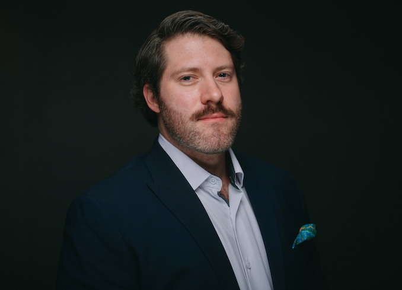

## <i>Bonjour</i>.

My name is Yaël Ossowski. I'm a consumer advocate, policy analyst, and writer who covers technology, privacy, energy, legal reform, and lifestyle freedom.

I'm currently Deputy Director at the [Consumer Choice Center](https://consumerchoicecenter.org/team/yael-ossowski/), where I contribute to newspapers, magazines, and online outlets on those topics, and am featured regularly in interviews. 

I'm also a Fellow at the [Bitcoin Policy Institute](https://www.btcpolicy.org/authors/yael-ossowski), focusing on smart policies to advance Bitcoin.

Previously, I was an investigative reporter at Watchdog.org, serving as Florida Bureau Chief and chief Spanish translator. From 2013 to 2020, I worked as a grassroots organizer, programs director, and fundraiser for the pro-liberty youth organization Students For Liberty across multiple continents.

My work has been featured and syndicated in USA Today, the Hill, Boston Herald, Chicago Tribune, Miami Herald, Reason Magazine, and [hundreds of other outlets](https://www.yael.ca/categories). I've been a member of the Society of Professional Journalists since 2011.

## Education

- BA, Political Science and History — Concordia University (Montréal) and University of Vienna (Austria)
- MA, Philosophy, Politics, Economics — CEVRO University (Prague, Czech Republic)

## Personal

Born in Québec, raised in the American south, and spend most of my days split between Central Europe and Washington, D.C.

<b><i>Mon pays ce n'est pas un pays, c'est l'hiver.
</b></i>

<b><i>Heimat ist kein Ort, Heimat ist ein Gefühl.
</b></i>