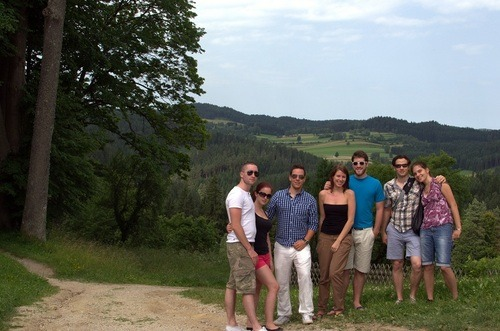
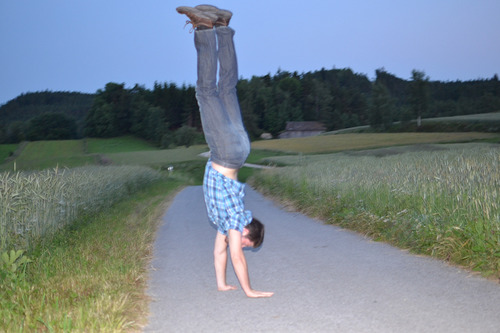

Far removed from the sandy beaches and tropical wonders of Florida, I have explored and enjoyed the wonders of Vienna and the outlaying region for the past 12 days.

While markedly shorter than my six month educational séjour in 2011, this trip was meant for a renewal of sorts—an opportunity to both reset my intellectual curiosity and embrace my most romantic ideals.

Considering the great amount of time spent amongst the ruins of the ancient empire and the vast, lush countryside of a region never touched by the horrors of war, I would say that it been nothing but a ravishing experience.

Where else can I embrace the woman I love in the city that has played host to so much historical and cultural significance in the past millennium?

Whether it was conquering the wilderness:

Or being exposed to new horizons:

I was never far from learning new worldviews, languages, or simple and complicated life lessons in the same fell swoop.

Alas, my Imperial City, I have but one last day to seek and praise your treasures.

Don’t let me down.
