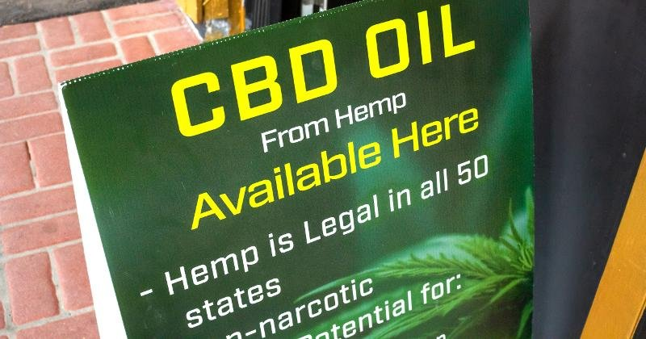

## Encourage competition, safety, medical facts and eradication of the black market

**ARLINGTON, Va. —** Flashy display cases, provocative brand names and lists of health benefits have elevated cannabidiol (CBD), a nonintoxicating compound found in cannabis, to be one of the hottest product trends today.

Whether it be for health, pets or beauty care, the use cases of CBD are becoming mainstream. It's not uncommon to hear stories of consumers using CBD to alleviate pain in their joints, reduce anxiety and improve sleep.

### Retail Revolution

The revolution is already here, and it arrived in a fury. The only guardrails came with the legalization of industrial hemp in the 2018 Farm Bill. That law created a legal distinction between a relative of cannabis without THC (tetrahydrocannabinol)—commonly known as hemp—and THC cannabis, which remains classified as marijuana and is still illegal under the Controlled Substances Act.

That law was a huge boost for farmers, entrepreneurs and consumers in the CBD space. And while it answered many questions, it sparked many more that will take time and deliberation to resolve: Who tests the actual CBD content of these products? Where are these products sourced? Which benefits and health claims are legitimate?

The U.S. Food and Drug Administration (FDA) has been running to catch up. It has so far focused on bogus health claims made by producers. Meanwhile, the FDA still maintains that food products containing CBD are illegal, despite their widespread availability in stores in practically every state and no real method of enforcement.

In May 2019, the FDA invited scientists, entrepreneurs and consumers to participate in a public hearing. Following statements and presentations from dozens of attendees, including myself, the FDA remains uncertain of what consumers and c-store owners looking to try or sell CBD products need to do to comply with the law.

The FDA is awaiting further instructions from lawmakers in Congress, who are currently floating myriad proposals to deal with cannabis. The latest would classify CBD as a health supplement, exempting it from more stringent regulation and allowing broader distribution in food and drinks.

### Core Issues

Apart from that, there are still many gaps to fill. Considering many store owners are currently selling these products, it’s important that both sellers and consumers are aware of the core issues that should be addressed by the FDA and regulators.

In that May hearing, my group, the Consumer Choice Center, presented the following suggestions to the FDA if it wishes to implement smart regulation of CBD. Smart regulation would encourage competition, safety, medical facts and eradication of the black market.

The suggestions are:

- Develop clear labeling standards, including the percentage of CBD and THC.
- Allow free advertising and branding.
- Allow stated health claims and benefits.
- Embrace harm reduction by allowing CBD products in food, drinks, oils and topical products that do not require combustion.

We hope the FDA takes these points seriously and that these principles are followed by the industry as well.

What should the CBD-curious c-store professional do if they want to dive into CBD products?

- Maintain a high standard for the products they source.
- Choose only products with clear labeling and reasonable health claims.
- Read the included fact sheets and materials that come with orders from reputable CBD firms.
- Use independent testing services to check the levels of CBD and other compounds.

Entrepreneurs and consumers can work together today to ensure a competitive market with safe, beneficial and exciting innovations that will provide value to everyone.

_Yael Ossowski is deputy director of the Consumer Choice Center. Reach him at [@yaeloss](http://twitter.com/yaeloss)_

PDF version of the article [here](http://yael.ca/wp-content/uploads/2020/03/2004-guest-column-ossowski.pdf).
