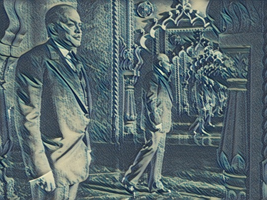

By Yaël Ossowski | [Devolution Review](https://devolutionreview.com/sole-flame-cast-hall-mirrors/)

Being a sole flame cast against a hall of mirrors has always been an excitable affair. Customs and ordinary occurrences are strange and new. There’s a deep yearning for understanding the deeper meaning of each word, each syllable, and each dialect spoken from anyone’s mouth. Even if comprehension is nowhere near achievable, it still makes a fun sport to give it a go yourself. Most, if not all, will appreciate it and give you a hoot at any decipherable jargon you slog out from that space between your lips.

That defined my adventure for so long and gave me all the energy to launch myself into journey after journey, either uncouth or overly appropriate.

On that June night, though, steeped behind the restaurant table I’ve inhabited too many times, the foreign novelty had worn off as easily as the paint on the square wicker chairs lined against the window. I’m too deep now, I thought. Zu tief. I made an attempt at a double conjugated genitive sentence formation with a fancy verb looped at the end as by a lasso. I tripped up in the first five words, throwing the Austrian waiter for good while, and leaving all my credibility back at the demo menu planted strategically 5 steps from the front door facing the street. Any hopes I had of slight immigrant integration were dashed before I left the runway.

The German language had always been difficult, but it had just been too long since my mind had thought critically about the words and sentences formed. I had fallen into a calm and comfortable rhythm, and all the Viennese were to blame for allowing me to slide without so much as a grimace, which they were usually so capable of flinging without a second’s notice. Could my newfound sense of ease with the culture and language have deceived me into believing I actually belonged? That I was one among the crowd, rather than one outside the crowd? Outside in the street, any tourist or local assumed I was a Wiener through-and-through. I might as well have had a district number tattooed on my left forearm and a medical insurance sick card in my back right pocket. But, alas, at that small Viennese restaurant where too many mélange had been consumed to count, and schnitzel upon schnitzel piled upon my plate, I was demoted to the status I perhaps had always so deserved: a visitor without purpose. A permanent staple of the Imperial city without so much as belonging to it.

I often was thrown the slur of visitor while studying in this city in my final year of university, where the wine flowed as easily as words of hello and next dance, bitte. It was a defense mechanism used by females of the local population to swat you away and keep you at bay, but still latched onto you via that tight piece of rope. I had experienced it too often to mistake the tug of it around my neck. Those six years later, one would have thought I had the brow and grip of a domestic conqueror, not the flimsy handshake of a traveling salesman like now. For those years ago, I had latched onto the ultimate score, a prized beauty of the local tribe. Her ways were known to me and those of her people even more. At least I had surmised such a scenario. In reality, I was just a bumbler and an imposter, a lost soul clutching for any semblance of culture and history as I aimed to assemble my own personality and being. Perhaps that had always been my crime: fleeing my own crisis of identity to latch on to another at least just convincing enough to allow me to creep by. It worked well for me as a Francophone maple leaf in the Land of Bibles. But this beast was entirely different. Thousands of years of existence different. How could I even hope to understand the vast amalgamation of spirit and time held in these hinterlands?

The waiter reformed his lips in an Anglo-Saxon fashion and asked me again in Shakespeare’s tongue: Did you say you wanted to try the best and most local of wines we have in stock, he asked in dry, plain words. Genau, I answered with resignation. My colossal mistake was bound to keep me from feeling my way through the various vines and grapes of this particular valley I had visited on so many occasions. The wine glass was filled to the brim, easily buoyed up by a thick layer of shame having stuck to the bottom. The brunette beauty I had so eloquently fought for in my younger days only stared back with a tinge of doubt. My domestic integration was only a fleeting concern of hers. She had willingly sprung her heart from these hills in hopes of finding a sole flame cast against a hall of mirrors, one face she recognize above them all. In that, she had succeeded, long ago. But that spoke only to her desires, not my own. How could I inhabit a cocoon of love and fulfillment when my side was scarcely complete and weathered from the elements while hers was overstuffed with every bit of booty from my own North American cultural ties? I could not let this inequity lay bare. I excused myself from the table, gently laid my white napkin to the left of my plate, and journeyed to the closest mirror. There, at least, I could take refuge in my individuality, safe from peeking eyes.

Upon entering the bathroom and glancing at the thin pane of reflective mirror in the wooden frame, however, its answer was dull. My usual oval face blended in easily with the darkened tiles behind me, now more square than any perfect square could be. I didn’t recognize myself. I was a figment of the novel self I knew so well before. I turned on the cold tap and collected water in my palms, enough to soak the entirety of my newly squared face. I looked up to my reflection and let the water trickle down my cheeks and neck. Had I just become a flame like any others seen in the mirror, tucked into the crowd? Had my own luster faded like so many others I had seen stalking the cafes of this city? Was I destined to be a placeholder to a once exciting existence that clamored the walls and filled up the cloakrooms of every social salon of Vienna?

My deep, intense want of understanding and cultural affixation could no longer motivate me. I was every bit a part of this city and this life as it was a part of mine. My status as visitor and foreigner was over. I was one with this life now, I recognized, but an even lower status. No longer anything special or remotely related to an excitable affair. Now, I was just a part of the scenery. An extra in the cast of inhabitants who could barely muster a cameo. I picked up the paper towels next to the sink. I gave a last glance at the face in the mirror and took a deep breath. Zu tief.
