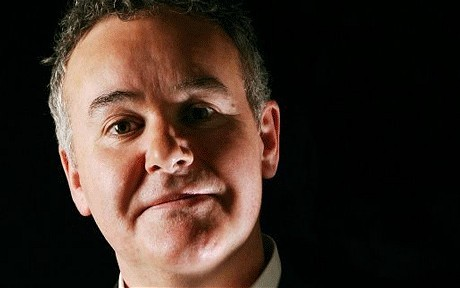

I’ve [often written](http://libertyinexile.com/2011/09/19/technocracy-individualism-and-the-future/) about the works of the BBC's **Adam Curtis**, one of the most fascinating documentarians of our age.

He came out with [this diddy](http://www.youtube.com/watch?v=TSwlqSwwqvQ) on journalism not too long ago.

His thesis is that TV journalists originally set out to create a narrative of the world, but in the midst of chaos, they’ve basically reverted to listening to people in power.

> “The only problem is that we don’t have a clue what’s going on. Particularly because the journalists have given up on their job of explaining the world to us.”
> 
> 

Some other great films are _The Power of Nightmares, The Century of the Self, The Trap, All Watched Over By Machines of Loving Grace,_ and _The Mayfair Set._
