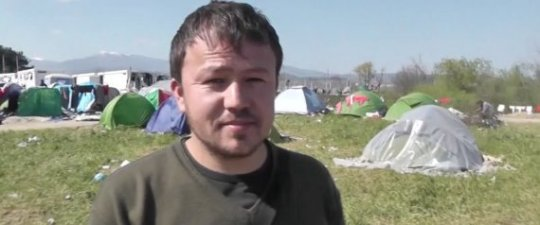

It’s a story full of hope among a sea of despair, one involving one of Europe’s smallest yet proudest countries.

With thousands of refugees currently awaiting their fate at the periphery of Europe’s borders, hoping to reach Germany, the United Kingdom or Sweden, at least one man was setting his sights on the Baltic nation of Lithuania.

Last week, American journalist Josh Friedman of the [Freeman Post](http://www.freemanpost.com/lithuanian-interpreter-from-afghanistan-stuck-at-greek-macedonian-border/) took a trip to the Greece-Macedonian border to interview refugees and collect stories of those stuck there.

It was outside Idomeni, Greece that he met an Afghan refugee named Basir Yousofy, who had been in the camp for over a month. [What made Basir’s story unlike so many others](https://youtu.be/bQ_fqiqqStA) was his surprisingly well-spoken Lithuanian he learned in his native land.

Basir claimed to have worked as an interpreter for the Lithuanian troops stationed in Afghanistan during the NATO War, and had documentation and photos to prove it. [Freeman Post couldn’t prove the authenticity of the documents](http://www.freemanpost.com/lithuanian-interpreter-from-afghanistan-stuck-at-greek-macedonian-border/), but they paint a compelling story.

He helped Lithuanian troops navigate amongst local tribes and he even picked up Lithuanian after years of working with them. He said he left Afghanistan after being threatened by the Taliban for having “collaborated” with Westerners, putting him and his family in danger.

Speaking with Freeman Post, he made a plea in Lithuanian to the people and government of the small Baltic Republic to grant him asylum so he could be saved from despair.

Once the video was published and translated thanks to the help of a mutual friend, it went viral, hitting over 50,000 views in just a few days. It quickly made its way into the [hands of the Lithuanian authorities](http://www.lrt.lt/mediateka/irasas/97774/panorama#wowzaplaystart=240000&wowzaplayduration=1206000). Basir was officially invited to the country and will likely be granted asylum within three months.

On Wednesday, Basir arrived at Vilnius airport with a smile larger than life and joy beaming from his face, and did at least five minutes of local media interviews.

He hopes to find a job as soon as possible and one day bring his family along to integrate into Lithuanian society.

Here’s at least one case which demonstrates the sheer power of journalism and storytelling.

_Originally published in the [Huffington Post](https://www.huffingtonpost.ca/yael-ossowski/refugee-viral-video_b_9634574.html)._
