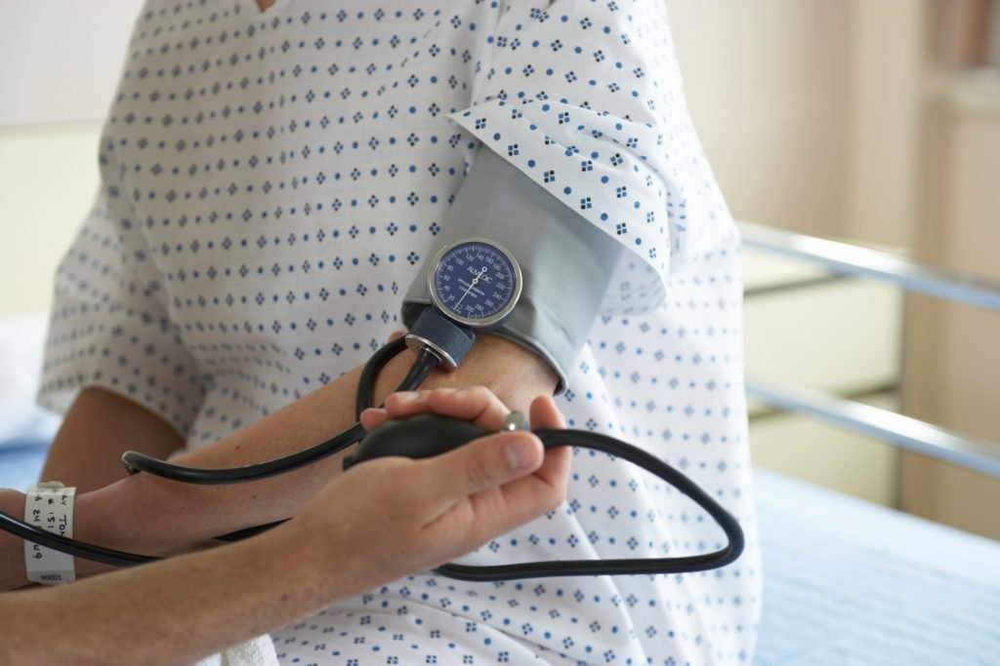

In between the jabs during the first presidential debate, both President Donald Trump and former Vice President Joe Biden stumbled through their vision for healthcare reform.

While Biden wants to expand a “public option,” a kind of Obamacare plus, Trump focused on his executive orders mandating cheaper drug prices and the congressional repeal of the Obamacare individual mandate.

Neither leaves voters feeling heard.

That there was no substantive health debate is a shame, considering health insurance costs and coverage personally affect every American. Who doesn’t have their own health insurance horror story?

If we want to radically improve insurance and healthcare in our country to ensure that every American receives the care they need, we have to be bold. And that begins with divorcing insurance from where we work.

Not only would that improve the choices of consumers, but it would also help lower costs and provide more options for people who aren’t covered in the current system. That would empower individuals to choose their health plans according to their needs.

As of March 2019, the U.S. Census [estimates](https://www.census.gov/content/dam/Census/library/publications/2019/demo/p60-267.pdf) that 91 percent of the population had health insurance. Nearly one third receive coverage from government health insurance, whether Medicare, Medicaid or state employees. Left out are approximately 29.9 million Americans without health insurance — public, private or otherwise.

The number of uninsured is an important metric because it is the target group for most substantial health insurance reforms of the past decade, including Obamacare at the federal level and the expansion of Medicaid eligibility at the state level, both problematic in their own right.

According to a Kaiser Family Foundation [survey](https://www.kff.org/uninsured/issue-brief/key-facts-about-the-uninsured-population/), 45 percent of the uninsured say the cost is too high, while 31 percent of the uninsured lost their coverage because they made too much money for Medicaid or they changed employers.

The single largest category of the insured in our country is those who receive insurance through their jobs, approximately 54 percent. Why is that?

Since 1973, the federal government provided incentives to employers who set up Health Maintenance Organizations (HMOs) for their employees. Since then, our health insurance market has pivoted to match having a job with health insurance.

Incentives to employers to cover healthcare for their employees is good policy on its face, but it has led to unforeseen economic consequences.

Employee health plans, managed by state-based health insurers ([another worthy reform to consider](https://thehill.com/blogs/congress-blog/healthcare/255490-health-insurance-across-state-lines)), often become a headache for workers and firms alike.

These plans aim to define benefits and coverage according to a firm’s needs and often have to hire several people to oversee them. Then, bureaucracy balloons, administrative costs creep up, and whatever advantage these plans initially offered is now buried in red tape.

Added to that, if you leave your job for another one or find yourself unemployed, you are now one of the 9 percent without health insurance, which puts you at risk.

There has to be a better way.

The alternative to this system would be a free and open marketplace in which individuals would be empowered to choose their healthcare insurance plan according to their needs, just like car insurance. Employers could offer cash subsidies in line with current federal incentives, but the choice of plan would remain that of the workers.

Such a plan would then empower people to try new innovative healthcare delivery models, such as direct primary care, concierge medicine, and medical startups.

As a relatively young and healthy person, for example, I opt for high deductible emergency insurance that is there when I need it. Smaller health expenses are paid in cash or with a health savings account that offers tax benefits. If I have a more serious injury or illness, my insurance covers the costs.

For me, and likely for millions of other individuals, this arrangement works. It is how insurance is supposed to work. We take out insurance to cover the costs and the risks we don’t foresee, not to cover each routine transaction we make with a provider. It’s the same reason we don’t insure windshield wipers or tires on our cars.

If someone wants more comprehensive insurance, they should be free to take it. And the costs should be reflective of that option.

If employees could be encouraged to build their plans, that would remove administrative and bureaucratic hurdles from existing insurance arrangements or mandates. It would also encourage more competition and lower prices from health insurers, helping bring down costs for employers and employees alike.

But doing so will require a huge shift in the way we think as Americans. We can no longer marry our health insurance to our jobs.

Separation of job and insurance should be a mantra as much as separation of church and state. And federal policy should encourage Americans who take control of their own private health insurance plan.

_Yaël Ossowski is a writer and deputy director at the Consumer Choice Center, a consumer advocacy group based in Washington, D.C._

Published in Inside Sources: [https://www.insidesources.com/americans-need-to-divorce-health-insurance-from-our-jobs/](https://www.insidesources.com/americans-need-to-divorce-health-insurance-from-our-jobs/)

Boston Herald: [https://www.bostonherald.com/2020/10/12/americans-need-to-separate-health-insurance-from-our-jobs/](https://www.bostonherald.com/2020/10/12/americans-need-to-separate-health-insurance-from-our-jobs/)

MSN: [https://www.msn.com/en-us/money/insurance/americans-need-to-separate-health-insurance-from-our-jobs/ar-BB19VWbJ](https://www.msn.com/en-us/money/insurance/americans-need-to-separate-health-insurance-from-our-jobs/ar-BB19VWbJ)
