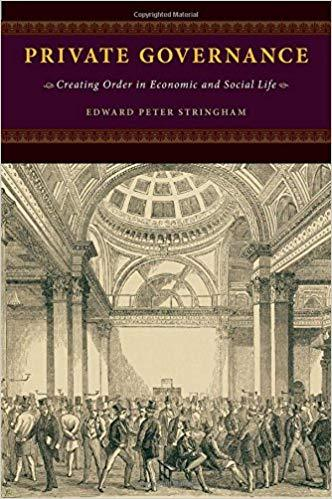

The ideological foes of Edward Stringham’s book Private Governance: Creating Order in Economic and Social Life are many.

Principally, it is an argument against the “legal centrist” mentality, according to Stringham, the practitioners of which are bound to place the role of the state as central to private economic transactions and exchanges. They look to legislation to create the rules for markets, and believe that markets can only expand and broaden once these rules are clearly established by means of central planning.

He dedicates the book, even, to the legal centrists of “all parties.” It’s a warped notion that befalls many in the political establishment across all lines, he argues. And he has plenty with which to dispel that notion time and again.

The central thesis that Stringham aims to prove in the book is that individuals and groups throughout history and in the modern era, through voluntary exchange, have devised methods of private governance that don’t require a role for government, legislation, courts, or centrally planned rules enforced by the state.

It’s a thesis which weaves between the very beginnings of the private stock markets in the coffeehouses of Amsterdam and London, the online world of commerce through eBay and PayPal, private policing on the streets of San Francisco, and the highly complex and routinely demonized market of derivative trading on Wall Street.

What Stringham is able to contribute is a well-researched collection of case studies of effective private governance, peppered with his own thoughts on the unnecessary interventions staged by state actors into the private realm to solve issues or problems which could be better adjudicated in the marketplace. There are many important points to consider throughout, some which are more convincing than others.

**The Genesis of Markets and Private Governance**

Important to Stringham’s central thesis is the notion that norms and rules come endogenously from the market, rather than from government by central decree. This is an important point because it refutes previous understandings of both private and public behavior, even the writings of well-known proponents of the free market, including Austrian Economist F. A. Hayek. Stringham stakes his claim that the most important examples of governance in modern society are private initiatives that have spontaneously arisen over time. Government arrived to the party much later and usually restricted market behavior rather than sparking it or merely enforcing contracts.

In his analysis of the options market which arose in 15th century Amsterdam, he emphasizes that entire markets arose without the role of government as the enforcer. In fact, they counted on the idea that enforcement would take place privately rather than by government intervention. “Either way, with whole classes of contracts unenforceable, the options market cannot be attributable to government enforcing the rules of the game” (Stringham, 2015, p. 53).

The genesis of Stringham’s opposition to the legal centralist mentality can be attributed to the trope of the deus ex machina. He puts forward the example of the literary plot device, usually employed to bring a sudden resolution of a large issue by an interventionist, god-like character in ancient plays, as a metaphor for how legal centralists view the role of the state. And because government legislation and agencies cannot solve all problems all the time, and generally do a poor job at such, demand for private services and private governance is forever present. More than that, Stringham claims that the deus ex machina can never come true when it comes to managing human affairs because governments lack the ability, knowledge, and incentive to solve private problems. This can be much better achieved by contracting parties who seek their own interest. “Private parties have mutual interests to create rules to regulate their concerns, and such order comes about independent of government” (Stringham, p. 227).

For ability, he means the capacity for resources, such as trying to police fraud on the Internet. Knowledge, the know-how on how to solve complex issues like spot markets or derivative trading on Wall Street. And incentive because, unlike private parties to a contract, governments don’t necessarily have an interest in solving a certain problem, recovering a good, or satisfying the needs of a client.

This is what generally divides the market for private governance from that of enforced, noncompetitive state enforcement mechanisms. We’ll further analyze the historical examples invoked by Stringham, and suggest additional revenues by which to research the field of private governance and its relation to standard legal centralist approaches to finding solutions to private problems.

The State in the Background versus the Reputation Market

The ability for government to use an enforcement mechanism, either through a police force, fines, or the court system, is seen as a great function of state power in the relationships between private individuals. The presumption is that if one party aims to defraud or shirk their duties to the other party, the government can enforce the contract and use force to alleviate the injured party. And while fraud is a normal byproduct of commerce, and cannot be explained away, Stringham’s examples of the early private stock markets of Amsterdam and London demonstrate that the means of private governance were enough to dissuade any such bad behavior.

He recognized that a party that would fail to follow through on their side of the trade would suffer social penalties from the private stock market, typically losing their ability to trade, or their access to the market wholesale. In these markets, like many in the present day, there was more value to be derived from following through on trades than shirking the other party and skipping out on promised deliverables.

“Even for contracts that take place through time, both parties in a transaction often realize that they will be better off following through with their bargain and continuing the relationship than reneging on their bargain and potential ending a relationship” (Stringham, p. 56).

These rules emerged from the market endogenously, according to Stringham, purely in the private realm. For the London Stock Exchange, the rules set by the stock market had to reflect the needs and demands of the clients, all the while providing a feedback mechanism that worked for everyone. They had to ensure clients that their fellow brokers were men of good standing, and had a clear reputation for honesty and fair practices. Going to the courts in the event of a case of fraud was simply too costly for any trader to bear, and surely not worth the time and effort. Transaction costs being too high therefore reduced the role for the enforcement mechanism of the state in these situations. The various methods of private governance between traders were even more effective.

In this model of exchange, the presence or absence of the state in the background is not entirely relevant. The relationship is mutually beneficial to both the buyer and the seller, and they each have their incentive to make sure the trade takes place. The expectations and obligations from this trade come from the trade itself, not an outside deus ex machina that will punish and restore order at a moment’s notice if something goes awry. In this example, Stringham is making the case that private governance is itself a powerful tool which doesn’t need to be imposed by some exogenous force.

This remains the case because there exist private governance tools such as reputation and loyalty, which are themselves powerful attributes. In the example of the London coffeehouse in the 1800s, a trader who did not pay back his loans or borrowed capital would be effectively banned from trading, his name etched into the blackboard for all to see. There are social costs affiliated with not following through on bets, debts, or promises in a repeat market, especially when negative attention will affect one’s livelihood. That’s Stringham’s broader contribution in this sense. If there can be feedback mechanisms in place in order to solicit pertinent information on a trader, then the reputation market will work and weed out the bad actors. “As long as information about the reliability of prospective trading partners can be shared, many of the incentives for cheating are eliminated” (p. 60).

Therefore, without the need for government stipulations or regulations on who can trade, or how, private clubs can better police their members and offer more responsive actions and governance. Exactly like the London Stock Exchange did for many years. This was done without the threat of outside coercion, and it worked to get capital where it was needed most to the benefit of all who traded.

High Technology and Private Governance in Markets

Until this point, Stringham’s insistence on the efficiency of private governance has been rather convincing. It’s been grounded in the mutual benefit present for several parties when they engage in trade and are able to solve disputes privately without intervention from the state. This argument is the most lucid when he describes the workings of the online commerce world, specifically eBay and PayPal, which rely totally on private governance measures to help protect their customers and users.

With fraud generally more prevalent online than in real life, and because of the irretrievability of goods in cases of nonpayment, Stringham shows how PayPal and eBay have both taken steps to successfully manage and protect against cases of fraud. These monitoring costs are internationalized into the price of products and fees, and anti-fraud firms work on the back end to catch those who are shirking their payments or shipping of products. This is clearly private governance, it works very well, and it’s a system that has been able to thrive without too much government regulation. At least in this context, Stringham’s argument continues to make sense.

When it comes to the world of high tech financial instruments and public offerings, however, it is difficult to recognize the core argument amid the praise for derivatives, alternative investment markets, and other complex debt vehicles.

For Stringham, the ability of private markets to organize investors, stockbrokers, and average working people is nothing short of a miracle. By the force of private initiative, these individuals have come together to swap financial instruments without the hand of government. But to say that these financial transactions don’t occur in a highly-regulated environment, almost since the beginning, would be missing the broader point. If the analysis points to whether the genesis of such an instrument, a collateralized debt obligation, for example, was a product of government regulation or private initiative, that’s a facile argument. Even the legal centrists would not dispute the notion that such instruments debuted in the private market and have since been regulated by financial agencies.

But for Stringham, the point he wants to seem to drive home is that the state’s role in later wanting to regulate these financial “creations of genius,” as he calls them, did arise from their failings. The Securities and Exchange Commission did not order a regulation of credit default swaps and similar inventions because they couldn’t understand them, but because some individuals lost their bets and came up short. That’s much different than the genesis argument Stringham wants to build up against the “legal centrists.” The fact remains that intervention did occur and was likely more destructive in the end than had they not intervened. But that is another question.

In the analysis of the different markets for listing public companies, Stringham fixates upon the Alternative Investment Market of London. By creating rules for public disclosure that are voluntarily opted by firms which seek to go public via the AIM, this market represents an example of private governance which seems very effective. There are disclosures which are required, as well as different fees as one would expect.

Generally, one can agree that this private arrangement is more suitable than what a government would otherwise mandate. That being said, the process for listing a company on the AIM, as explained by Stringham, is nothing short of a labyrinth of bureaucracy in itself. The reams and reams of financial disclosures, income statements, declarations, and more would be enough to give an average businessperson a disincentive to try to go public.

However, as Stringham points out, it comes down to cost. If a company can go public on AIM at the cost of $3.4 million versus $4.5 million on the NASDAQ, it is quite clear what most companies in a tight spot would choose. However, there are more positive externalities which come with listing with NASDAQ, including a much higher market capitalization for trades. That would seem to make the trade-off worth it for listing with NASDAQ. This point isn’t explored too deeply by Stringham, as he rests his case on the existence of the private process initiated by listing with AIM. He stakes his claim on the fact that NASDAQ and other markets do not have a monopoly on the public listing of companies, and because the alternative exists.

“If the government rules were so great, then investors would flock to markets regulated by them, and no mandates would be necessary. The fact that mandates are required, however, is prima facie evidence that the rules are not value enhancing and would not pass a market test” (p. 99).

For my part, this is where the argument for private governance seems to be caught up more in semantics than in analyzing the costs and benefits of private versus government regulated initiatives. He regains his strength by invoking the notion of competition and the role it plays in deciding the winners and losers, rather than government. He correctly points out that the role of the market, in general, is not to always find the perfect solution, but rather to cut down on inefficiencies and bad firms.

“Competition does not guarantee that every firm serves its customers in the best possible way but competition overall creates pressures to weed out bad firms and to provide better customer service over the long run” (p. 170).

While the case of private governance in the financial markets seems to be the weakest case study of those selected, it at least presents the idea of alternatives to government regulation and how they can either thrive or fail. His view that further regulation of financial instruments has created more confusion and moral hazard for consumers and investors is true, and an important point to take home. But as to whether this should be the primary argument for private governance is likely not certain. Perhaps a more detailed analysis of how regulations have impacted private trades and markets would also have been a very useful data point for making the overall argument about private governance.

**Furthering the thesis of Private Governance**

Where Stringham makes a big contribution is in highlighting private initiatives in both law and policing which provide an interesting groundwork for further research and application. He examines positive effects of private security and policing in turn-of-the-century San Francisco. The same for campus security guards and police forces. The bundling of private police forces with real estate is a very practical method of avoiding the common economic problems that can occur with a good that is not excludable. It would be interesting to read more about how this has favored with contracted private military firms, but Stringham points to “contracted” government work as antithetical to the private market. There are likely many other organizations or institutions which could be attached to this study to further the thesis of private governance.

When mentioning the law, Stringham points out the budding industry of Alternative Dispute Resolution which has arisen as a counterweight to government courts, an example of what he calls “market chosen law” (p. 150). This is indeed a very interesting example of parties choosing a private route in order to avoid the transaction costs of going to court, paying lawyers, and the chances of an unfavorable opinion. In this case, the opportunity costs of actually using the government courts have created the private market for justice and law, whereas his previous examples were all solely private behavior that later became regulated by the state. While he uses American examples, there are also plenty of case studies from Human Rights trials and private adjudication in post-conflict Uganda which could be used to further strengthen his thesis (Kakooza, 2009).

He could also have used many more examples of Roman law, which formed the basis of the current civil law system, but began as a private venture between quarreling parties who sought a nonbiased third party to adjudicate on their behalf. Such an exploration of the origins of the civil law system, which don’t differ too much from the common law system in practice, could have made a much stronger argument for private governance.

This is especially the case because of Stringham’s examination of Hayek’s own preference of the “discovery” of common law. Stringham opposes Hayek’s own legal centralist tendencies when it comes to this question, and offers the examples mentioned above as counterpoints to the necessity of the state to be the enforcer of disputes and order. Though Hayek’s contributions on law were very much structured in this regard, biased toward a neutral arbiter in the state, his economic contributions would likely support Stringham’s central thesis about private governance. Further exploration of the relationship between Hayek’s idea of spontaneous order and Stringham’s private governance would likely better solidify this book’s analysis of the advantage of systems outside of government to solve unique problems of individuals.

**Conclusion**

As an expansive and highly technical book on the advantages of private governance, Stringham has contributed massively to the idea that governance can be private and that government is not always necessary. No doubt, he would likely be delighted that such a complex and scholarly work could be summarized into such a simple idea that many have embraced without the need for the academy or research.

Nevertheless, the use of case studies to highlight the advantageous systems of private governance which have emerged in finance, technology, policing, and more have given credence to the argument that private individuals have as much of an incentive to resolve their issues peacefully than a government or state. He was able to eloquently tie his argument together between the markets of yesterday and tomorrow, using examples well-known and some obscure. Regardless, it stands to reason that Stringham’s contribution to the study of economic and social life has been one that demonstrates that centralization of decision making and punishment is not absolutely necessary, and that alternatives exist.

It is a fascinating read, heavy at times but always very entertaining and well thought-out. To see more arguments built out of this book and more examples from different traditions would likely add a good amount of muster to this scholarly work. But that being said, it remains a very powerful defense of the private market and the right to be left alone to solve problems, without the interference of the deus ex machina of government and the state.

[Purchase Edward Stringham’s Private Governance: Creating Order in Economic and Social Life.](https://www.amazon.com/Private-Governance-Creating-Economic-Social/dp/0199365164/ref=as_li_ss_tl?ie=UTF8&qid=1541001925&sr=8-1&keywords=Edward+Stringham's+Private+Governance:+Creating+Order+in+Economic+and+Social+Life.&linkCode=sl1&tag=devolutionrev-20&linkId=7aa30e183a804f70da893107bf14fb85&language=en_US)

(This book review was originally submitted as classwork in the [CEVRO Institute’s Master’s Degree PPE Program](http://cevroinstitut.cz/en/article/ma-philosophy-politics-economics/))

_Published on [Devolution Review](https://devolutionreview.com/an-evaluation-of-private-governance-creating-order-in-economic-and-social-life/)_
