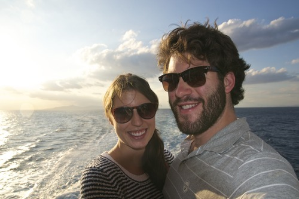

The careening bow of the ship tilts the top two centimeters of my beer ever so slightly, but the violence is contained within the glass. It’s been at least 40 minutes since we spotted land, but the boat continues to cut through the dark blue waters.

Even with such anarchy below, currents ripped up by strong steel propellers powered by mega jet engines, the waiter at the bar adjusts his bow-tie. We were stopped by his colleague for entering the lounge without a ticket, but the maladjusted waiter had recognized me by my choice of adult beverage and waved us through to the comfortable benches and chairs. Such chaos below and such decadence above.

We departed from the Athens port near 17h30, marveling from above at the sheer size of a vessel bound for such a tiny place. The sails are set for Paros, a small island in the Aegean Sea, part of the Cyclades group. It’s 160 kilometers from Athens, but still takes 4 hours by ferry.

I don’t often get to indulge in business class travel, save for the small hops across the Atlantic on stand-by, so I decided to spoil Melanie and get 2 one-percent seats for our maiden voyage to the Greek islands. We had flown to [Santorini](http://im.yael.ca/html/Santorini-1400785996.html) just a few months prior, but the ferry made it more real. It made the difference between a few extra snoozes in an aluminum tube and the feeling of being chugged along Mediterranean waters on a massive hulk of a ship.

I think my fascination with boats begin with my young summers in Saint-Pie, Québec, at my family home. Our backyard had prime access to the Rivière Yamaska. In winters, it was our ice playground. My brothers and cousins would put chairs on the ice and skate endlessly until we were either dizzy or too cold. Summers meant I could see the boats putter up and down without even putting on their blinkers or stopping at traffic lights.

The Yamaska boat captains of yesteryear, most likely local factory workers enjoying their day off, represented total freedom to me at such a young age. They could chose to speed up or slow down, turn left or turn right, and even walk around the deck while the motor pushed on. They weren’t limited by asphalt and followed the flow of the river as their guide.

That’s why the idea of a worldwide voyage by boat excites me. It represents total freedom. It puts man on the ocean and squares him up against mother nature and the forces of the Earth. He can arrive in Buenos Aries just as easily as Capetown, Los Angeles, Perth, or Miami.

With that in mind, Melanie and myself are on day 3 of our Greek adventure. I booked travels in Athens, Paros, Milos, and we’re still deciding what to do with our last 3 days. But because Athens proved to be such a wonder, we just may end up there. We had a great local tour by some friends and were blessed with an amazing AirBnb. Regardless, for now we’re on the open sea and aiming for shore. I’m using the modern marvels of WiFi and electricity while traveling at 20 miles per hour on the water.

Maybe, if we like it so much on the Greek islands, we’ll just stay there. We could save up enough money for a small boat and just sail slowly between the islands. I’d be the captain of yesteryear, only on a larger body of water and with a beautiful Austrian woman on my arm. Total freedom.
