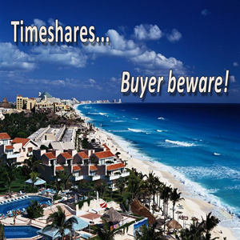

Last year, I won a free trip to a Las Vegas resort.

But it came with a catch: I had to listen to a sales pitch on at least one afternoon of my three-day, two-night stay.

No biggie, I thought. I’d pop in and hear the pitch before I hit the pool.

The trip was offered by a resort company affiliated with a well-known hotel chain. I was connected on the phone with them after confirming another reservation.

When they told me it was a timeshare, I admit I was taken aback. Aren’t timeshares those nightmare long contracts that you can’t ever get rid of? I clicked around, did some research, and canceled my trip. No Vegas resort for me.

But millions didn’t cancel their trip. For years, Americans have looked to timeshares as an affordable means of “owning” their vacations.

The industry is worth an estimated $114 billion globally, and approximately 9.6 million Americans own a timeshare. There are 1,580 timeshares are in the United States, and likely thousands more in locations such as the Dominican Republic, Virgin Islands and Aruba.

Rather than simply booking a hotel or resort temporarily, a timeshare allows vacationers to become joint owners of a property — usually in a tropical location. And properties can be exchanged, meaning you switch your six-day stay in the Bahamas for a European vacation in the south of France.

By pooling ownership with other people, the costs of “owning” are low. It becomes a monthly payment like any other, like a cable bill or car loan. But that’s exactly where the comparison stops.

Unlike cable or phone bills, timeshare contracts are often convoluted, the costs are hidden, properties aren’t all they’re made out to be, and it’s virtually impossible to get out of one.

Thousands of stories profiled on sites like [ripoffreport.com](http://ripoffreport.com/) detail stories of services not being honored, blackout dates that stretch all desirable months, and properties looking completely different than in the brochures. In many cases, the maintenance fees unexpectedly jump into the thousands.

There are currently hundreds of class-action lawsuits aimed at timeshare companies for false claims, unfair trade practices and outright fraud.

Financial guru Dave Ramsey calls timeshares a terrible investment. “Timeshares are basically getting you to prepay your hotel bill for 20 years,” he writes on his website. He recommends setting money aside monthly for paying for vacations directly, rather than an ownership payment plan brokered by timeshare companies.

The American Resort Development Association, the trade group that represents the timeshare industry, dedicates much of its efforts to protecting consumers. It shares lists of fraudulent companies and offers a hotline to those who smell a questionable transaction.

But those efforts sometimes aren’t enough to catch the bad actors.

The Federal Trade Commission catalogs the timeshare process and warns about unscrupulous business practices that have ensnarled would-be vacationers.

The setting is familiar: a group of people is hosted in a nice resort conference room, an open bar beckons, and consumers are told to enjoy as much as they can. After slick presentations, sales representatives push individuals to sign contracts for dream properties. Some even offer to open credit card accounts. Once the contracts are signed, some individuals have trouble even booking their supposed property for whole ranges of dates, not to mention “access fees” to even visit.

Not doing your homework and bad business deals aren’t illegal in themselves, but they’ve still been the subject of many lawsuits. No doubt, many class-action lawsuits are tenuous and don’t rise to the category of an actual injury or tort. But being swindled and blinded into signing a multiyear contract with opaque terms? That’s different.

It’s no surprise that the timeshare industry is riddled with shady businesspeople with sour reputations and histories to boot.

One example is Austrian Markus Wischenbart. He spent two and a half years in prison for timeshare fraud, yet today runs a multi-billion dollar timeshare company called Lifestyle Holidays Vacation Club. There are currently 19 pending lawsuits against the group in the Dominican Republic. The Dominican press has dubbed him the ultimate timeshare “villain,” and former Dominican Republic attorney general Angel Lockward has made it his mission to uncover the misdeeds of the timeshare group and its owners.

Not to be outdone, the timeshare exit industry, whereby timeshare owners hope to sell their properties and be relieved of their contracts, is also ripe with fraud.

Recently, Washington state Attorney General Bob Ferguson filed a lawsuit against Timeshare Exit Team for allegedly extorting and threatening hundreds of timeshare owners, damaging their credit by unknowingly filing bankruptcy on their behalf.

Other companies have been targeted by investigative journalists for charging exorbitant fees and then disappearing, leaving consumers tens of thousands of dollars out of pocket. Some lucky people have been able to get their money back.

That said, there are thousands of happy timeshare owners in the United States who haven’t had to face their problems. Rigorous self-regulation by the industry and consumer groups have helped many people avoid this fate.

But no one wants to be duped into a business deal, especially when it means not getting the vacation you deserve. Consumers should beware of what they’re signing for when they receive the pitch, and do their homework.

_Published on [InsideSources.com](https://www.insidesources.com/are-timeshares-the-ultimate-vacation-racket/)_

[https://www.chieftain.com/opinion/20200219/are-timeshares-ultimate-vacation-racket](https://www.chieftain.com/opinion/20200219/are-timeshares-ultimate-vacation-racket)
