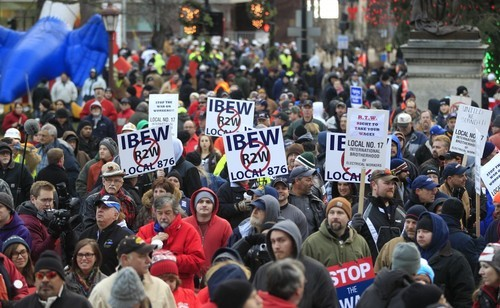

Another article of mine was [reprinted on Reason’s website](http://reason.com/archives/2012/11/26/florida-weighs-corporate-welfare-for-new), this time on Michigan passing “right-to-work” legislation. 

**Reason** is a libertarian magazine that features great commentary and analysis on the pressing issues of our day.

Enjoy:

[Yaël Ossowski](http://reason.com/people/yael-ossowski/all) | Dec. 11, 2012 2:55 pm

> Overcoming the large crowds that have descended upon the capital, Michigan House members approved legislation allowing workers to freely decide whether they wish to pay union dues as a condition of employment.
> 
> Fights have broken out in front of the Capitol, and at least one warming tent has been torn down.
> 
> Watchdog.org’s Matt Kittle spoke with reporter Ryan Ekvall who is in Lansing, and saw the mob tear down the AFP tent.  
> The bill is the first of two considered by lawmakers, applying to workers in both government and private-sector unions.
> 
> The Republican-led House on Tuesday adopted one measure by a 58-51 vote, freeing government workers from compulsory union membership. A second bill, for private-sector workers, is expected to be passed later Tuesday.
> 
> Adoption of the laws would make Michigan the 24th “right-to-work” state.
> 
> Gov. Rick Snyder has indicated that he will sign the bills as early as this week.
> 
> Shouting “Kill the bill,” demonstrators attacked the warming tent of Americans for Progress, a conservative organization that supports the right-to-work legislation.
> 
> Unlike the labor battle in Wisconsin, which prompted the failed recall election of Gov. Scott Walker, Michigan union groups in the private and public sectors will still be entitled to collectively bargain for wages and benefits.
