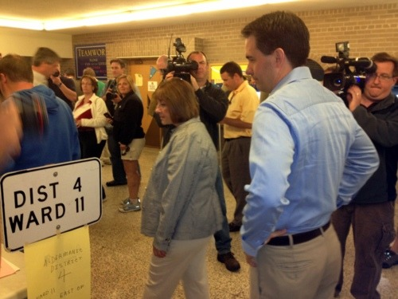

By Yaël Ossowski | Wisconsin Reporter

> MILWAUKEE— Voter number 51 at Jefferson Elementary School in Wauwatosa. As a testament to fair democracy, despite the sea of millions of ballots to be cast in the Badger State gubernatorial recall election Tuesday, this single vote is counted just like any other.
> 
> Though the ballot cast was that of Gov. **Scott Walker**, the man facing off against Democratic Milwaukee Mayor **Tom Barrett** in a high-stakes gubernatorial recall election watched nationwide, the modesty of the voting process was enough to remind supporters and opponents that an orderly process exists for changing political leaders.
> 
> Without pause, the governor queued up behind dozens of voters with surprised looks, reminded by his security detail that he could bypass the line.
> 
> “No, it’s fine,” he declared, taking up his wife’s hand and smiling at his father, Llew Walker, who stood in line behind him.

Read more: [Wisconsin Reporter](http://www.wisconsinreporter.com/at-small-suburban-elementary-school-in-wisconsin-walker-casts-vote)
