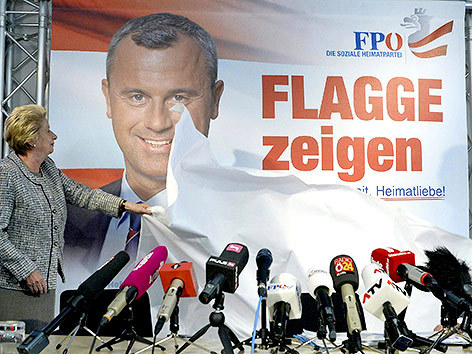

A modern visitor to the vibrant Alpine Republic of Austria can be forgiven for succumbing to its charm, beauty, and permanent sense of order.   

From the stunning Alps in the west to the cobblestoned streets of the Imperial City of Vienna in the east, it’s a majestic country which boasts great pride from its 8.5 million inhabitants. It’s delightful in spirit, neutral in foreign affairs, and has one of the most stable political systems in all of Europe. 

But if one is to receive their news from the Anglo-American establishment, it would seem that Austria is just one step away from its horrid past of the 1930s and 40s. 

That’s the image projected by outlets such as the New York Times, The London Telegraph, and the BBC, who foreshadow marches of men with armbands and rounding up of undesired residents. 

It’s a shameful trope practiced by [dozens of journalists](http://blog.yael.ca/post/130197171719/vienna-nazi) and outside commentators who write about Austria. A tiresome and facile posture which makes the domestic population both ambivalent to outside opinion, and spiteful in the same fell swoop. 

These facile arguments make a caricature of the people of Austria, slandered as being just two elections away from totalitarianism. 

As someone who has voluntarily called Austria home for the last several years, it’s more than galling to hear the “warning cries” from abroad, often invoked by people whose consummate knowledge on Austria is derived from one-too-many viewings of The Sound of Music. 

In the wake of the first round win of Freedom Party Presidential Candidate Norbert Hofer in April and the subsequent resignation of Chancellor Werner Faymann on May 9, the Social Democratic Party leader in power since 2008, the high-browed opinion of the establishment in London, New York, and Washington has been predictable. The second round election will take place on May 22nd, and it hasn’t stopped the slander from abroad.

The fact that Austrians are becoming skeptical of the same two political parties that have governed the country for the past 70 years, the Austrian People’s Party and the Social Democratic Party, is tantamount to endorsing genocide and fascism in the eyes of these observers. It’s despicable and irresponsible.

“History’s shadow of rabid nationalism and xenophobia — kept at bay since the end of World War II — is already lengthening across the Continent,” warns the erudite [New York Times Editorial Board](http://www.nytimes.com/2016/05/13/opinion/austria-and-the-future-of-europe.html?_r=0). 

“The Freedom Party has its roots in Austria’s ugly Nazi past,” it wrote last Sunday in its pages. “More recently, it has taken up far-right European nationalist, anti-immigrant and anti-Islam themes.” 

To explain modern politics, the BBC [invokes hordes of Austrians darting to Heldenplatz](http://www.bbc.com/news/world-europe-36150807), the “emblematic square in central Vienna where Hitler chose to celebrate the annexation of Austria in 1938.” 

 The Financial Times [cites the work of famed Austrian author Joseph Roth](http://www.ft.com/intl/cms/s/0/a67a840c-0ad4-11e6-b0f1-61f222853ff3.html#axzz48inmHwKm), and provides an anachronistic twisting to forebode the obvious danger. 

“We cannot know exactly what Roth, who loathed Nazism, would make of the rise of Austria’s far-right Freedom party,” they write. “But we can surmise that he would be deeply worried.” 

During the Vienna city elections in September 2015, a British journalist [parachuted into town](http://mobile.nytimes.com/2015/09/30/world/europe/rise-of-austrian-right-lengthens-shadow-of-nazi-era.html?smid=fb-share&_r=1&referer=http://m.facebook.com) and scribbled together what was tantamount to a mass smearing of the entire Viennese population in the New York Times. 

She wrote that behind the beautiful churches and tourist-friendly cafes of Vienna “lurks the legacy of the Nazis who forced Jews to clean sidewalks with toothbrushes.” And that was only the second sentence of a 1,000-word article.

Even worse, modest gains in the polls by the Freedom Party of Austria “shame the country” and “lengthen the shadow of the Nazi era,” according to the author. One would think the Parliament of Austria was deliberating which brand of jackboots to distribute to young paramilitaries storming through the streets.

To point to the obvious, Austria is far from a televised reunion of a Nazi comeback. Indeed, the country of Austria in the year 2016 is worlds away from its existence in the 1930s. 

Its most prized celebrity du jour is Conchita Wurst, a bearded drag queen. Tel Aviv Beach, a bar on the banks of the Danube River, is one of the most popular spots in town for young people. Left-wing protestors who demand [free education](http://unsereuni.at/?page_id=11819&lang=en), marijuana legalization, or support of migrants dwarf any right-wing public demonstration. 

“Nazis out, refugees in!” was the most popular campaign by students at the University of Vienna throughout the fall and the 100,000 refugee supporters [who swarmed Heldenplatz](http://derstandard.at/2000023167422/Fluechtlings-Aktionstag-mit-Demo-und-Konzert) last October. 

While forces condemn the changing of the political tide in Austria, it must be realized that the Freedom Party is still not too far from its domestic political brethren and has great differences with the actual fascist-leaning regimes both in and beyond Europe. 

Presidential hopeful Norbert Hofer’s [platform](https://www.norberthofer.at/) represents approximately 90 percent of the same agenda as the rest of the main political parties in Austria: skeptical of foreign treaties, protection of social welfare and state services, some mild curbing of the debt. Rhetoric about immigration is hot and plenty, but the same is seen by members of the two leading political parties. 

Is this in anyway comparable to the very real tyranny which already controls state institutions not far from Vienna’s gates?

In Turkey, there is the rise of an [actual authoritarian leader](http://www.economist.com/node/21689877/print) in President Recep Tayyip Erdogan, who has jailed journalists, shut down newspapers, stifled free speech, diluted the power of the judiciary, and sought greater executive power through constitutional change. 

In neighboring Hungary, Prime Minister Viktor Orban has [followed much the same playbook](///10-journalists-resign-over-covert-funding-of-hungarian-news-website), watering down judicial power and subverting the nation’s press. Both are actual despots who are actively taking away liberties from people in their populations.

The condemnations are plenty for ring-wing populism in Austria, but there is no conceivable situation what has happened in Turkey and Hungary would or could happen in Austria in 2016. The institutions are too strong and democracy too present. Which is why Austria has enjoyed the success it has had until this point. 

Of course, immigration and refugee policy are a concern, but the same can be said of the half dozen other countries in the region dealing with the hundreds of thousands of asylum seekers who have poured into Europe in the last several years. It is an unprecedented situation which has thrown state institutions into chaos, unable to adapt to such huge numbers of people entering and needing assistance. 

That people would be concerned should not surprise anyone, least not the Anglo-American establishment, [who themselves](http://www.smithsonianmag.com/ist/?next=/history/us-government-turned-away-thousands-jewish-refugees-fearing-they-were-nazi-spies-180957324/) don’t have a great record when it comes to accepting refugees in times of peril. And weighing the small numbers of refugees considered for the United States and Britain and the [overblown outrage](http://www.newsweek.com/why-us-not-doing-more-help-syrian-refugees-369539) that ensued, the Austrian response is as mild as vanilla.

That being said, any parallel of the 1930s to today is ludicrous. 

In those times, Austria was still living through the hardship of losing its place as the preeminent cosmopolitan empire of continental Europe. It had lost a war, suffered hyperinflation, lost most of its territory and shrunk from a population of 50 million subjects to just 8 million. Radical forces swung into place, enabled by the even worse conditions in war-torn Germany.

After the bloodshed of years past and the subsequent decades of peace and progress, Austria has risen to become a great country with industry, capital, and stability. It is a great place to invest, a crossroads of Europe, and its capital of Vienna has been voted the “[most livable city in the world](https://www.wien.info/en/lifestyle-scene/most-livable-city)” seven times in a row.

For the elementary commentators still stuck in their World War Two textbooks, such an Austria is not conceivable. But it grows nonetheless.

Despite being constantly reminded of its Nazi past, reinforced by the former Allied powers even today, Austria has forged its own existence. It is a rich and stable country with a multicultural population. 

The opening of borders, thanks to the Schengen Act has helped this. A more open market economy has propelled it. Stable social policies have given a large safety net to its citizens. Perhaps too large and not well equipped to face the future, but far from a fascist haven. These facts are conveniently tossed when examined by the establishments across the English Channel or Atlantic Ocean. 

That being said, populism is a concern, whether left-wing or right-wing. Most of Latin America has been plagued by the former for over two decades and it has had disastrous results. Some members of the FPÖ do represent factions of the latter, but only in matters of immigration and come nowhere near to the days of extinguished liberty in 1930s and 40s Europe. 

While there may be some disagreement on the gravity of proposed policies by opposing political forces in Austria and abroad, the temptation to resort to an immediate invocation of the past must be eliminated. Both abroad and at home.

The people of Austria deserve better and should at last be free to engage in the same political reality as every other modern, democratic country.
