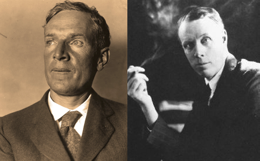

At present, I’m making my way through Sinclair Lewis’ _It Can’t Happen Here._

It’s a rather dated novel, detailing the rise of a fascist American leader who employs typical patriotic tropes, slogans, and attitude during the election of 1936.

Many today would like to [make the obvious connection](http://time.com/4574009/donald-trump-sinclair-lewis-it-cant-happen-here/) to the rise of President-Elect Donald Trump. I think that’s a bit off (considering the rather dim political view of the 1930s cannot compare to today) and I’ll likely explore in a future post.

There is much to take from the novel, hastily written in the fall of 1935 by Lewis. 

It was put together in the context of fascism taking root in Italy and Germany, and progressive, socialist, and populist waves gaining their own strength in Depression-era America. 

The book takes liberties with mentioning several real-life political and literary figures whose ideas are either explicitly used or rejected by the supposed fascist leader, “Buzz” Windrip.

The protagonist, Doremus Jessup, editor of a small town Vermont newspaper, claims his stake as a key dissident of the regime. He pens scribes to excoriate the rise of the Windrip phenomena and the accompanying “Minute Men” who whip and beat any opposition to Windrip’s rule. Think Yankee Doodle brownshirts.  

What interests me most, however, is the fascinating back story and source material which compounds both socialism and fascism in Lewis’ writings. And it begins with his many literary and political influences.

In the course of the book, Lewis often invokes the name of Upton Sinclair, another American author who modern readers will likely assume to be a relative of Lewis’, as a huge influence. He even dubs him “Honorable.” For good reason.

Lewis mentions the very real **EPIC plan** Upton Sinclair used as the basis for his 1934 socialist campaign as the Governor of California as an influence for the fictional fascist leader. It’s a forgotten piece of history due for revision. 

The EPIC plan was revealed in the vociferous essay written by Upton Sinclair as his manifesto to the people of California: _[I, Governor and How I Ended Poverty: A True Story of the Future.](https://depts.washington.edu/epic34/docs/I_governor_1934.pdf)_ 

In 1933, Sinclair abandoned the Socialist Party to join the ranks of the Democratic Party for a chance to win the gubernatorial race in bustling state. But his socialist ideals were still very much the rage in his platform. The nationalization of large farms, a guaranteed basic income to the poor and elderly, and an eventual replacement of the free enterprise model. No more would scrupulous capital owners bully the poor and unemployed.

Acclaimed author Greg Mitchell, one of the [premier historians](https://www.amazon.com/Campaign-Century-Sinclairs-Governor-California/dp/1468075721) of Sinclair’s gubernatorial run and a fascinating writer on the left, [described the EPIC plan and the 1934 run](http://gregmitchellwriter.blogspot.co.at/2010/10/my-classic-book-just-published-in-new.html) as the birth of the modern political campaign. For the first time, there were significant political consultants, national fundraising, and extensive attack ads in a state race. Hollywood had inserted itself into the political word.

I saw the modern version of that in the 2012 gubernational recall election of Wisconsin Govnor Scott Walker, [which I covered for Watchdog.org at the time](http://watchdog.org/19140/walker-with-scs-haley-builds-on-message-at-sussex-factory/). There were forces from across the country who converged on Wisconsin to fight for their political convictions, conservative grassroots, union activists, and all in between. Governors from southern states, Hollywood celebrities, big media, and political operatives of all stripes camped out in Wisconsin to stake their claim to a victory or die trying.

A simple state recall election had been elevated to the level of a national battle between epic political forces, much like the 1934 California Governor’s election.

In that sense, one can see obvious parallels between the Sinclair EPIC plan and that of Vermont Sen. Bernie Sanders in 2016. 

Much like Sinclair, Sanders abandoned his socialist label to fight for the Democratic Party nomination, albeit for the presidency. He talked about nationalizing the banks, making university education cost-free for students, and offering social security and medicare to increased numbers of the population. [All 21st century ideas, but Sinclair-esque flavor](http://www.americanthinker.com/articles/2014/12/bernie_sanderss_12point_socialist_plan_for_america.html).

It’s in this vain that Sinclair Lewis threw Upton Sinclair into the mix of the making of a fascist leader in a fictional 1930s America.

In his [expansive article](http://www.nybooks.com/articles/1992/10/08/the-romance-of-sinclair-lewis/) on Lewis’ contributions to the literary world, philosopher and critic Gore Vidal focused a great deal on the relationship with the older Upton Sinclair when they met in the early 1900s.

Lewis interned for two months in 1906 at the Helicon Home Colony, a sort of commune masquerading as a socialist utopia in rural New Jersey concocted by Upton Sinclair. He planned it as a haven for artists and authors who craved collectivism and eradication of the master-servant relationship, according to his [article in the _Rock Island Argus_](http://chroniclingamerica.loc.gov/lccn/sn92053934/1906-06-22/ed-1/seq-9/#date1=1906&index=15&rows=20&words=colony+UPTON&searchType=basic&sequence=0&state=&date2=1906&proxtext=Upton+colony&y=0&x=0&dateFilterType=yearRange&page=1) in the summer of 1906. The colony later burned to the ground and was quickly forgotten.

It was from this relationship that the elder Sinclair later came to know Lewis’ writing. He offered prescient advice:

“Everything of yours that I have read is about half and half…wherever you are writing about the underworld, you are at your best, and when you come up to your own social level or higher, you are no good,” [Sinclair wrote to Sinclair Lewis](http://sinclairsquared.blogspot.co.at/2014/02/upton-mentors-sinclair.html).  

What is made clear in _It Can’t Happen Here_ is surely informed by Lewis’ time under Sinclair’s tutelage. The grand plans of socialism are doomed once put into practice, several characters surmise, even before the rise of Windrip. But fascism can somehow use that existing path and exploit it for its own. 

It’s a great commentary on the complementariness of the ideologies we’re so often told are worlds apart and represent totally opposing forces. 

It turns out they’re not so different in that they remove the individual from the natural governing order and supplant him with a larger, more necessary force, whether that is the General Welfare guaranteed by socialism or the Great State of Our Nation enforced by fascism.

The truth is that both socialism and fascism would be very difficult to implement in a country as vast and institutionally protected as the U.S. At least for now.

But that their adherents will stop trying is as false as the notion that we can all be productive and happy on a New Jersey farm commune, throwing shade and every up and coming writer.

Maybe it can happen here.

_Here’s a clip on Upton Sinclair’s 1934 California Gubernatorial run which may be of interest._
