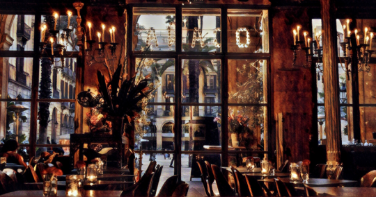

Beyond the café window, there’s a young girl squeezing her schoolbooks between her clasped arms. Her round glasses sit low on her nose, and her long brown hair swings from side to side.

She’s waiting on the light to change, her head quickly darting to and fro to anticipate the bustle of horn-friendly cars. The maroon blouse around her shoulders and torso flutters as the cars go by. Her stance is so innocent, yet guarded. I can’t for the sake of me make out what the books in her arms are, but they look like textbooks on architecture and design. The corners are bent in and yellow post-it notes poke out from the top and bottom of the books.

I can imagine she has a full day of lectures praising the latest trends in modern architecture: the large slanted buildings with windows the size of small space shuttles and big, swooping arches made of marble. There’s probably a lot of heated debate over which style is best, and what future architects should do to make their mark in the competitive world out there. Maybe they argue and fight and spit to make their point heard. But not her.

She’s probably spent nights and weekends studying those books clutched in her arms, trying to edge out her classroom rivals and peers to spark her career and build her dream office in Barcelona’s Gràcia neighborhood. It’d be the prettiest and the most elegant office in Catalonia, and it’d be as unassuming and innocent-looking as the girl waiting at the crosswalk.

The light changes, and her legs carry her across the street. Another innocent girl off to meet the world.

You see, beyond that café window, there’s a lot that people are arguing about.

On this trip, as with every trip to a city that wasn’t my own, I opened the local newspaper to get the gist of the local sex and scandal. It’s my favorite way to blend into the crowd. And here, there was plenty of the scandal.

Page 3 had a huge exposé with pictures and bloodied faces. Policemen and crowds, banners and shouting faces.

Beyond that café window, there was a struggle for national identity and political control. I didn’t know much about it, but I saw plenty of nostrils flare up at the mention of it. Especially the whiskered Catalonian gentleman seated to my left inside the café, enjoying his café solo by himself but loud enough for anyone within earshot.

From what I gathered, Catalonia tried to organize a region wide vote on whether or not to be independent from her mother Spain. “Nada estaba roto!” exclaimed the whiskered gentleman. If it ain’t broke, don’t fix it.

Some patrons took issue with his quip and began a small argument. A young tattooed fellow with an apron from the café, his hands hot off the espresso machine, engaged him directly. They argued about Madrid, the rule of law, and political prisoners. “Estamos una nueva generación!” It was the most exciting thing I’d seen all day.

I followed along like a boxing spectator, but had to tap out once they switched to Catalan, which I didn’t understand. Now it was just another foreign struggle just beyond my comprehension, like outside the café window.

I thought back to the girl and her tightly clutched books.

She was just as much a part of this ordeal. Presumably, she lived here and probably had an opinion about it. Her grandparents probably told her about how they had to abandon their Catalan tongue during the dictatorship of Franco.

Maybe she even sided with the tattooed barista. Spain was surely a different beast now, but I didn’t know how that’d change her mind. I wonder she would have fareed in this fight. But maybe she wouldn’t fight at all.

Maybe she was more interested in her books and her designs for that future office in Gràcia.

At least there, she controlled everything, from the swooping arches to the huge glass windows the size of small space shuttles, even what kind of coffee they’d serve in the lobby. There wasn’t any complication notion of nations, languages, or borders. Just that beautiful and innocent office, parked on an unassuming corner.

To me, her future seemed better than anything conjured up by the Catalonian debaters in the café. They were angry, and she seemed happy.

What would happen if I could clutch books all innocently like that and think of the world in the same way? Would I still be stuck inside this café, listening to an endless debate? It was time I took my cues from the innocent girl.

_Originally published on [Devolution Review](https://devolutionreview.com/beyond-the-cafe-window/)._
