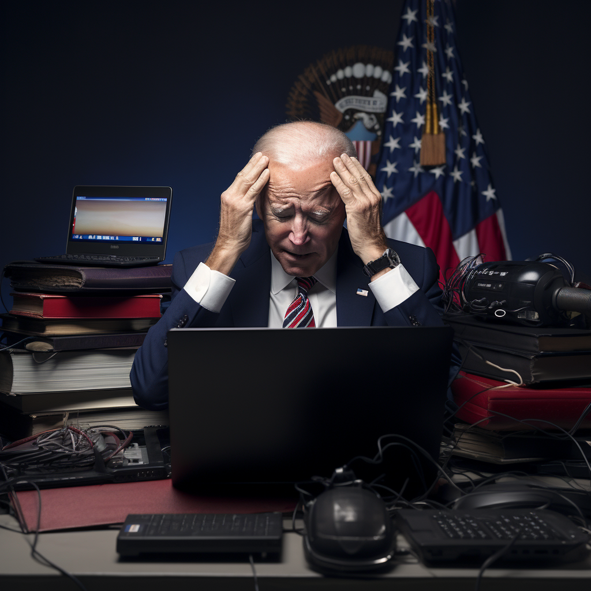

## **The European approach to AI regulation will prevent its future expansion.**

Last week, President Joe Biden [unveiled an executive order](https://www.whitehouse.gov/briefing-room/statements-releases/2023/10/30/fact-sheet-president-biden-issues-executive-order-on-safe-secure-and-trustworthy-artificial-intelligence/) that marks the beginning of a U.S. regulatory path for artificial intelligence. The order is a prelude to forming a U.S. AI Safety Institute, housed within the Department of Commerce—[announced by Vice President Kamala Harris](https://www.whitehouse.gov/briefing-room/statements-releases/2023/11/01/fact-sheet-vice-president-harris-announces-new-u-s-initiatives-to-advance-the-safe-and-responsible-use-of-artificial-intelligence/) in the UK last week. This period of “[close collaboration](https://www.politico.eu/article/uk-us-slated-to-announce-ai-safety-partnership/)” with the UK and EU is a considerable threat to decades of American leadership in tech.

Rather than embracing traditional hallmarks of American innovation, the Biden administration seems intent on importing some of the worst aspects of Europe’s fear-driven and burdensome regulatory regime. If the current approach continues, AI innovation will be smothered, overly surveilled, and treated as guilty until proven innocent. 

Two distinct worlds are taking shape on each side of the Atlantic regarding the future of artificial intelligence and its benefits.

The first is one with cutting-edge competition between large language model developers, open-source software coders, and investors tooling the best practical applications for AI. This comprises ambitious startups, legacy Big Tech companies, and every major global corporation looking for an edge. As anyone can guess, a high percentage of early movers in this category are based in the United States, with close to [5,000 AI startups and $249 billion](https://aiindex.stanford.edu/wp-content/uploads/2023/04/HAI_AI-Index-Report_2023.pdf) in private investment. This space is hopeful, energetic, and forward-looking. 

The second world, languishing behind the first, is characterized by bureaucracy, intense approval processes, and permitting. The predominant mindset around AI is threat mitigation and a fixation on worst-case scenarios from which consumers must be saved. 

Europe is that second world, guided by the nervous hand of its Commissioner for Internal Market, [Thierry Breton](https://ec.europa.eu/commission/presscorner/detail/en/STATEMENT_23_3344), a key foe of American tech firms. Breton is the face of [two sweeping digital EU laws](https://ec.europa.eu/commission/presscorner/detail/en/STATEMENT_23_3344) that place additional burdens on tech firms hoping to reach European consumers. 

On AI, Breton’s distinctly European approach is entirely risk and compliance-based. [It requires that generative AI products](https://digital-strategy.ec.europa.eu/en/policies/regulatory-framework-ai), such as images or videos, are slapped with labels, and specific applications must undergo a rigorous registration process to determine whether the risk is unacceptable, high, limited, or minimal.

This process will prove restrictive to an AI industry that is constantly changing and ensure that tech incumbents will have a compliance advantage. EU regulators are accustomed to dealing with the likes of Meta and Google and have established some precedent for subordinating these high-flying American companies. 

It’s a convoluted system that EU bureaucrats are happy to champion. They adopt burdensome rules before the industries even exist, with the hope of maintaining a certain status quo. As a result, Europe lags far behind the investment and innovation taking place in the United States and even China. 

At present, the United States hosts a significant portion of the AI industry—whether it be Meta and Microsoft’s open-source large language model known as [LLAMA](https://ai.meta.com/blog/large-language-model-llama-meta-ai/), OpenAI’s [Chat-GPT](https://chat.openai.com/auth/login) and [DALL-E products](https://openai.com/blog/dall-e-3-is-now-available-in-chatgpt-plus-and-enterprise), as well as Midjourney and Stable Diffusion. This is not a fluke or bug in the international order of tech innovation. America has a specific ethos around entrepreneurial risk-taking, and its regulatory approach has historically been reactive.

While President Biden could have taken that as a signal that a light touch is needed, he has instead taken the European route of “command and control,” a way that may prove even more expansive.

For instance, Biden’s executive order invokes the [Defense Production Act](https://www.cfr.org/in-brief/what-defense-production-act), a wartime law designed to help bolster the American homefront in the face of grave outside threats. Is AI already classified as a threat?

Using the DPA, Biden [requires](https://www.whitehouse.gov/briefing-room/statements-releases/2023/10/30/fact-sheet-president-biden-issues-executive-order-on-safe-secure-and-trustworthy-artificial-intelligence/) that all companies creating AI models must “notify the federal government when training the model, and must share the results of all red-team safety tests.” Like the European risk system, this means firms will have to constantly update and comply with regulators’ demands to ensure safety.

More than increasing compliance costs, this would effectively lock out many startups who wouldn’t have the resources to report how they’re using models. Larger, more cooperative firms would swoop in to buy them out, which may be the point.

Andrew Ng, a co-founder of Google’s early AI project, [recently told](https://www.afr.com/technology/google-brain-founder-says-big-tech-is-lying-about-ai-human-extinction-danger-20231027-p5efnz) the Australian Financial Review that many incumbent AI companies are “creating fear of AI leading to human extinction” to dominate the market by directing regulation to keep out competitors. Biden appears to have bought that line.

Another aspect that threatens existing development is that all firms creating models must report their “[ownership and possession](https://www.klgates.com/President-Biden-Issues-Wide-Ranging-Executive-Order-on-Artificial-Intelligence-11-3-2023#:~:text=Within%2090%20days%20of%20the,of%20the%20models'%20training%20and).” Considering Meta’s LLAMA, the largest model produced thus far is written as open-source software, it is difficult to see how this could be enacted. This puts the open-source nature of much of the early AI ecosystem in jeopardy.

Is any of this truly necessary? [Singapore](https://www.weforum.org/agenda/2023/01/how-singapore-is-demonstrating-trustworthy-ai-davos2023/), which has a nascent but rising AI industry, has opted for a hands-off approach to ensure innovators create value first. In the early days of Silicon Valley, this was the mantra that turned the Bay Area into a global beacon for tech innovation. 

This impetus to regulate is understandable and follows Biden’s ideology. But if Washington takes the Brussels approach, as it seems to be doing now, it will risk innovation, competition, and the hundreds of billions in existing AI investments. And it could be precisely what the incumbent big players want.

Congress should step up and rebuff Biden’s “phone and pen” approach to regulating a growing industry. 

To ensure American leadership on AI, we must embrace what makes America unique to the innovators, explorers, and dreamers of the world: a risk-taking environment grounded in free speech and creativity that has delivered untold wealth and surplus value for consumers. Taking our cues from European superregulators and tech-pessimists is a risk we can’t afford.

[_Yaël Ossowski_](https://consumerchoicecenter.org/team/yael-ossowski/) _is a consumer and technology advocate and deputy director at the Consumer Choice Center. He tweets at_ [_@YaelOss_](https://twitter.com/YaelOss)_._

_Published in [The National Interest](https://nationalinterest.org/blog/techland/biden%E2%80%99s-ai-%E2%80%9Ccollaboration%E2%80%9D-europe-will-hurt-innovation-207167) ([archive link](https://archive.ph/WLr2u))_
