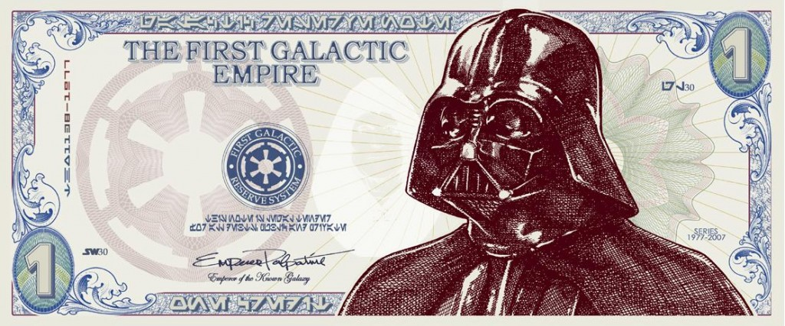

By **[Yaël Ossowski](http://panampost.com/author/yael-ossowski/ "Yaël Ossowski")** | [PanAm Post](http://panampost.com/yael-ossowski/2014/03/11/bitcoin-responding-to-the-pessimists/)

Worthless, invisible, and impractical. Impossible for the poor to use. A fantasy of the privileged.

For devotees of cryptocurrencies such as bitcoin, these pessimistic criticisms are ceremoniously raised in conversations and articles invoked by skeptics.

In the viral YouTube video “[Shit Bitcoin Fanatics Say](http://www.youtube.com/watch?v=reo7WbibxaQ&feature=youtu.be),” the rudimentary objections to the digital currency are laughingly brought up in true comedic fashion, highlighting the certain fan-boy attitudes of many early adopters who have gone all-in for bitcoin.

And as the currency grows in popularity, under increasing scrutiny by the state and regulatory agencies, answering these claims remains important and vital in order to protect free transactions of bitcoin going forward.

To begin, the first inevitable claim voiced by leery onlookers is that bitcoin has no intrinsic value. Rather than offer people a physical currency that can be seen and traded in the streets, the digital currency exists only as ones and zeros in the realm of cyberspace, and isn’t backed by anything of substantial worth.

Modern currencies are almost always backed only by governments.

As is often pointed out, the same argument can be made against standard fiat currencies such as the US dollar, or the Euro. While these currencies have governments backing them up, they continue to thrive only because there is an inherent belief that the government will guarantee them, no matter the circumstances.

“Fiat money, if you like, is backed by men with guns,” [said _New York Times_ columnist](http://www.businessinsider.com/paul-krugman-on-bitcoin-2013-12) and Nobel Prize-winning economist Paul Krugman. “Bitcoin is not.”

But since governments entities themselves are prone to bankruptcy, a coup d’état, and invasion, even major fiat currencies run the risk of losing their complete value. Holders of [Venezuelan bolívares](http://blog.panampost.com/carlos-garcia/2014/01/27/venezuelas-currency-control-slow-painfull-death-economy/) or [Argentinean pesos](http://blog.panampost.com/manuela-gonzalez-cambel/2014/02/07/why-the-us-dollar-still-rules-the-roost-in-argentina/) know this reality all too well, not to mention the [monetary failures](http://www.forbes.com/sites/greatspeculations/2010/12/10/5-failed-currencies-and-why-they-crashed/) in Zimbabwe, Peru, and Chile. Apologies to Krugman.

There will always be a value to transferring money across national borders at [little or no fee](http://thestatelessman.com/2013/06/03/using-bitcoin/), which bitcoin allows anyone in the world to do. Anyone who has ever traveled to a foreign country or tried to send money anywhere else knows this. Therefore, it is clear that the market will find value in bitcoin, just as much or even more than fiat currencies enforced by the state.

Bitcoin, unlike all fiat currencies, is completely voluntary.

No one is forcing anyone to set up a Bitcoin wallet, put money in exchanges, or use QR codes to complete Bitcoin transactions online or in brick and mortar stores. People are not coerced to hand over portions of their digital income, nor are they responsible for settling various debts by use of Bitcoin.

This is the exact opposite of current fiat currencies maintained by governments, even to the point of [arresting and jailing anyone](http://en.wikipedia.org/wiki/Liberty_Dollar) who happens to introduce some form of alternative currency, such as currency pioneer Bernard von NotHaus, creator of the “Liberty Dollar.”

It is this simple fact that negates all criticism about legality, adoption, and practicality. Bitcoin is a monetary alternative, as it was [envisioned by its founder](https://bitcoin.org/bitcoin.pdf).

Some, like libertarian mascot Jeffrey Tucker, make the claim that bitcoin will “[end the nation state](https://www.youtube.com/watch?v=qwy5kgwvzE4)” and completely obliterate fiat currencies. It may very well, but that’s not the goal of the currency itself, nor of the majority of its users. That remains secondary to the simple prospect of bitcoin as an alternative to the economic and monetary systems that impose certain constraints on entrepreneurs and customers.

Much more than giving users a financial alternative, cryptocurrencies such as bitcoin also empower individuals to make alternative contracts and legal arrangements, which exist outside any state-controlled system.

“I came to the \[Texas Bitcoin\] conference expecting to hear about private money, but instead it’s been about private law,” said economist Robert Murphy recently on an episode of [Free Talk Live](http://soundcloud.com/freetalklive/free-talk-live-2014-03-05/download).

Rather than only the economic question about what defines a currency, many early adopters have elevated the discussion to the virtues of private contracts and regulation between consenting individuals, which bitcoin allows. I’ve already purchased food, drinks, coffee, web servers, and VPNs with Bitcoins, and I’ve been able to do that on my own terms, set in the course of the transaction. Much the same applies to the dozen or so [anonymous markets](http://www.youtube.com/watch?v=CtVypq2f0G4) that exist on the [Tor network](https://www.torproject.org/).

The last significant criticism of bitcoin is much less about the currency and more about those lining up to be early adopters.

Certain [progressive outlets](http://thinkprogress.org/economy/2014/02/27/3341411/bitcoin-privilege/) and pseudo-libertarian commentators have labeled Bitcoin a currency of the “privileged,” owing to its great resonance among tech-savvy, young, and white males in developed countries.

Certainly, for the tech-disadvantaged, there is a question of how they can adopt Bitcoin. In rural villages of Ecuador, Pakistan, or the Central African Republic, the idea of a digital currency backed by an algorithm isn’t likely to inspire confidence.

But it must be reiterated that bitcoin is an alternative used to empower these individuals beyond the standard fiat currencies mandated by governments. The technology that will advance in these countries will help lift people out of poverty, not condemn them to it. The boon of [cell phone use for mobile payments](http://www.economist.com/node/14505519), certainly among the poor in African countries, has shown great promise for developments in digital currencies, and it will only continue going forward.

Besides, smartphones were once seen as exclusively for the “privileged,” but now nearly [one individual out of every five](http://www.businessinsider.com/smartphone-and-tablet-penetration-2013-10) across the world has one and uses it on a daily basis. It is not inconceivable that such a surge of adoption could happen to bitcoin or another crypto-currency in the coming years.

Though critics may continue to paint bitcoin as nothing more than a digital gamble not backed by the conventional system, it remains an important force for those looking for ways to improve human lives and access to capital and goods.

Rather than try to spark a paradigm shift, all Bitcoin does is introduce an alternative for millions of people hungry for one.

Isn’t that itself worth it?

_This article was published on [PanAm Post](http://panampost.com/yael-ossowski/2014/03/11/bitcoin-responding-to-the-pessimists/)._
