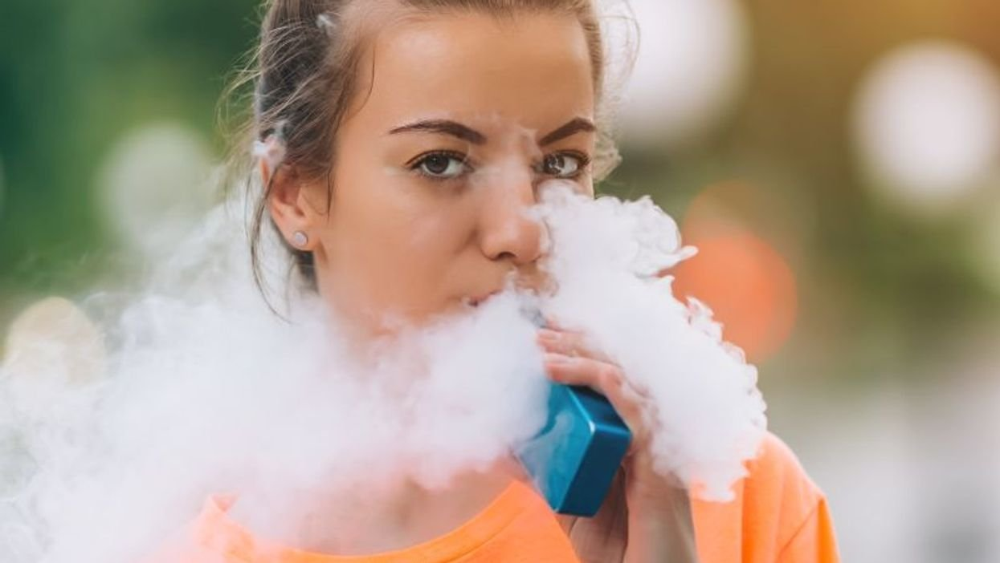

Since the fallout from the effects of the COVID-19 pandemic, there has been a renewed focus on improving global health, and that’s been a welcome sign.

A [study](https://newatlas.com/health-wellbeing/obesity-coronavirus-bmi-disease-death-vaccine-cdc/) produced by the American Centers for Disease Control and Prevention (CDC) found that nearly three-quarters of hospitalized COVID patients were either obese or overweight. At the same time across the European Union, health ministries have put more resources into keeping their populations healthy, using education and incentive programs to encourage children and youth to exercise, eat healthy foods, and more.

Several of these [initiatives](https://www.bloomberg.org/press/releases/tokyo-joins-bloomberg-philanthropies-partnership-for-healthy-cities/) have been funded and promoted by Bloomberg Philanthropies, the chief charity vehicle of American billionaire media executive Michael Bloomberg. His charity focuses on causes Bloomberg passionately has championed for years: climate change, public health, education, and the arts.

In October of 2020, Bloomberg’s charity [partnered](https://www.bloomberg.org/press/brussels-joins-forces-with-bloomberg-philanthropies-to-provide-cleaner-air-to-residents/) with the Brussels-Capital Region Government for an initiative on air pollution and sustainability, boosting his [role](https://www.who.int/news/item/03-02-2021-michael-r.-bloomberg-and-dr-tedros-adhanom-ghebreyesus-call-for-global-focus-on-noncommunicable-diseases-to-save-lives-from-covid-19) as the World Health Organization’s “Global Ambassador for Noncommunicable Diseases and Injuries.”

And while most of Bloomberg’s efforts to improve public health are well-intended, there are cases when the groups he funds are pursuing policies that would be detrimental to the health outcomes of ordinary people, especially when it comes to tobacco control.

Though there is a commitment to reduce tobacco use in middle and low-income countries, a significant part of Bloomberg’s philanthropic fortune has ended up going to [global efforts](https://www.tobaccofreekids.org/what-we-do/global/electronic-cigarettes) to clamp down on novel vaping products, which do not contain tobacco, and have been proven to be [instrumental](https://www.gov.uk/government/news/e-cigarettes-around-95-less-harmful-than-tobacco-estimates-landmark-review) in getting smokers to quit.

Across the globe, as the use of vaping devices has become more widespread, the number of daily smokers has continued to decrease, [hitting](https://worldpopulationreview.com/country-rankings/smoking-rates-by-country) low teen digits in many developed economies. This is an amazing achievement. Regardless of that, many of these charities are still dedicated to their destruction.

The conflation between vapers who use non-tobacco-containing vaping devices, mostly fabricated by small companies out of Asia and Europe, and the tobacco industry, however, has shifted the focus of these billion-dollar health efforts.

In direct competition with the all-powerful tobacco industry, independent companies have created alternative devices that are cheap, less harmful, and provide the real potential to quit. The vast majority of vapers use open-tank devices and liquids that do not contain tobacco, a point that is often glossed over in the debate.

Despite the rise of a technological and less harmful method of delivering nicotine through vaporizers, the well-funded [tobacco control complex](https://www.clivebates.com/tobacco-control-and-the-tobacco-industry-a-failure-of-understanding-and-imagination/) has retooled its efforts to ban vaping outright, using a series of drafted bills, gifts to health departments, and questionable foreign funding of domestic political campaigns.

This has been aided by Michael Bloomberg’s [$1 billion global initiative](https://www.nytimes.com/2019/09/10/nyregion/vaping-bloomberg-e-cigarette.html) on tobacco control.

In the Philippines, a federal investigation revealed that health regulators received [hundreds of thousands](https://mb.com.ph/2021/03/17/foreign-ngo-pushing-for-ban-on-cigarette-alternatives-funded-drafting-of-ph-regulations/) of dollars from a Bloomberg-affiliated charity before they presented a draft bill to outlaw vaping devices. Congressional representatives have complained that the law was presented with no debate, and came only after the large grant was [received](https://maharlika.tv/2021/03/10/solon-slams-premature-fda-issuance-of-e-cig-htp-regulation/) by the country’s Food & Drug Administration.

In Mexico, just this past week, it was [revealed](https://politico.mx/politileaks/politileaks-congreso/intereses-detr%C3%A1s-de-l%C3%B3pez-gatell-y-medel-atacar%C3%ADan-cigarro-electr%C3%B3nico/) that a staff lawyer for the Campaign for Tobacco-Free Kids, one of the largest global tobacco control groups [funded](https://www.tobaccofreekids.org/what-we-do/global) by Bloomberg Philanthropies, drafted the law to severely restrict imports and sales of vaping devices. It is alleged that Carmen Medel, president of the health committee of the Mexican Chamber of Deputies, contracted the charity to “advise” on the law, but ended up [submitting a draft bill](https://www.elheraldodechihuahua.com.mx/local/analizan-prohibir-venta-de-cigarros-cerca-de-escuelas-tabaco-cigarros-venta-noticias-chihuahua-proteccion-6471013.html) that still contained the name of the NGO lawyer who wrote the law.

This is compounded by ongoing investigations into foreign NGO influence on similar policies in [India](https://thewire.in/business/india-bloomberg-scrutiny), where Prime Minister Narendra Modi severed ties with the Bloomberg charity after his domestic intelligence services [raised](https://www.reuters.com/article/india-tobacco-bloomberg-idINKCN1B91AE?edition-redirect=in) concerns.

What makes all of these efforts a tragedy is that a real victory for public health is being stifled in countries that cannot afford it.

In nations where vaping is endorsed and recommended by health authorities, such as the United Kingdom and New Zealand, [real reductions](https://hpa.org.nz/sites/default/files/Final%20Report%20-%20E-cigarette%20use%20and%20perceptions%20among%20current%20and%20ex-smokers%20in%20NZ_Jan%202019_0.pdf) in the number of smokers can be seen.

Unfortunately, though Michael Bloomberg’s charitable giving has been significant and well-intended, the groups that receive that money for tobacco control have made the deadly mistake of equating the cigarette to the real alternative of the vaping device. And that will be to the detriment of global health on a massive scale.

_This article was published in [Brussels Times](https://www.brusselstimes.com/opinion/160680/bloombergs-misguided-push-to-outlaw-vaping-in-developing-nations/)._
