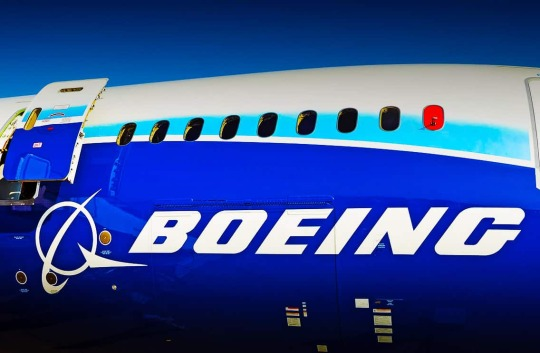

By Yaël Ossowski | [Comment Central](http://commentcentral.co.uk/boeing-proves-protectionism-doesnt-pay/)  

_Yaël Ossowski argues that the Boeing-Bombardier affair shows that waging trade wars isn’t to anyone’s benefit, certainly not consumers, workers, and citizens who have the most at stake._

A stinging rebuke by the U.S. International Trade Commission last month was a hard defeat for Boeing.

The American aircraft manufacturer brought a case to the U.S. Department of Commerce [last fall](https://www.commerce.gov/news/press-releases/2017/09/us-department-commerce-issues-affirmative-preliminary-countervailing-1) in hopes of sinking a deal with their Canadian competitor Bombardier to build narrow-body jets for Delta Airlines.

Agreeing with Boeing’s claims that Bombardier was “dumping” the planes in the U.S. at a cheaper price, the Department of Commerce promptly slapped a 300 percent tariff on the C-Series jets. But that decision was overturned by the ITC [last month](https://www.usitc.gov/press_room/news_release/2018/er0126ll898.htm).

That was a cause for celebration in Canada as well as the United Kingdom, considering parts of the aircraft are fabricated in Belfast and upwards of 4,000 British jobs depend on the C-series jet project. In the U.S., thousands of consumers and travellers will soon benefit from a new fleet of aircraft.

On Feb. 13, we’ll learn the commission’s justifications for overturning the tariffs, which could prompt Boeing to take another approach to tackle its Montreal-based rival.

Beyond that report, what is clear now is that Boeing will have to compete if it wants to outperform the competition. Protectionism, though the mantra in Trump’s D.C., won’t pay. Crony capitalism cannot, in itself, be the main tool used by an international firm that wants to compete in today’s global economy. Entering the arena of politics can have serious blowback.

That’s a lesson the Chicago-based firm will certainly learn after causing flare-ups in London, Washington, and Ottawa. It even put Prime Minister Theresa May’s coalition government with the Democratic Unionist Party, who vowed to protest those Belfast jobs, on shaky ground.

What’s more, the company’s protectionist play has put its lucrative defence contracts in harm’s way. Canadian Prime Minister Justin Trudeau [threatened to pull](http://www.telegraph.co.uk/business/2017/10/12/justin-trudeau-tells-donald-trump-will-block-boeing-contracts/) Boeing’s military contracts, and UK Defence Minister Michael Fallon said their actions “could jeopardise” Britain’s [£500 million relationship](http://www.dailymail.co.uk/news/article-4928436/Boeing-turn-UK-attack-helicopters-trade-war.html) with the aircraft firm to supply attack helicopters and aircraft.

For a company that relies on government contracts for a [large chunk of its profits](http://www.boeing.com/company/key-orgs/government-operations/index.page), this news is concerning.

If Boeing wants to stand its ground, it’ll have to work on rectifying these relationships. Putting jobs at risk in order to stake a monopoly isn’t a good look for business, and it is toxic in politics.

This will certainly serve as a warning to dozens of other multinational firms who hope to leverage trade by seeking government monopolies and tariffs targeted at their fierce competitors.

What this affair has proven, in due time, is that waging trade wars isn’t to anyone’s benefit, surely not consumers, workers, and citizens who have the most at stake.
