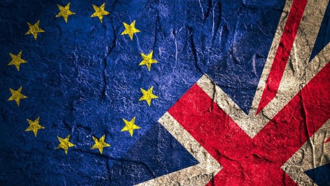

**The United Kingdom Never Fit in the EU in the First Place**

On the fate of Great Britain in the European Union and Brexit, the people have spoken. A good number of them. 

Now, The Mob has been set loose. It’s more vociferous than ever before. But it’s not the gang of thieves you may imagine. 

Not The Mob of club-wielding south Englanders looking to bang up curry shops or Italian cafes. Not the cigar-clutching Nigel Farage fans bursting pint glasses in immigrant neighbourhoods. 

Rather, it’s The Mob of elite persuasion searching for proof of any kind that Brexit was brought on by hoards of knuckle-dragging racists and unworldly knaves. There’s no other rational explanation.

Cue the lazy Twitter search journalism — _can you believe what these people are saying?_

[The Independent](http://indy100.independent.co.uk/article/theres-a-new-campaign-to-document-brexitrelated-racial-abuse--W1WSKn_ZRVb) gave it an early shot. Then [The Guardian](http://www.theguardian.com/politics/2016/jun/26/racist-incidents-feared-to-be-linked-to-brexit-result-reported-in-england-and-wales) took pieced together small events to build a huge “racist Brexiters” narrative. The Washington Post: “[The uncomfortable question: Was the Brexit vote based on racism?](https://www.washingtonpost.com/news/worldviews/wp/2016/06/25/the-uncomfortable-question-was-the-brexit-vote-based-on-racism/)" 

Brendan O’Neill of spiked! magazine has done a [great job](http://blogs.spectator.co.uk/2016/06/the-howl-against-democracy/) deconstructing this narrative in the days since.

The fact that random and unproven tweets can muster evidence on the Internet is troubling enough. The added fact that they’re unquestionably given weight as a first-person reporting by major news organizations is a disgrace.

But that’s another point. 

The bigger focus now is what this shakeup for the European experiment can teach good western liberals about reform, political unions, and immigration. 

For the record, I’ve been living in continental Europe for the past three years, the mass of land many Brits voted to unchain themselves from. Naturally, the fruits of European integration have been more visible on this side of the English Channel, one can freely admit. 

It’s easier to trade, travel, and interact with national neighbors who share natural borders. Continental European states profit greatly from open borders and reduced barriers to trade. [Liberalization of the markets](http://www.cambridge.org/ls/academic/subjects/law/european-law/services-liberalization-eu-and-wto-concepts-standards-and-regulatory-approaches?format=HB) in many central and eastern European countries has led to more investment and a growing private sector.

[Efforts to root out corruption](http://www.euractiv.com/section/central-europe/opinion/why-the-west-wants-romania-to-be-less-corrupt/) have brought stability and inviting opportunities for foreign investors. Limits on public spending [agreed upon in treaties](https://stats.oecd.org/Index.aspx?DataSetCode=SNA_TABLE750) have brought a new philosophy of financial governance to dozens of states. 

And that last point is an important one (unfortunately, however, these rules are often ignored by recent governments). 

Unlike many other countries in Europe, the United Kingdom is rooted in market capitalism, limits on power, and political philosophy.

For many, enthusiasm for Brexit and rejection of the European Union was philosophical. Local government and decision-making is best, supranational government and unelected bureaucrats are to be avoided. 

That’s why the United Kingdom has always been different from the other countries in the European Union. The Magna Carta, a strong Parliament, the rule of law. Truth be told, it never really fit in the EU in the first place.

It didn’t require the type of reform needed in places like Spain, Poland, and Croatia, the last country to join the EU. 

It was already a world power with plenty of allies and global reach. It’s always generally favored a freer market with more international trade and less tariffs, thanks to its colonies. 

Political union has always been a problematic pill for the British public to swallow.

"We have not successfully rolled back the frontiers of the state in Britain only to see them re-imposed at a European level, with a European superstate exercising a new dominance from Brussels,” said [Prime Minister Margaret Thatcher in 1988](http://www.bbc.com/news/uk-politics-10377842). 

The Brits didn’t join the Schengen Zone, scoffed at the Euro, and are well known for using their veto in the Council of the European Union, most recently when it [came to European-wide finance regulation in 2011](https://www.theguardian.com/world/2011/dec/09/david-cameron-blocks-eu-treaty). 

A referendum in favor of the UK leaving the EU, therefore, isn’t that much of a surprise to anyone who has paid attention to European politics for the past two decades (I’m looking at you, five-minute American experts of the politics of Brexit). 

As much as western liberals may want to deny it, immigration played a huge part of this campaign. Brits have been skeptical of this part of the European project [since the 1990s](http://www.telegraph.co.uk/news/uknews/immigration/8789777/The-Left-is-rewriting-Britains-immigration-history.html). 

To the modern working class that has been dispossessed of their jobs and their comfortable homes and secure future, immigrants are convenient scapegoats. And why not? Any contemporary visitor to London is more likely to be served by a Mr. Patel than a Mr. Jones. 

Added to that, the refugee crisis on the European continent did nothing to calm the worst wishes of the Brexiters. 

But the mistake here is to interpret this as some huge movement of xenophobia that is based on hatred of the other.

Truth be told, every country in Europe has been somewhat rocked by the refugee crisis. Some more than others. And no government has really presented any plan to adequately address the truly unprecedented crisis. 

Austria was just [thousands of votes from electing a president](http://blog.yael.ca/post/144622282294/austrian-past) of the dissident Freedom Party who vowed to stop the migrant wave. Angela Merkel’s CDU has been rocked by the upcoming Alternativ Für Deustchland and lost its otherwise [god-tier grip](http://www.spiegel.de/international/germany/merkel-conservatives-divided-by-right-wing-afd-a-1091491.html) on the German electorate. 

This came about because of [western escalation in Syria](http://opinion.ijr.com/2015/09/247426-helped-cause-refugee-crisis-europe-now-need-help-fix/) and European powers not ready or capable of dealing with the fallout.

Can the voting public really be blamed for wanting to take their politicians to task for all this mess? 

More surprising is the fact that more political upsets haven’t sparked across the continent, putting the elites on defence. 

Brexit, more than anything, should be a reminder of that.

Regardless, what’s past is past. Western liberals are now awake to the reality of pushing political union and immigration policy on a populace that isn’t ready to accept it, whether it’s the rational decision or not. 

And as to the United Kingdom of tomorrow? Will it be the [Britain of Daniel Hannan](https://www.facebook.com/ozpoliticallyincorrect/videos/1655630014762457/) or that of [Nigel Farage](http://www.theguardian.com/politics/2016/jun/26/nigel-farage-ukip-britain-recession-brexit)? Of nationalism or cosmopolitanism? 

For those of us on the outside, the most important direction to take is to avoid the politics of The Mob.

We have to respect democracy and self-governance. If we don’t respect it for other nations, what will that say for our own future democratic decisions?
