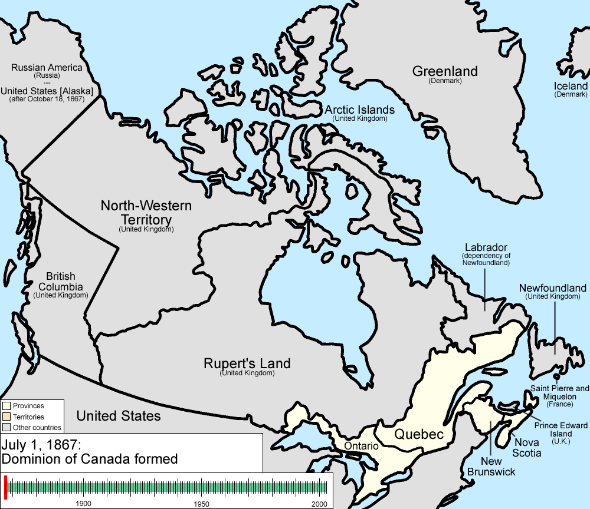

#### Putting Her Southern Neighbour to Shame

Among the nations of North America, people often trumpet the United States as the true bastion of freedom and limited government.

But as the US federal government hoards a [US$17 trillion debt](http://www.brillig.com/debt_clock/), polices the world with its [sprawling number](http://en.wikipedia.org/wiki/List_of_United_States_military_bases) of military bases, and nurses a regulatory addiction on full display with 174,545 pages in the [latest Federal Register](http://spectator.org/archives/2013/06/05/twenty-years-of-non-stop-regul), it’s fair to ask how the experiment has fared in comparison to its continental neighbors. It was a nation “[conceived in liberty](http://www.gutenberg.org/dirs/etext90/getty11h.htm),” in the words of Abraham Lincoln — a loose association of states assigned the majority of governing power to keep the central government decentralized and accountable to the people.

Has either of the fellow North American countries of Mexico and Canada lived up to the principles of limited, decentralized government?

Considering that Article 27 of the 1917 Mexican Constitution [grants all land ownership rights to the central government](http://www.utm.utoronto.ca/~w3his/D-1917-Constitution.Mexico.reader.pdf), it’s doubtful the United States’ southern neighbor can serve as an exemplar. And since over 80 percent of all Mexican tax revenue goes directly to the central government, [according to the latest available statistics](http://www.theatlantic.com/past/docs/issues/97feb/mexico/mexico.htm), it’s rather certain that decentralization and limited government don’t exist there.

But what about Canada, the Great White North? The country with the second-largest landmass and frosty winters confederated in 1867 in a [deal between the English and French-speaking settlers](http://en.wikipedia.org/wiki/Canadian_Confederation) in order to avoid the moral and legal struggles which sparked the US Civil War.

Offering his assessment at the 2013 Conservative Party Convention in Calgary, Alberta, on November 1, Canadian Prime Minister Stephen Harper shined an optimistic light on the Canadian project.

“In a world that is struggling, Canada is rising, being steadily lifted by a rising tide,” Harper [told his gathered supporters](http://www.youtube.com/watch?v=XavjxCIBef0). “Our sound finances, our stable politics, our expanding network for trade relationships, our natural wealth, and the growing demand for it worldwide.”

All of these achievements can arguably be traced to what former Liberal Party leader Stéphane Dion called the “[decentralized nature of the Canadian Federation](http://www.pco-bcp.gc.ca/aia/index.asp?lang=eng&page=archive&sub=speeches-discours&doc=19980325-eng.htm).”

The Canadian Constitution of 1982 [explicitly recognizes](http://www.youtube.com/watch?v=f4tg_BbLqbw) provincial authority in the fields of health care, education, taxation, and social benefits. The federal government is left to national defense, small levels of taxation, and the [creation of the criminal code](http://laws.justice.gc.ca/eng/Const/Const_index.html).

And since the Supreme Court of Canada has “interpreted the Constitution in a way that respects the autonomy of the province” for decades now, [according to Dion](http://panampost.com/yael-ossowski/2013/11/05/canada-the-true-north-american-experiment-in-decentralization/nterpreted%20the%20Constitution%20in%20a%20way%20that%20respects%20the%20autonomy%20of%20the%20province), power has become even more decentralized since confederation.

This has allowed provinces such as Québec to grow resolute and maintain a great level of autonomy in political and economic affairs, giving plausible assurances to the independence movement who believe _la belle_ province could easily break out on its own. This fact has troubled some national leaders and intellectuals who view Canada as too large and not centrally governed enough.

“We’re already the most decentralized federation in the world,” former Liberal Party leader Michael Ignatieff [lamented to the BBC after the Quebec independence referendum](http://www.youtube.com/watch?v=BOmd2U7IF9Y) in 1995. “I can’t see how we can be still more decentralized and survive.”

Contrary to Ignatieff’s fears, it is Canada’s decentralism that has played a great part in its growth and success, allowing for maximum protection of social and economic freedoms. It is this model of devolution of powers that has allowed for so many to prosper financially and made it such an attractive place for potential immigrants.

It was decentralism that brought a great deal of privatization, financial reforms, and cost-cutting throughout the 1990s. Many economists [heralded these measures](http://www.cato.org/policy-report/mayjune-2012/we-can-cut-government-canada-did) as a [key model](http://johnlocke.org/newsletters/research/2012-03-26-k3bd7os6c1gvpdjqs5l2sfncj2-fiscal-insight.html) for cutting the size and scope of the modern industrial state. Nearly a fourth of all Canadians are foreign-born, [according to the Organization for Economic Co-operation and Development](http://www.oecd-ilibrary.org/economics/country-statistical-profile-canada_20752288-table-can), one of the highest percentages in the industrialized world. _National Geographic_ [describes Canada](http://news.nationalgeographic.com/news/2013/06/130630-immigration-reform-world-refugees-asylum-canada-japan-australia-sweden-denmark-united-kingdom-undocumented-immigrants/) as having one of the “most open immigration policies in the world,” owing to 1970s-era reforms which relaxed visa standards to import more skilled labor.

And the difference isn’t chiefly limited to questions of finance and immigration.

Whereas US politics mostly centers on Washington, D.C., and federal legislation battles, Canadian politics follow jurisdictional questions about provincial authority and the limits of the federal government. Provincial leaders [do not hesitate to challenge](http://www.theglobeandmail.com/news/national/alberta-quebec-unite-to-challenge-ottawa/article1211805/) Ottawa’s policies and claim more freedom and autonomy for their citizens.

Perhaps the US experiment was intended to give individuals greater control and influence through more local government, but the current realities show it has [lost its way](http://blog.panampost.com/fergus-hodgson/2013/11/04/he-who-pays-the-piper-calls-the-tune/). Oddly enough, it’s Canada, the friendly northern neighbor who has taken up that model and thrived because of it.

It’s Canada’s adoption of decentralization and devolution of powers that has allowed it to be such a massive territory and still so stable and prosperous. Perhaps it can still serve as an example for its southern neighbors.

_This article originally appeared on the [PanAm Post](https://web.archive.org/web/20170421025048/https://panampost.com/yael-ossowski/2013/11/05/canada-the-true-north-american-experiment-in-decentralization/)_.
