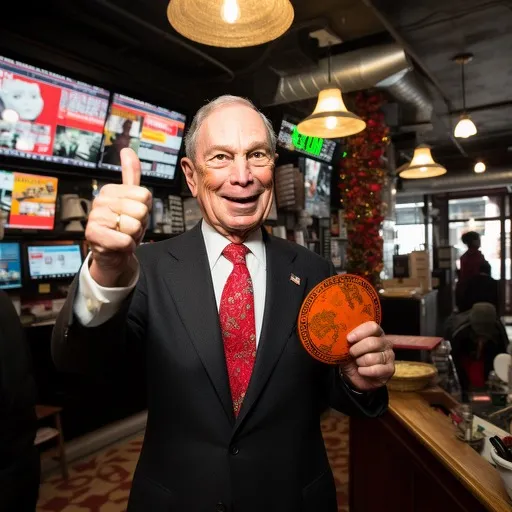

For years, we’ve [covered](https://consumerchoicecenter.org/michael-bloomberg-is-coming-for-your-vape/) the extent of former New York City mayor Michael Bloomberg’s multi-million dollar campaigns to try to shape the lives of ordinary consumers.

What began as an erstwhile [nanny state campaign](https://www.washingtonexaminer.com/opinion/op-eds/michael-bloomberg-propels-the-whos-nanny-state-mission-creep) on Big Gulps in New York City has ballooned into a massively funded operation that uses grants and NGO funding on many tobacco issues, mostly on outlawing nicotine alternatives like vaping products.

In 2019, Bloomberg pledged [$160 million](https://www.washingtonpost.com/health/bloomberg-to-spend-160-million-to-ban-flavored-e-cigarettes/2019/09/09/5abc1e5c-d33c-11e9-9343-40db57cf6abd_story.html) to get US states and localities to ban flavored vaping products, mostly funneled to anti-tobacco groups who’ve pivoted from “stop smoking” campaigns to “stop consuming nicotine in all forms.”

Those efforts quickly scaled to the level of the World Health Organization, including funding US anti-tobacco groups in the millions to even go so far to [completely outlaw nicotine alternatives](https://consumerchoicecenter.org/leaked-bloomberg-funded-campaign-for-tobacco-free-kids-global-strategy-to-ban-vaping-products-by-bribing-public-bodies/) in developing countries across Latin America, Asia, and more. While nations on these continents typically have larger smoking populations than in the US and Europe, they have thus far been deprived of the life-saving nicotine alternatives that would serve as a less harmful switch away from smoking.

In the name of “halting tobacco,” Bloomberg and the organizations he funds have actively sought to poison the well of tobacco harm reduction by miscasting vaping products as “just as bad” as combustible tobacco. Even though health agencies in nations such as the United Kingdom, New Zealand, and even Canada [actively recommend](https://www.aier.org/article/harm-reduction-takes-a-u-turn-on-vaping/) vaping products to get smokers to quit, this option is kept off the table in developing nations where Bloomberg has influence.

In February of this year, Bloomberg’s commitment to severely restrict harm reduction increased significantly to nearly [$420 million](https://www.bloomberg.org/press/bloomberg-philanthropies-commits-additional-420-million-to-reduce-tobacco-use-globally/), hoping to drive a larger global campaign in 110 countries around the world to cut off citizens from nicotine alternatives that are less harmful.

Over $280 million of that money will focus on developing countries, offering grants to political groups, health agencies, and politicians to implement a zero-tolerance nicotine agenda.

https://youtu.be/uSSNMMVzZJ8

The issue with Bloomberg’s approach, and by extension the dozens of health and anti-tobacco groups he funds, is their denial of the [real scientific evidence](https://casaa.org/explore-resources/information-library/) on tobacco harm reduction.

Rather than endorse the market-derived alternatives that have been successful in getting adult smokers to quit – much more effectively than government education programs – they have created a false equivalence between the vape and the cigarette.

That not only harms public health, but continues to fester a narrative of misinformation that has captured many public health researchers and government agencies. We know this all too well from our [cross-national survey](https://consumerchoicecenter.org/tobacco-harm-reduction-and-nicotine-perceptions/) of health practitioners in Europe, in which many doctors were simply unaware of the growing category of less harmful nicotine alternatives like vaping, heat-not-burn sticks, nicotine pouches, and more.

As Bloomberg continues his global crusade against harm reduction, and many groups pick up his baton to carry out policies to deny safer options to smokers who need them in developing countries, researchers and activists must continue to underscore the need for options and consumer choice when it comes to nicotine alternatives.

Consumers, political leaders, and community activists must uphold the both scientific and anecdotal evidence provided by the consumer-led revolution in harm reduction. Only then can we continue to save lives, influence better policy, and ensure a generation of people who will have more options to live their lives, not less.

_Originally published at the [Consumer Choice Center](https://consumerchoicecenter.org/checking-in-on-michael-bloombergs-multi-million-dollar-global-crusade-against-harm-reduction/)._
