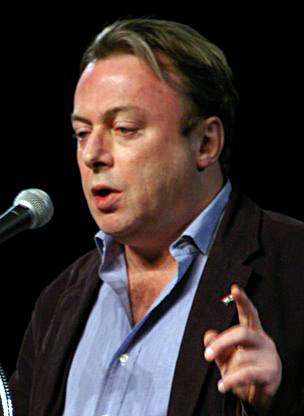
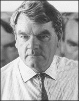

Here is a great speech by essayist and journalist **Christopher Hitchens.** I came across it while researching Western attitudes toward free speech, specifically in the case of prosecuting individuals for professing certain beliefs.

> 
> 
> Essayist and author Christopher Hitchens

Throughout his remarks, which follow the theme of questioning orthodoxy and protecting every element of free thought, Hitichens comments on several cases which I’ve become very familiar with over the years.

He references the case of [**David Irving**](http://en.wikipedia.org/wiki/David_Irving), a British WWII historian who was sentenced to prison in Vienna, Austria in 2006 for “trivialising, grossly playing down and denying the Holocaust.” The arrest provoked little outrage and protest at the time, but it remains a clear example of the extent of prosecuting free speech in Western nations.

Irving has produced [great historical works](http://www.fpp.co.uk/online/index.html) on the bombing of Dresden in WWII and the true biography of Adolf Hitler, and has been criticized for playing down the claims that the German leader specifically ordered the mass killing of Jews and other minorities.

> 
> 
> British Historian David Irving

Hitchens’ essential argument is that conventional wisdom and thought should be subject to as much scrutiny and debate as all other ideas, and that the better ideas will, in the end, win out. He calls for protecting the free speech of both popular and unpopular ideas, underscoring the need for human beings to be free in their conscience and thought.
