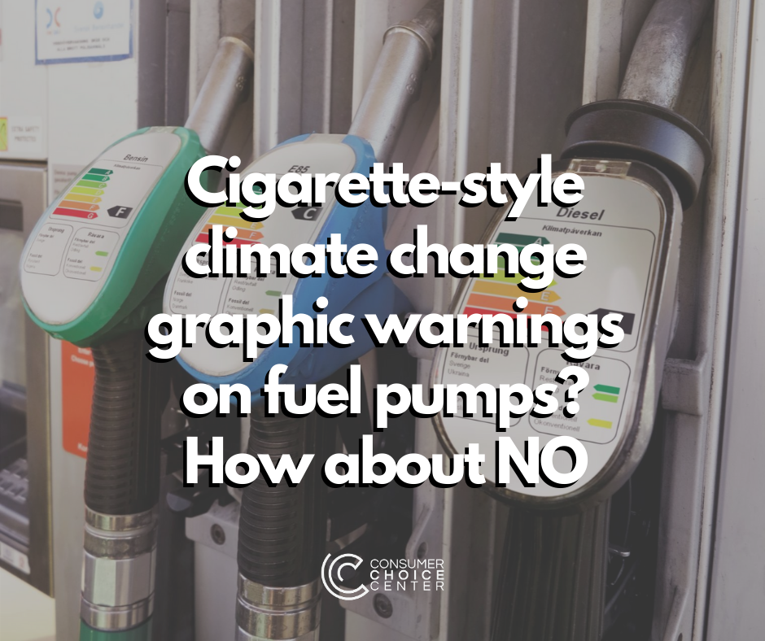

Are consumers prepared to be hounded at the pump for fueling up their cars?

An [article](https://blogs.bmj.com/bmj/2020/03/31/we-need-health-warning-labels-on-points-of-sale-of-fossil-fuels/) published last week in _BMJ_, the journal of the British Medical Association, makes an argument for including "cigarette-style" warning labels on fuel pumps, airline tickets, and energy bills. The warnings would highlight the "major health impacts" of fossil fuels for both the environment and human health.

The researchers behind the article claim this strategy, borrowed from tobacco control efforts, would highlight the "harmful" effects of fossil fuels and their contribution to climate change.

> Warning labels connect the abstract threat of the climate emergency with the use of fossil fuels in the here and now, drawing attention to the true cost of fossil fuels (the externalities), pictorially or quantitatively. They [sensitise people](https://blogs.bmj.com/bmj/2020/03/31/we-need-health-warning-labels-on-points-of-sale-of-fossil-fuels/) to the consequences of their actions, representing nudges, designed to encourage users to choose alternatives to fossil fuels, thus increasing demand for zero-carbon renewable energy.

While there is every reason to be concerned about climate change, there is no evidence that "warning labels" on gas pumps will do anything to dissuade individuals from using their vehicles to commute to work, visit family, or run errands.

Multiple studies have shown that warning labels are [not effective](https://hbr.org/2016/11/consumer-warning-labels-arent-working) in changing consumer behavior. Faced with increasing warning labels on many products, including those mandated by California's Prop 65 law that labels almost everything carcinogenic, most consumers just tune out and learn to ignore them.

Because ordinary people need fuel for their cars, it doesn't take much imagination to see such labels easily laughed off.

Rather than informing people and attempting to shift their behavior, this measure infantilizes consumers and assumes they aren't intelligent enough to make the connection between daily driving and climate change. And it is not as if these warnings propose any alternatives.

When it comes to tobacco, one of the largest catalysts in getting to quit has actually been [innovation](https://www.huffingtonpost.ca/yael-ossowski/free-market-tobacco-legislation_b_13626946.html): vaping devices and harm reducing nicotine alternatives, not warning labels.

Innovation allows for new products to get consumers to switch to less harmful products.

Rather than trying to use warning labels that won't work, what about educating citizens on energy alternatives that produce fewer greenhouse gases, such as nuclear energy, [natural gas](https://afdc.energy.gov/vehicles/natural_gas_emissions.html), or [biodiesel](https://web.wpi.edu/Pubs/E-project/Available/E-project-042815-163944/unrestricted/Biodiesel_MQP_FINAL.pdf)?

If we allow creative forces and innovation to derive a solution, wouldn't that prove to be more effective?

This may be one attempt at "nudging" people into using fewer fossil fuels, but it won't be anywhere as effective at mitigating climate change as actual innovation. Maybe that's what we should write on the fuel pumps.

https://www.youtube.com/watch?v=8rtEKQhkZus

* * *

_The Consumer Choice Center is the consumer advocacy group supporting lifestyle freedom, innovation, privacy, science, and consumer choice. The main policy areas we focus on are digital, mobility, lifestyle & consumer goods, and health & science.  
  
The CCC represents consumers in over 100 countries across the globe. We closely monitor regulatory trends in Ottawa, Washington, Brussels, Geneva and other hotspots of regulation and inform and activate consumers to fight for #ConsumerChoice. Learn more at [consumerchoicecenter.org](https://consumerchoicecenter.org/)_

Originally published [here](https://consumerchoicecenter.org/cigarette-style-climate-change-graphic-warnings-on-fuel-pumps-how-about-no/).
