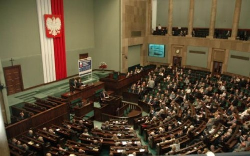

## La Pologne envisage de nationaliser les fonds de pension privés. Dans l’esprit de Victor Orban en Hongrie.

Par Marek Tatala\* et Yaël Ossowski\*\* | [L'AGEFI à Genève](http://www.agefi.com/une/detail/archive/2013/november/artikel/la-pologne-envisage-de-nationaliser-les-fonds-de-pension-prives-dans-lesprit-de-victor-orban-en-hongrie.html)

Cet automne, le premier ministre polonais Donald Tusk a déclaré son intention de revenir sur les réformes du système de retraites en saisissant les comptes d’épargne privés. S’il réussit, cela amènera une nationalisation totale des fonds de pension privés, dans l’esprit de Victor Orban en Hongrie et des Kirchner en Argentine. La loi proposée démontera tout le succès de la transformation polonaise depuis 1989, caractérisé par la privatisation. La Commission européenne et le Fonds monétaire international, jusqu’ici, ont tourné le dos à ces développements dangereux. Une potentielle réaction en chaîne aurait pourtant des conséquences catastrophiques.

La nationalisation des fonds des pensions polonais ne créera pas de consolidation fiscale durable et défera tous les efforts de la Pologne ces dernières vingt années en termes de croissance et prospérité.

La fait que le gouvernement polonais veuille nationaliser la moitié des actifs du système privé de retraites, poussera les fonds à investir à plus court terme, tenant compte que le gouvernement souhaite garder l’option de saisir le restant des actifs des fonds de pension.

Actuellement, le système polonais de retraites a deux piliers: un pilier de retraites par répartition, à la bismarckienne, et un autre complètement privé. La réforme proposée par le gouvernement polonais fait du premier pilier le système par défaut. Les citoyens devront déclarer expressément qu’ils préfèrent le système privé.

Selon la psychologie béhavioriste, la majorité des gens ne signera pas de déclaration spéciale pour rejoindre le système de retraites privé. Cela mènera à la marginalisation et à la liquidation des fonds de pension.

D’un point de vue fiscal, la nationalisation ne garantira aucune amélioration structurelle des finances publiques. Au contraire, cela aggravera la dette polonaise. Saisir les fonds de pension privés diminuera la dette publique à court terme, mais augmentera les passifs non capitalisés sur le long terme. Les régimes de retraites bien capitalisés sont beaucoup plus à même de s’adapter aux changements démographiques. Un taux de fécondité en baisse n’a pas d’effet négatif sur un régime capitalisé, mais peut être catastrophique dans un système de retraite par répartition, quand les plus jeunes travailleurs paient pour les retraités. Avec un moyen de 1,3 enfant par femme, la Pologne fait face à une immense transformation de sa structure démographique. Les changements prévus mettent en danger la viabilité du système.

Selon l’économiste et ancien vice premier ministre Lesezk Balcerowicz, les passifs non capitalisés dépassent déjà 193% du PIB polonais. L’abolition du pilier privé des retraites augmentera les passifs non capitalisés. Les contribuables et futures générations paieront le prix de ces décisions populistes.

Le silence de la Commission européenne et du FMI est loin d’être surprenant. La Commission fait deux poids, deux mesures dans ses interactions avec les Etats membres de l’Union européenne. D’un côté, elle glorifie les réformes des retraites en Lettonie. De l’autre, elle ne dit rien quand la Pologne indique qu’elle nationalisera les fonds de pension privés.

Puisqu’elle reste silencieuse face au gouvernement polonais, qui risque d’être une autre Hongrie, la Commission renie son rôle sinon volontiers trompété de gardien budgétaire.

Il y a un danger que cette «Orbanisation» des fonds de pension privés se diffuse à travers l’Europe entière si elle n’est pas combattue. Les gouvernements de l’Europe de l’Est sont sous pression de ralentir la consolidation fiscale ou recourir vers un plan de relance économique. Les exemples hongrois et polonais risquent d’accroître le pouvoir et l’emprise des voix populistes dans ces régions. C’est pourquoi il serait indispensable d’arrêter le plan du gouvernement polonais et de défendre les retraites privées des citoyens.

\* Economiste au think tank polonais FOR

\*\* Young Voices

**Version PDF: [yael.ca/orbanisation.pdf](http://yael.ca/orbanisation.pdf)**

_Cet article a été publié dans [le journal L'AGEFI](http://www.agefi.com/une/detail/archive/2013/november/artikel/la-pologne-envisage-de-nationaliser-les-fonds-de-pension-prives-dans-lesprit-de-victor-orban-en-hongrie.html)._
