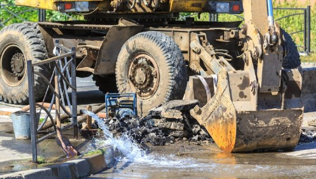

By Yaël Ossowski | [Washington Examiner](http://www.washingtonexaminer.com/congress-shouldnt-dictate-how-water-pipes-are-rebuilt/article/2638051)

With a slew of agenda items in front of President Trump, there is one more which requires the utmost attention: infrastructure.  

Bridges, highways, electric grids, water, and sewer systems — all of which are aging — have fallen off the national agenda because of gridlock in the Capitol.

If a national infrastructure bill is going to be delayed until 2018 or beyond, we should look at the delay as a small blessing. Rather than rushing into a trillion-dollar program at the behest of Washington, D.C., we should use this time to think through the nature of the problems and the best long-term solutions to them at the state and local levels.

The first contracts to build the interstate highway system were signed in 1956 — a little over 60 years ago. We can see the need for repairs required to keep those highways open. We can literally feel the road surfaces. We might not see the underside of the bridges we cross, but we know from report after report that a huge percentage of America’s bridges — almost 56,000 by some estimates — are in need of serious repair or total replacement.

An included element of infrastructure that is in growing need of attention: our nation’s municipal water systems.

Unlike bridges and highways, we don’t know a water main is likely to fail until it does. And when it does, it is far more disruptive than closing a lane on a highway or a bridge to make repairs.

A broken water main often means closing off whole streets and — more importantly — closing businesses, schools, and hospitals until the repairs are made.

While the interstate system has been in place for less than 60 years, municipal water systems have been in operation since the 1840s — about 170 years. In all that time, engineers have tried to use the longest lasting materials because the repair/replace effort for underground water lines is so disruptive.

For more than 100 of those 170 years, cast iron pipe has been the material of choice. More recently polyvinyl chloride, or PVC, pipe has been suggested as a replacement. But newer, longer lasting ductile iron pipe is the favorite for many locales.

The two most important words in a municipal water system are “durability” and “safety.” Iron is a proven material for durability. More than 600 utilities in the United States and Canada have had cast iron mains in continuous service for more than a century. At least 21 cities have had the same cast iron mains in continuous service for over 150 years.

Since 1955, ductile iron pipe has been the new and improved metal pipe used instead of cast iron. Ductile iron has approximately twice the strength of cast iron as determined by tensile, beam, ring bending, and bursting tests.

Unlike PVC pipe, ductile iron pipe is made of 100 percent recycled iron and steel. After its long service life, it is recyclable for use in new products. PVC is not recyclable and it is largely impervious to natural breakdown.

The PVC lobby wants Washington to demand state and local authorities actively pursue bids from PVC pipe manufactures for their water project. This is typical of D.C.-mandated spending. It is not the skill of local engineers considering the local terrain, geology, and history; it’s the skill and depth of pockets of lobbyists demanding their clients gain an unjustifiable and unwarranted advantage.

This would be like demanding the same materials that are used for a bridge along the Atlantic or Pacific coast be used for a bridge over the Ohio or Missouri rivers. The environment and the demands are quite different.

There will be an infrastructure program approved by Congress in the near future. As part of that program, it is imperative that Congress not dictate to local utility experts what materials must be used in the repair and replacement of aging roads, bridges, or water systems.

Local leaders must be free to use whatever they and science deem to be the safest, most durable products available. Otherwise, taxpayers will end up paying for repairs much sooner than they should.

_Yael Ossowski is deputy director of the [Consumer Choice Center](http://consumerchoicecenter.org/)._
