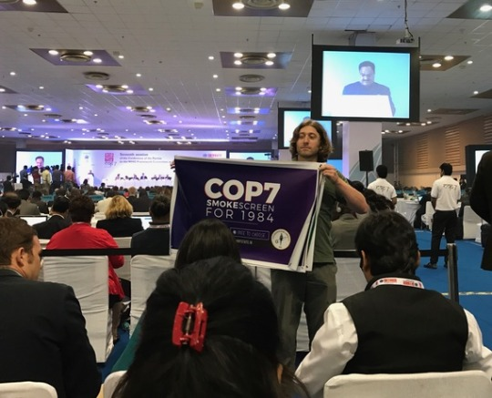

DELHI - It’s only fitting that a conference dedicated to the eradication of smoking tobacco would be held in a city caked with smog pollution.

Last week in Noida, a southeastern suburb of New Delhi, delegates from over 180 countries filed out of tour buses for the World Health Organization’s seventh Conferences of the Parties Framework Convention on Tobacco Control.

The dangerous levels of pollution in New Delhi certainly worried the health-conscious crowd in attendance and provided a great dose of irony as a backdrop for a global conference on regulating public health.

Arriving at the COP7 event, it was impossible to miss the large military and police presence at the front gate, as well as the half dozen checkpoints keeping the health regulators away from the general public.

Many people wearing cloth masks entered, coughing and wheezing as they pick up their credentials, and hundreds of national representatives, journalists, NGOs, and members of the public rushed to the center of the conference center once inside to seek refuge in air conditioning.

The day began with optimistic words from the head of the conference on the transparency of the process.

“We are an organization dedicated to transparency, which you can now see on our Tweet wall outside,” said WHO FCTC Convention Secretariat Vera Luiza da Costa e Silva at the conference’s opening.

The Tweet wall, unfortunately, only featured tweets from the FCTC’s official account, and not delegates or members of media present at COP7.

Though members of the public and media were granted entry on the first day, it was [well known](http://dailycaller.com/2016/11/07/reporters-banned-from-global-anti-tobacco-conference/) that they would soon be excluded from the proceedings of the conference.

Asked when the media would be notified if they were going to be removed or not at the first press briefing on Monday morning, the answer was blunt. “Before the smell of coffee is gone, you’ll know,” said WHO spokesman Samuel Compton. It didn’t take long.

As [Daily Caller’s Drew Johnson reports](http://dailycaller.com/2016/11/07/reporters-banned-from-global-anti-tobacco-conference/), reporters and the public were outright banned from the remaining plenary sessions near the end of Monday evening. This cut off access for the rest of the week to the nearly 100 journalists and members of the public who made their way to New Delhi to participate.

A [video](https://www.youtube.com/watch?v=359PO0rFsRI) has emerged of Johnson being forcibly removed from the floor of the conference on Tuesday morning by Indian security guards, even having his media credential ripped from his neck. The footage was captured by [Canadian journalism outlet Rebel.media](https://www.youtube.com/watch?v=359PO0rFsRI).

On Tuesday, the WHO was awarded the tongue-in-cheek “[Least Transparent Organization in the Galaxy](http://studentsforliberty.org/blog/2016/11/04/toast-students-liberty-like-present-world-health-organization-least-transparent-organization-galaxy-award/)” award by the international libertarian activist group Students For Liberty, [who held their own rally near the conference venue blasting the WHO’s](https://www.youtube.com/watch?v=ursPik73fo0) rules.

The reason for the FCTC’s insistence on barring journalists and members of the public is given in a [report](http://reason.org/news/show/who-opposition-to-harm-reduction) by Reason Foundation’s vice president of research, Julian Morris.

“The primary justification the FCTC Secretariat gives for restricting participation and operating in secret is the avoidance of conflicts of interest,” writes Morris in the [report published](http://reason.org/news/show/who-opposition-to-harm-reduction) on the WHO’s opposition to harm reduction strategies.

“But the real reason is that the FCTC doesn’t want to allow anyone into the tent who disagrees with its assumption that the only option for smokers is to "quit or die.”
