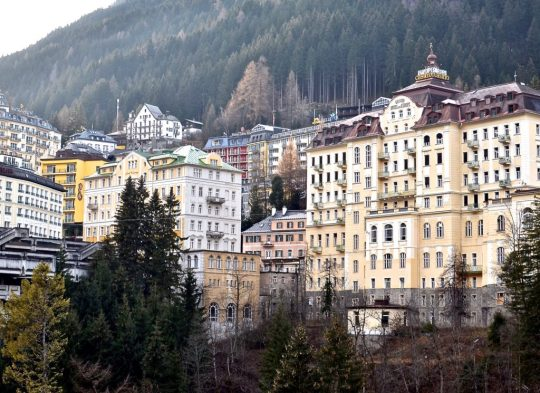

This is, without a doubt, one of the best times to be alive. We live longer. We’re subject to less violence. We live in cleaner, more prosperous cities, and enjoy more civil and individual freedoms than any generation before us.

Innovations have brought us closer together and shed our prejudices. Young men now take up video game controllers in their homes rather than firearms in foreign wars. Women outnumber men at universities and climb corporate hierarchies at unprecedented speed. Poverty has been all but eradicated for billions of people on the Earth.

As Swedish author Johan Norberg outlines in his book [_Progress: Ten Reasons to Look Forward to the Future_](http://amzn.to/2FNZnTY), the solitary, poor, nasty, and brutish lives that were once inevitable for human beings in centuries past have improved a thousand-fold.

Even the poorest communities in the world now have access to world-class vaccines, instantaneous communication, and are more literate than the richest countries were not more than two centuries prior. Provincial backwaters have sprouted up into international metropolises of culture, commerce, industry, and trade. Globally, our economic and personal lives become more sanguine and interconnected as we move into cities. These centers of busy exchange throughout history have always fostered the conditions for creative freedom and expression. The idea of shared humanity, rather than competing tribes of humanity, became the mantra. It’s a political movement all the while being expressly apolitical.

This is the cosmopolitanism we celebrate.

Cosmopolitanism, the idea that our existence is a shared experience, divided by no lines and no frontiers. Culture is our language and our currency. Freedom is our common goal, and that alone makes us brothers.

This differs from global liberalism, which is an ideological quest for freedom (and a noble one). It is very conducive to the spirit of cosmopolitanism, and likely a necessary catalyst. Regardless, cosmopolitanism is about understanding people without the constraints imposed by nationhood, language, or location.

It has been the aim of every cosmopolitan revival in memory.

In the 1920s, Paris was the hub for expatriate writers escaping their countries. In the presence of mustached Parisian waiters in the interwar years, Ernest Hemingway, F. Scott Fitzgerald, James Joyce, and Gertrude Stein slowly boozed themselves and crafted tomes that defined the times.

Stefan Zweig crisscrossed the European continent in constant admiration of the beauty and art he found in each capital, no matter the language.

These writers’ travails were enveloped in stories and characters that blossomed in the foreground of cosmopolitan cities and experiences. And through their writing and art, the settings of their stories became romantic sanctuaries for the blossoming of the human spirit. With each novel, story, or painting, we became transfixed by their candor. Every page whisked us to these majestic centers of culture, beaming with optimism and hope.

There is a reason we look back to Greek city-states, the Roman Republic, Moorish Spain of the 10th-century, fin de siècle Vienna, interwar France, and 21st-century New York as nirvanas of intellectual exchange and political tolerance.

Differences between tribes and people were celebrated and enjoyed, a sort of spontaneous voluntary acculturation. The best practices, foods, and ideas were adopted and their origin an afterthought. More representative forms of societal organization promised freedom from oppression. Newly peaceful backdrops gave way to an explosion of unique literature, poetry, and art.

More than the sword or the tank, it was art that conquered the ills of fascism, communism, and discrimination. Art pushed back, ridiculing the powerful and untouchable. It renewed ancient wisdom and ideals lost for a moment in time.

Modern cosmopolitanism is thus reliant upon the foundations built by the philosophers of Greece, the legal minds of Rome, merchants of Moorish Spain, and the artists of 20th-century western Europe. These are the forefathers of the cosmopolitan vision we hope to carry on in these pages.

Thus, Devolution Review is a culmination of a unified story of modern cosmopolitanism.

The writing you’ll find here is inspired by the idea that existence is a shared experience. Left to his own devices to exchange with every culture he can, man will not only be better off, but he’ll create beautiful and evocative art. And considering today’s context, we’re in for more of that than ever before.

We no longer need to wait for vast paradigm shifts in tolerance and expression to create flourishing metropolises in large capitals. What once took millennia and centuries to take root is now a present reality accessible to anyone with a curious mind and active imagination.

We are living in the best time humanity has witnessed, and we cannot let it go to waste. We must return to the first order, devolve our highest pretensions, and celebrate once more the beauty we know exists in every person, every part of the world, and in every story.

If we even come close to achieving this by presenting you with our choice of writing, poetry, and stories, then we will have succeeded. We hope you’ll join us for the ride.

**Purchase your copy of the first Devolution Review magazine in print [here](https://devolutionreview.com/shop/).**
