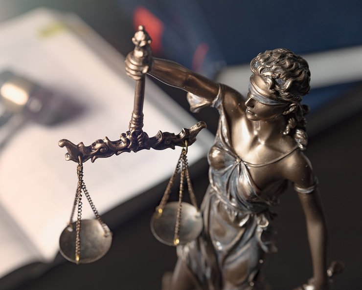

<figure>

<figcaption>

Lady justice, themis, statue of justice on books background. Law concept with justice figurine in library

</figcaption>

</figure>

Public life is now at a standstill in the United States.

Millions are social distancing and staying at home to avoid further community spread of the novel coronavirus known as COVID-19.

It’s important to remain positive, but times are tough. Nearly 18% of American households are facing reduced hours or layoffs at work according to a new [NPR/PBS NewsHour/Marist poll](http://maristpoll.marist.edu/?page_id=45175). Plugging into the 24-hour news cycle and its doomsday predictions doesn’t give many good vibes either.

That said, some government institutions remain on the clock. Legislatures in New Jersey, Wisconsin, and dozens of other states [still have open sessions](https://www.jdsupra.com/legalnews/as-covid-19-coverage-law-suits-are-83489/) to piece together legislation to alleviate their constituents, police officers and mail carriers are still on the job, and hospitals and clinics are working overtime to heal the sick. All these institutions have had to pivot to the situation at hand and focus on how to react to the impact of the pandemic.

Police officers in cities such as Philadelphia and Lansing, MI have been [instructed](https://whyy.org/articles/philly-da-krasner-curb-low-level-arrests-to-slow-spread-of-coronavirus/) to not pursue low-level nonviolent crime to concentrate resources on the coronavirus.

This week, district and federal courts have been [shuttered](https://www.law360.com/trials/articles/1253984/dc-circ-district-delay-proceedings-amid-covid-19-outbreak?nl_pk=5e19d718-1655-49b8-ae5b-203d67b3bc56&utm_source=newsletter&utm_medium=email&utm_campaign=trials) across the nation to do the same, leaving criminal, civil, and immigration cases hanging in the balance.

With a huge pause button pressed, what will be the impact on our legal system?

While judges and lawyers have been sent home, there remain thousands of major lawsuits on the docket that could shape much of our lives once all this ends. And that’s important to remember.

Perhaps during this time, we can evaluate what we’d like our nation’s courts to prioritize once they return to normal.

That’s especially important, because for every bogus lawsuit about Amazon “[price gouging](https://topclassactions.com/lawsuit-settlements/lawsuit-news/household/amazon-class-action-alleges-coronavirus-price-gouging)” toilet paper or hand sanitizer companies [overstating](https://www.aboutlawsuits.com/purell-class-action-lawsuit-167514/) their claims for killing germs, there are other major trials featuring outright hysteria and moral panic that deny scientific evidence and could lead to sweeping negative changes.

Currently, there are [dozens](https://www.insurancejournal.com/news/national/2019/09/30/541511.htm) of lawsuits related to the tenuous connection between nicotine pod vaping devices sold by companies such as Juul, and the outbreak of lung illnesses that took place last year. The CDC came out in December and [clarified](https://www.cdc.gov/tobacco/basic_information/e-cigarettes/severe-lung-disease.html) the injuriues were caused by vitamin E acetate found in illicit cartridges, but tort lawyers [have not been dissuaded](https://www.torhoermanlaw.com/personal_injury_lawsuit/toxic_tort_lawsuit/juul-lawsuit-e-cigarette-lawsuit/). They hope juries will buy emotional arguments over the science.

The same can be said for cases considering whether Johnson & Johnson baby powder contained talc products laced with asbestos, a carcinogen.

One trial in New Jersey is reviewing whether one testimony claiming such will be considered [credible scientific evidence](https://www.wsj.com/articles/johnson-johnson-faces-key-test-in-defense-against-talc-safety-lawsuits-11563701400), known as the Daubert standard. Multiple scientific studies [have yet to prove](https://www.forbes.com/sites/legalnewsline/2018/12/04/study-undermines-key-theory-behind-talc-asbestos-lawsuits/#52a689b95794) a link between talc in modern baby powder and any cancer, but previous cases have awarded as much as [$4.7 billion](https://www.nytimes.com/2018/12/19/business/johnson-johnson-baby-powder-verdict.html) to plaintiffs and their attorneys.

Will the judge listen to existing scientific evidence or hired court “experts” who [stand to gain](https://legalnewsline.com/stories/511415345-two-trials-same-result-sheldon-silver-guilty-of-using-public-office-to-make-millions-from-asbestos-lawsuits) from huge payouts?

These are the types of perverse incentives that exist in today’s legal system.

Talk of reforming both criminal justice and tort law have been top of mind for many legal researchers and policy advocates for the past few years, and for good reason.

Much like the anti-scientific tort cases outlined above, too many people have had their lives ruined by nonviolent offenses that have stunted their careers and limited their successes. This legal abuse swarms our legal system and leaves legitimately injured consumers and citizens locked out of the courts.

Not everything deserves to rise to the level of our courts and our legal instruments if there isn’t legitimate harm to our people and communities. In the face of coronavirus, police officers in Philadelphia and Lansing being [instructed](https://whyy.org/articles/philly-da-krasner-curb-low-level-arrests-to-slow-spread-of-coronavirus/) to avoid low-level arrests of nonviolent offenders. It’s the same principle.

When life picks up again, and we deconstruct how our institutions fared in a time of crisis, we will need to ensure important reforms are implemented.

We need tools and reforms to avoid abuse of our nation’s courts by overzealous attorneys and prosecutors alike. That’s a noble goal we can all agree on.

_Yaël Ossowski is deputy director of the Consumer Choice Center. Follow him @YaelOss_

Republished here:

https://www.insidesources.com/covid-19-gives-us-the-opportunity-for-legal-reform/

https://www.sentinelandenterprise.com/2020/03/26/covid-19-gives-us-the-opportunity-for-legal-reform/

https://www.lowellsun.com/2020/03/26/covid-19-gives-us-the-opportunity-for-legal-reform/

[https://www.newsday.com/opinion/commentary/coronavirus-covid-19-shutdown-government-laws-legal-reform-1.43438982](https://www.newsday.com/opinion/commentary/coronavirus-covid-19-shutdown-government-laws-legal-reform-1.43438982)
