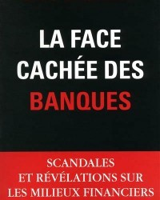

Après avoir lu _La face cachée des banques,_ écrit par le journaliste [**Éric Laurent**](http://www.eric-laurent.com/), je me sens un peu sombre. Plus morose que dépressif.

Ce n'est pas un sentiment tout à fait neuf quand on réfléchit au système bancaire moderne. Des mille milliards, flottants à travers des réseaux financiers, perdus en un instant comme ils n'ont jamais existés.

Nous travaillons fort chaque jour pour notre pain quotidien et tout cela évapore le moment qu'un banquier, cigare en bouche, se déclare « en faillite » et ses amis dans le gouvernement lui permet accès à ton portefeuille.

Alors, voici pourquoi la narration de M. Laurent est importante et nécessaire.

Lorsqu'on se place dans les mois turbulents de l'automne 2008, on s'en souvient de la tromperie totale qui a eu lieu. Le monde financier était sur le bord de chavirer sans l'aide de l'état, on nous disait. Toutes les maisons et voitures des familles américaines étaient à risque d'être prises sous la vague de crédit toxique, on nous disait. Nous ne pourrions jamais imaginer la grandeur de la douleur à venir, on nous disait. Laissez-nous prendre le volant, on nous disait.

Mais ils ont menti.

Les hommes qui avaient l'air responsable et neutre, comme Henry Paulson, Timothy Geithner et Ben Bernanke, n'étaient que des poules avec la tête coupée, ayant besoin de 800 millions de dollars pour pouvoir la récupérer.

Comme décrit bien Laurent, ce n'était qu'un mensonge. Les banques nous ont conduits au précipice et c'est l'état qui fournissaient l'essence, le véhicule et les mauvaises directions.

Sa narration prend le temps de décrire les personnalités derrières les fonds spéculatifs ; leur arrogance, leur cynisme et leur conviction totale que le gouvernement ne leur laisserait jamais échouer.

Le marché libre a disparu il y a longtemps, avoue Laurent, et le système qui a pris sa place ne laisse que certaines institutions financières avec liens étroits au gouvernement, des institutions enhardies grâce à l'absence de la discipline du marché.

En outre, les mêmes acteurs qui ont provoqué la crise financière furent présentés comme les sauveurs. La **Federal Reserve** et la **Banque centrale européenne** ne recevaient que des notes positives selon les experts. Les seules critiques tolérées citaient « inaction », une idée mal-conçue à la tradition neo-keynésienne. Elle invitait encore plus d'intervention gouvernementale dans l'économie, même après que les conséquences des banques centrales très actives soient bien connues, surtout par le contribuable américain.

> « Les banques sont les seules bénéficiaires de la crise qu'elles ont provoquée, dit-il sans ironie. »

Alors, pourquoi dois-je lire cette narration de la crise économique, vous me demandez ? Pour enfin avoir l'histoire entière dans votre tête, réponds-je. L'histoire entière dans laquelle les grandes institutions financières de Wall Street se sont réunies avec les agences gouvernementales pour flouer le peuple et voler leur portefeuille. Tout cela sous la bannière de sauver le monde et l'économie moderne.

Lisez-le.

—

_Voici aussi une entrevue avec l'auteur Éric Laurent:_
