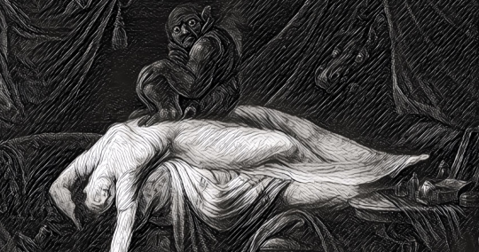

In one of the episodes in the newest seasons of Netflix’s Black Mirror, a young woman visits a strange museum across the way from a gas station in the hot desert. Inside, she meets the museum’s proprietor who offers her an early tour.

The exhibitions preserved onsite include eccentric artifacts viewers of the series recognize from other episodes, along with new ones that are just as eerie. Each item in the “Black Museum” represents a story with some kind of allegory about the incredible potential but also drastic consequences of technology, one of the main themes of Black Mirror.

This theme is a giant one in human storytelling.

Every day, we’re reminded of this core struggle and the dualism it represents. The great benefits of social media connecting humanity while also causing significant sociologic stresses, the vast potential of artificial intelligence for cracking difficult problems while at the same times smart devices spy and record information on people in their homes. Technological devices used to further democratic revolutions also embolden and arm tyrannical regimes against activists.

It’s no mistake that the core plots of movie franchises such as The Matrix and The Terminator pit humans against their technological inventions.

One of the first iterations of this struggle is in the Greek myth of Prometheus, a Titan who steals fire from the gods and gifts it to human civilization. As punishment, Zeus banishes him and chains him to a rock, where he daily receives the constant pecking at his liver by an eagle. Prometheus is seen as having given a great gift to humans, but at a significant cost. Humans may have prospered with fire, but it also causes great destruction.

“Thou art a symbol and a sign to Mortals of their fate and force; Like thee, Man is in part divine, A troubled stream from a pure source,” writes Lord Bryon in his poem on the myth of Prometheus. Though the mythical Titan is a hero in Bryon’s interpretation, he still gifted humans with a power “to which his Spirit may oppose.”

**Duality of Technology**

This myth informed the Greek philosophical notion of a pharmakon, something that is both an antidote and an illness in one fell swoop. Sometimes it is invented by humans, and in other interpretations it is gifted from deities. But above all, it punishes as much as it provides.

One of the best written English-language novels, Mary Shelly’s Frankenstein: The Modern Prometheus, deals with this issue rather well, posing Dr. Frankenstein’s creation as the ultimate pharmakon, destructive to itself and human civilization while still representing something of a positive marvel.

The Swedish television series Äkta människor (Real Humans) also represents this rather well. It documents the rise of autonomous robotic humans (hubots) that eventually fill and replace the roles of humans in ordinary tasks and relationships. Society then has to adjust to these changes, both in law and practice, and entire political parties and movements form to resist hubots and their mainstream acceptance.

In “Industrial Society and its Future,” Theodore Kaczynski, later unmasked as the Unabomber, [makes the point](http://www.washingtonpost.com/wp-srv/national/longterm/unabomber/manifesto.text.htm) that the industrial society of the future will necessarily restrict freedom because it will launch humans down a path contrary to our nature. Humans will instead become subservient to arbitrary rules and functions, leading to “oversocialization” and complete obedience devoid of any and all autonomy.

One cannot accept Kaczynski’s premise without denouncing the barbarous acts he took to publish these thoughts, but his ideas remain loyal to the essential struggle posited by artists and thinkers.

**The Coming Nightmare**

For the current age, the crypto imagination jointly shared by millions rightfully yields the revolution of information and access that digital tools can provide. It is now possible for billions of people to engage in work and communication across national boundaries. Poverty-stricken communities can use cheap cell phones to transfer electronic funds for ordinary goods, and literacy can almost be universally guaranteed. The possibilities are endless.

But, at the same time, progress and innovation must also adhere to the core truths of humanity. The fairly recent establishment of individual freedoms as safeguards against misery must not perish while technology allows quick and immediate change. The inviolability of individuals should remain a core virtue as much as a forward bent toward progress. That’s been the siren of the Black Mirror series and the dozens of media that emulate it. And we should truly push back against our coming nightmare before it becomes a reality.

One could argue the political rise of a television character and real estate mogul is very much an exemplar of this warning. Traditional institutions of restraint and limits wantonly demolished in order to further a virulent and illiberal nationalism. Social media networks such as Twitter and Facebook gave way to this phenomenon, but it also gave us the Arab Spring. Dictators and tyrants in Turkey, Russia, and Hungary seize on this status quo to show their strong hand at the same time dissidents rally against them.

And that is why limits on the centralization of power, whether political or technological, must not be eschewed for the sake of convenience. Philosophical debates on innovations and their potential should be a major concern for anyone, whether positive or negative. That will be the most important call for our time.

The benefits of technological progress and the technical society will surely increase the wellbeing of many people, and we have already seen that today. But to do so without the frame of human institutions may be disastrous, and we’d be wise to avoid such a path.

_Originally published on [Devolution Review](https://devolutionreview.com/crypto-imagination-coming-nightmare/)._
