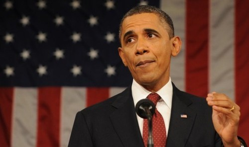
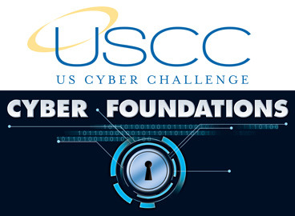
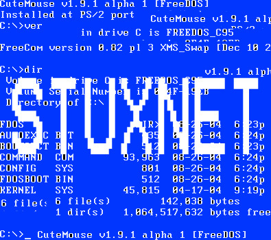
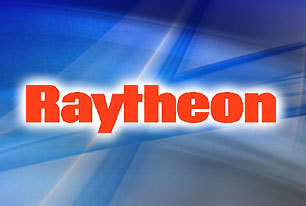

> [  
> ](http://watchdog.wpengine.netdna-cdn.com/wp-content/blogs.dir/1/files/2013/02/obama-state-of-union-address-2-12-13.jpg)
> 
> RUMORS OF CYBER WAR: President Obama’s State of the Union Address included this hidden stock tip: invest in cyber-security companies with government contracts.

By Yaël Ossowski | Special to [Watchdog.org](http://watchdog.org/77981/cyber-security-swindle-the-next-billion-dollar-boondoggle/)

WASHINGTON, D.C— Speaking to the nation during his 2013 State of the Union address in February, President **Barack Obama** used the spotlight to warn of the growing threat posed by attacks in cyberspace.

“We know foreign countries and companies swipe our corporate secrets,” he declared. “Now our enemies are also seeking the ability to sabotage our power grid, our financial institutions, and our air traffic control systems.”

And as the president spoke, [an executive order](http://www.whitehouse.gov/the-press-office/2013/02/12/executive-order-improving-critical-infrastructure-cybersecurity) on cybersecurity policy went into effect, calling attention to the “serious threat” posed by cyber attacks and ordering immediate changes to facilitate “protection of vital infrastructure.”

Announcement of new spending to defend against cyber attacks was supported by more official drum beating.

“There’s a strong likelihood that the next Pearl Harbor that we confront could very well be a cyber attack,” warned **Leon Panetta**, former **Secretary of Defense** and director of the CIA for the Obama administration, in [Jan. 2012](http://www.nytimes.com/2012/10/12/world/panetta-warns-of-dire-threat-of-cyberattack.html?pagewanted=all&_r=0).

> 
> 
> NOT EFFICIENT: Secretary of Homeland Security Janet Napolitano is admittedly not keen to adapt technology.

On Mar. 7**,** Secretary of Homeland Security **Janet Napolitano**, [a self-described “luddite”](http://security.blogs.cnn.com/2012/09/28/the-luddite-atop-us-cybersecurity/) who refuses to use email because it’s “inefficient,”  [testified before the**Senate Homeland Security Committee**](http://www.dhs.gov/news/2013/03/07/written-testimony-dhs-secretary-janet-napolitano-senate-committee-homeland-security) that “sophisticated threats” posed great danger to the “nation’s critical Internet infrastructure,” and more cooperation with “private sector Internet partners” was needed to ward off attacks.

While the administration’s push for a cybersecurity agenda has been met with praise among officials and industry leaders, it’s unclear just how costly — for businesses and taxpayers alike — such a plan will be.

**The nature of the ‘threat’**

Hypothetical “9/11-Pearl Harbor-sized attacks” have received regular mention in House and Senate testimony, serving as the justification for current bills such as the **Cybersecurity Enhancement Act** and the **Cyber Intelligence Sharing and Protect Act**, or CIPSA, the latest version of the **Stop Online Piracy Act** and **Protect Intellectual Property Act**, which both failed after a public uproar in 2012.

It’s a threat the government deems serious enough to hire more than [10,000 “cyber warriors”](http://articles.washingtonpost.com/2012-05-29/business/35458606_1_cybersecurity-college-students-visit-colleges) in the near future, according to the [**Cyber Security Challenge**](http://www.uscyberchallenge.org/)**,** a public-private contest created to hire the next generation of cybersecurity experts.

> 
> 
> RECRUIT: The Cyber Challenge aims to hire 10,000 new “cyber warriors” in the near future.

And it’s a focus that already consumes billions of dollars in taxpayer dollars each year.

In 2011, the federal government spent over $13 billion on cybersecurity, all but $3 billion of that from the Department of Defense, according to a [recent report by the DOD’s Cyber Threat Task Force](http://www.acq.osd.mil/dsb/reports/ResilientMilitarySystems.CyberThreat.pdf).

“There has been very little analysis as to the cost or expected benefits for any regulation pertaining to cybersecurity,” said **James Gattuso**, a senior research fellow at the **Heritage Foundation,** a nonprofit conservative think tank in **Washington**, D.C. “It’s admittedly a very difficult thing to measure.”

> 
> 
> SKEPTICAL: Gattuso sees no role for the government in regulating cybersecurity.

Gattuso recognizes the importance of cybersecurity, but maintains [government regulations](http://www.heritage.org/research/reports/2012/06/cybersecurity-and-red-tape-more-regulations-not-the-answer) will only burden American businesses even more, putting their bottom line at risk in the face of unproven claims.

“You don’t want to go into this blindly and regulate the most innovative industry of the last century,” he told Watchdog.org. “I think cybersecurity is a real serious issue, but the costs imposed by government will be big for companies and consumers alike, not to mention the loss of innovation due to complying with new rules.”

He maintained that businesses have the ultimate market incentive to protect themselves against attacks, and won’t need costly regulations to do so, a point supported by the latest research.

According to the [latest report](http://cts.businesswire.com/ct/CT?id=smartlink&url=http%3A%2F%2Fwww.idc-fi.com%2Fgetdoc.jsp%3FcontainerId%3DFIN240400&esheet=50602437&lan=en-US&anchor=Pivot+Table%3A+Worldwide+IT+Spending+2013-2017+%E2%80%93+Worldwide+Risk+IT+Spending+Guide%2C+1H13&index=2) by IDC Financial Insights, a market research firm in Framingham, Mass., global cybersecurity spending is estimated to exceed $80 billion by 2017, averaging 16 percent of all tech spending by private firms.

Even without government regulations, these companies are spending an average of 5.5 percent more on cybersecurity each year, according to the study, demonstrating an active role by business in protecting their own systems, something Gattuso believes the government won’t be able to provide.

“Whenever you have a generalized concern and consultants are willing to give opinions about it, you get a lot of useless advice and you’ve got to watch for the ultimate costs that may come about because of this,” said Gattuso. “The taxpayer does have a lot to worry about it.”

So far, the only use of a major cyber weapon worldwide came from the United States itself: the federal government’s reported release of the **Stuxnet** worm, a highly sophisticated malware program designed to cause damage to Iran’s nuclear facilities.

> 
> 
> WEAPON: The U.S. government reportedly released the Stuxnet virus to attack Iran’s nuclear facilities.

Release of the worm was [uncovered by the New York Times](http://www.nytimes.com/2012/06/01/world/middleeast/obama-ordered-wave-of-cyberattacks-against-iran.html?pagewanted=all) in June 2012, but the government has never publicly acknowledged ordering the attack.

**The cybersecurity industry**

According to statistics [gathered by the Washington Post](http://articles.washingtonpost.com/2013-03-24/business/37990123_1_cybersecurity-mandiant-industries), 513 different consultants and companies lobbied Congress on issues of cybersecurity in 2012, an 85 percent increase from the previous year.

“A good deal of the narrative is that there are bad people or greedy people, either who want to do harm or want to get data,” said **Lee Tien**, senior staff attorney at the **Electronic Frontier Foundation**, a digital rights group based in **San Francisco**, Calif. “But there’s a serious question of whether the federal government getting more active in this area is actually going to be a good thing.”

> 
> 
> DANGER: Tien says involving the government in internet security puts privacy at risk.

He sees the current solutions as inherently problematic, especially considering the role of the would-be regulators and industry lobbyists in **Washington**, D.C.

“The issue is not so much if there are threats, but what are the right ways to respond to them, especially in lieu of the different ways to protect against them,” he told Watchdog.org. “I think that when you follow the money, you have a very objective take on why people are pushing for this—the House bill incentivizes cybersecurity providers to spring up.”

He sees the potential for taxpayer abuse if things go too far.

“There are a lot of things which sound good in the beginning but then end up being a boondoggle and waste in the end,” said Tien.  “We don’t think things will change too much in a good way after all this regulation.”

And Tien is not alone in his skepticism.

“There’s an enormous amount of money and power that results from pushing cyberwar and cyberterrorism: power within the military, the Department of Homeland Security, and the Justice Department; and lucrative government contracts supporting those organizations”, wrote Internet security expert **Bruce Schneier** on his [website](https://www.schneier.com/blog/archives/2012/10/stoking_cyber_f.html) last year. “As long as cyber remains a prefix that scares, it’ll continue to be used as a bugaboo.”

**‘Great investment opportunity’**

It is no accident, therefore, that the [10 largest U.S. defense contractors](http://special.defensenews.com/top-100/charts/rank_2011.php) each have their own cybersecurity offices—a fact well known on **Wall Street**.

According to [**InvestmentU**](http://www.investmentu.com/2013/March/is-the-time-finally-right-for-cyber-security-stocks.html) financial analyst **Jason Jenkins**, the “growing problem” of cybersecurity promises “great investment opportunity” for his clients. “Cyber stocks are finally starting to move,” Jenkins wrote last week. “And the cyber-crime issue has exploded.”

He recommends buying stock in companies such as **Symantec,** an Internet security firm,and **Raytheon**, the nation’s fourth-largest defense contractor and the world’s largest producer of guided missiles, [according to its website](http://www.raytheon.com/capabilities/products/lgr/).

In 2011, Raytheon made $24.8 billion in total revenue, $23.4 billion of which came directly from military contracts—over 93 percent, according [to an analysis by Defense News](http://special.defensenews.com/top-100/charts/rank_2011.php).

It spent $7.5 million lobbying Congress in 2012, [according to the **Center for Responsive Politics**](http://www.opensecrets.org/orgs/summary.php?id=D000000175)**,** and has upped its commitment to meet the government’s cybersecurity needs.

> 
> 
> CASHOUT: Raytheon has been identified as a major player in the cybersecurity industry.

“Information sharing and collaboration between government and industry partners is critical to defending our nation against the cyber threat,” proclaimed Raytheon vice president **Steven K. Hawkins** [in a press release last month](http://raytheon.mediaroom.com/index.php?s=43&item=2287).

U.S. Sen. **Thomas Carper**, D-Del., [author of the Cybersecurity Act of 2012](http://www.carper.senate.gov/public/index.cfm/pressreleases?ID=fa6acfd3-e14c-4a0e-aeda-a610365b5fde), owns anywhere between $1,000 and $15,000 in Raytheon company stock, [according to his 2011 financial disclosure form](http://pfds.opensecrets.org/N00012508_2011.pdf).

The [board of directors](http://investor.raytheon.com/phoenix.zhtml?c=84193&p=irol-govcommcomp) hosts powerful political and military players, including former U.S. Sen. **Warren Rudman**, R-New Hamp., former U.S. Deputy Secretary of Defense **John Deutch**, and former Chief of Naval Operations **Vernon Clark**.

Calls to Raytheon’s press office were not returned.

As the experts contend, it is not so much about questioning a threat, but it is about if the incentive already exists for companies to privately deal with those threats, without the hand of government.

_Contact Yaël at_ [_yael@ossowski.ca_](mailto:yael@ossowski.ca) _and follow him on Twitter @YaelOss._
