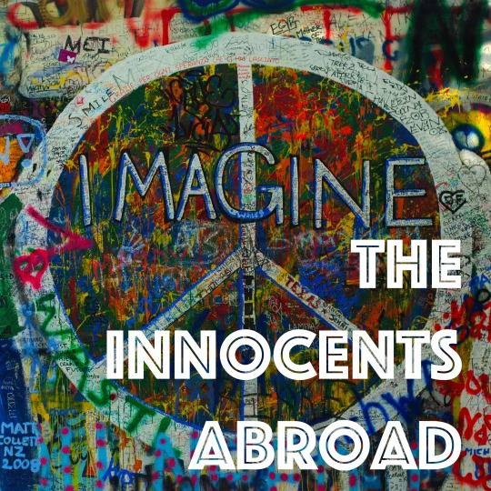

Today I was joined by writer and journalist Anthony Hennen for his take on living and traveling in post-communist Europe.

We met in Prague years ago, and we ponder the possibility of both returning to uncover more about this fascinating place. 

[http://anthonyhennen.com](http://anthonyhennen.com) 

Song: “Freak” by Shane Ó Fearghail Buy his latest album ‘They Might See Dolphins’ on iTunes:  [https://itunes.apple.com/ie/album/they-might-see-dolphins/id1112270111](https://itunes.apple.com/ie/album/they-might-see-dolphins/id1112270111)

[http://theinnocentsabroad.com](http://theinnocentsabroad.com)
