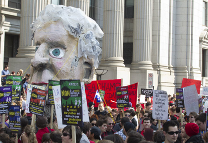
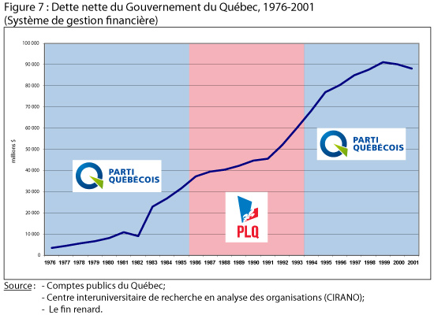
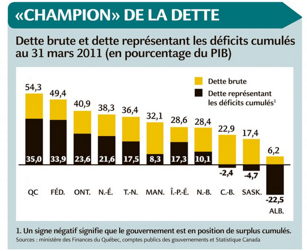

Quand j'ai vu mes compatriotes dans les rues de Montréal le printemps passé, il n'y avait jamais un doute que ces jeunes révolutionnaires jouaient un rôle pertinent.

En pleine conscience, mes anciens collègues se battaient pour un avenir libre d'intimidation, d'incertitude et d'identité imposée par l'état.

Quant à moi, si le boycott étudiant avait été suggéré plus tôt, j'aurai peut-être même eu l'occasion de joindre mes camarades, puisque mes sympathies me font toujours joindre ceux qui s'opposent à un état interventionniste, pénible et ésotérique.

Néanmoins, je n'avais aucune raison pour me plaindre.  Ayant récemment été diplômé de l'Université de Concordia,  j’occupais un bon emploi de journaliste aux États-Unis, et était concentré sur les conneries des politiciens américains. Il y avait du travail à faire.

Pendant que je m'investissais dans les affaires américaines, le mouvement étudiant s'agrandissait quotidiennement, donnant aux activistes dans le monde entier un renouvèlement de l'esprit de désobéissance déclenché par le printemps arabe en 2011.

Dans mes voyages américains, dans le Wisconsin, la Pennsylvanie, la Floride, dans les camps des indignés et les centres communautaires, le carré rouge se faisait connaître, épinglé sur les vestes de sympathisants qui s'imaginaient dans la même lutte que leurs confrères québécois.

Le mouvement, qui concernait initialement presque qu’exclusivement les gens concernés par le coût de l'éducation, a ensuite évoluer et à attirer un afflux de syndicalistes, de gauchistes et d’étatistes qui ont perçu l'opportunité politique accordée par ce niveau élevé de mécontentement.

Entre **Pauline Marois** du **Parti Québécois**, **Fraçoise David** du **Québec Solidaire** et **Jean-Martin Aussant** de l’**Option Nationale**, les trois chefs qui n'ont pas honte de porter le carré rouge et de frapper des casseroles aussi longtemps que nécessaire pour obtenir l’appui des jeunes révolutionnaires.

Certes avec de légères différences, les trois chefs partagent entre eux une vision d'un Québec indépendant et souverain du pouvoir fédérale d'Ottawa, mais en même temps d'un Québec beaucoup plus interventionniste et actif dans l'économie, selon les besoins sans fin de leurs constituants.

**LE STATU QUO ÉCONOMIQUE**

Comme a dit le **Minarchiste Québécois** sur [son blogue](http://minarchiste.wordpress.com/2012/08/22/elections-2012-mon-analyse-des-programmes-des-partis/), ces partis représentent une forme de « régression vers des principes qui ne collent plus avec le monde d’aujourd’hui : le mercantilisme, le protectionnisme, le nationalisme, le collectivisme ».

D'après ces partis nationalistes, le pouvoir de réglementer l'éducation, la culture et la langue leur donne aussi le pouvoir de gérer la vie économique de leurs citoyens.

Taxer les riches, disent-ils, pour financer les programmes. Mettre en place immédiatement un moratoire complet au secteur des gaz et pétrole de schiste, disent-ils, pour enfin éliminer le spectre de profit dans le jeu de « l'indépendance énergétique ». Grossir et cultiver les dépenses sociales, disent-ils, pour amener la société dans une direction plus ordonnée et adequate, pour maintenir le caractère « distinctif » de la belle province.

Certes, la province de Québec est très «distincte» dut au fait qu'elle soit la plus taxée, reglementée et endettée de l’Amérique du Nord.

Les étudiants devraient donc reconsidérer un vote péquiste, **Québec Solidaire** ou **Option Nationale**, les partis qui promettent une continuation du statu quo de collecitivisme québécois.

Puisque ils savent que le **Parti Liberal** n'a plus de crédibilité après 10 ans au pouvoir, il ne reste qu'une option: la **Coalition Avenir Québec**, géré par l’ex-péquiste **François Legault**.  Le choix que je suggère à mes compatriotes.

**LA VRAIE BATAILLE**

Lorsqu’ils appuient la gauche québécoise, les jeunes étudiants ne se trouvent qu'en bataille pour maintenir le statu quo québécois. Leur bataille n'est plus radicale.

Ce n'est plus une bataille pour rejeter la hausse des tarifs de 1 625 $ sur sept ans ou pour s'opposer à la loi 78, qui interdit la liberté d'expression et de manifestation à la discrétion du gouvernement provincial.

C'est une bataille pour défendre le modèle québécois contre des changements structurels, rendues nécessaire puisque le Québec en 2012 se trouve dans [une situation financière très «fragile»](http://www.conferenceboard.ca/topics/economics/budgets/quebec-2012-budget-fr.aspx), selon le **Conference Board du Canada**, un think tank spécialisé dans l'analyse économique.

En ce moment, la dette brute frappe 191,7 milliards $ ou presque 24 000 $ par habitant au Québec. L’**Institut économique de Montréa**l [calcule](http://www.iedm.org/fr/57-compteur-de-la-dette-quebecoise)que la dette du secteur public, comprise de la dette des réseaux de santé, d'éducation et des municipalités, se rapproche des 252,9 milliards $.

Selon le plan budgétaire du ministre des Finances **Raymond Bachand**, le déficit achèvera 1,5 milliard $ d'ici la fin de l'année fiscale, un chiffre qui donne peu de confiance aux créditeurs du peuple québécois.

Malheureusement pour M. Bachand, le dernier rapport mensuel des opérations financières, dévoilé le 7 août, révèle qu'en avril et mai, le gouvernement a « enregistré un solde déficitaire de 1 416 milliard $ sur ses comptes », selon **Le Journal de Montréal**, lequel représente 93% [du déficit prevu](http://www.journaldemontreal.com/2012/08/14/93-du-deficit-prevu-pour-toute-lannee-en-seulement-deux-mois).

Le gouvernement **Liberal** de **Jean Charest** se rend compte du problème, démontré par leur impôt-santé, comme nous voyons avec la hausse des frais de scolarité, mais préfère sous-estimer le danger, juge-t-il.

Si les étudiants veulent être reconnus comme iconoclastes, veulent s'opposer à l'ordre imposé et veulent s'attacher à un paradigme en évolution, il faut donc cesser de soutenir les partis politiques qui promettent que l'intervention étatique sera la potion magique pour tous les maux de la société.

**CONCLUSION**

Quant à la souveraineté, il y a sans doute des milliers de québécois qui choisiront leur député local sur la promesse d’un futur référendum et d’un rêve indépendantiste.

Je partage ces sentiments d'être maîtres chez nous, mais il faut admettre qu'on ne peut pas soutenir une nation québécoise sur des montagnes de dette et d'argent que nous n’avons point.

Il faut faire le ménage chez nous avant qu’on soit capable de déclarer qu'on est souverain.

Avec un oeil sur le futur, je voterai CAQ le 4 septembre.
