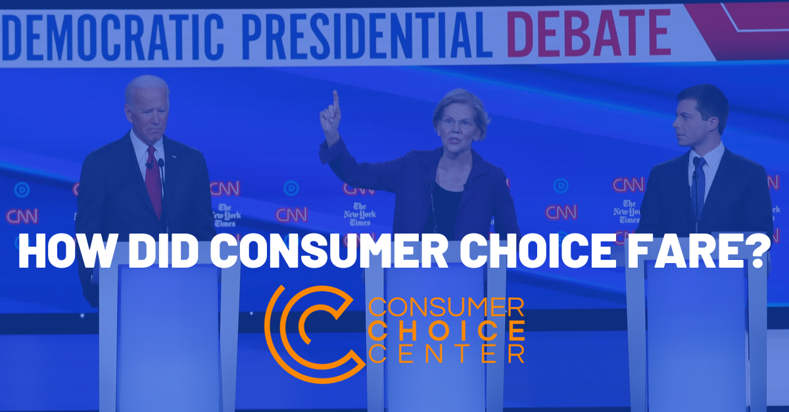

 

With the 2020 presidential race running on full steam, 12 Democratic candidates for president participated in yet another televised debate last night in Ohio.

Considering consumers will be directly impacted by many of the policies mentioned, here's a breakdown by categories mentioned by the candidates and our own spin on how it relates to consumer choice.

**HEALTHCARE**

**Mayor Pete Buttigieg** makes some good points on keeping competition for healthcare insurance, blasting **Sen. Elizabeth Warren** for not being straight on whether taxes will go up with her Medicare For All plan.

Buttigieg: "No plan has been laid to explain how a multi-trillion-dollar hole in this Medicare For All plan that Sen. Warren is putting forward is supposed to get filled in."

He prefers "Medicare For All Who Want It," continuing to allow private healthcare insurance and a public option for those who want it. [As we've written before](https://consumerchoicecenter.org/what-happened-to-the-right-to-choose-your-healthcare/), more choice in healthcare is what should be championed.

And Buttigieg had another great line:

> "I don't think the American people are wrong when they say that **what they want is a choice**...I don't understand why you believe the only way to deliver affordable coverage to everybody is to obliterate private plans, kicking 150 million Americans off their insurance in four short years."

Warren, on the other hand, calls her plan the "gold standard," again stating that while taxes on the wealthy will go up, costs for middle-class families will go down. Here, she's taking an objective view of the total costs to families, mixing taxes and healthcare expenses. Of course, that's very convoluted, and doesn't leave much clarity to consumers.

**Sen. Bernie Sanders** is more honest: "I do think it's appropriate to acknowledge that taxes will go up...but the tax increase they pay will be substantially less than what they were paying for premiums and out-of-pocket expenses.

**Sen. Amy Klobuchar:** "We owe it to the American people to tell them where we're going to send the invoice...we need to have a public option." She calls Medicare For All a "pipe dream," calling for an expansion of Obamacare.

**Former Vice President Joe Biden:** "The \[Medicare For All\] plan is going cost at least $30 trillion over 10 years." He similarly wants to just expand Obamacare.

Overall, it seems there is still a lot of support for competition in healthcare, and that is to be celebrated. Medicare For All, which would remove all aspects of competition and free choice, only got moderate support by all except Sanders and Warren.

**CANNABIS LEGALIZATION**

The idea of a smart cannabis policy was quite absent from the debate. That's quite a mishap, considering the ongoing issue of federal cannabis prohibition while select states continue with their own version of legalization.

The only two mentions came in the context of the opioid crisis, by Sen. Cory Booker and Andrew Yang. They only mentioned that cannabis could be used as an alternative for those addicted to opioids.

What about the very real fight to have [smart cannabis policy](http://smartcannabispolicy.com) implemented at the federal level? We hope this is covered more in future debates.

**AUTOMATION**

The idea of a federal job guarantee was fresh on the lips of Bernie Sanders, but that was shot down by most people on the stage.

**Entrepreneur Andrew Yang** hit it out of the park with this one:

> "Most Americans do not want to work for the federal government. And saying that is the vision of the economy of the 21st Century is, to me, is not a vision that most Americans would not embrace."

He promotes his _Freedom Dividend_, offering $1,000 a month to every American as a replacement for welfare, as a way to boost consumer spending, and help workers who lose their jobs due to automation.

There is much that could be written about whether or not this universal basic income would be good for consumers, but it is at least a different policy debated by mainstream presidential candidates on a national state.

**TECH REGULATION**

There was much room for beating up tech companies that offer great services for ordinary consumers. That includes services like Facebook, Amazon, and Google. We've written about the [trust-busters](https://consumerchoicecenter.org/opinion-facebook-trustbusters-motivated-by-partisan-politics-not-consumer-protection/) and their desire to usurp consumer choice before.

Warren led the salvo, using a quip about separating the umpire and the baseball team as some kind of strange metaphor about Amazon selling its own products on its website. Enter her zinger: "We need to enforce our anti-trust laws, break up these giant companies that are dominating big tech, big pharma, all of them." Pretty clear there.

Yang: "Using a 20th-century anti-trust framework will not work. We need new solutions and a new toolkit...the best way to fight back against tech companies is to say that our data is our property. Our data is worth more than oil." He made the case for his Value Added Tax on digital services as well, which we'll examine below.

**Sen. Kamala Harris** pleaded her fellow candidates to [support her call](https://www.washingtonpost.com/opinions/2019/10/04/kamala-harris-wants-boot-trump-twitter-it-wouldnt-work/) to get Twitter to ban **President Donald Trump** from Twitter but got no love.

The person who made the most consumer-friendly response about tech regulation was, surprisingly, **former Rep. Beto O'Rourke**.

> "Treat them as the publishers as we are. But I don't think it's the role of the president to specify which companies will be broken. That's something Donald Trump has done...we need tough rules of the road, protect your personal information, privacy, and data, and be fearless in the face of these tech giants."

He was one of the only people in the debate to mention consumer privacy and pushed back against trust-busting, and should hence get a pat on the back.

**TRADE**

No Democrat mentioned the trade wars, the harmful impacts of tariffs, and the promise of free trade. Rather, trade got mostly slammed.

Elizabeth Warren: "The principal reason \[for losing jobs\] is trade. Giant multinational companies have been calling the shots on trade...they are loyal only to their bottom line. I have a plan to fix that: accountable capitalism."

Warren's version of accountable capitalism:

- 40% of corporate boards should be elected by the employees
- We should give unions more power when they negotiate

Again, no mention of the USMCA free trade agreement, no talk of free trade with the European Union or any other countries.

**Sen. Cory Booker** agrees that unions should be empowering to offer Americans a "living wage."

**Rep. Tulsi Gabbard** says universal basic income is a "good idea to help provide that security so that people can have the freedom to make the kinds of choices that they want to see." It's not a total endorsement for freedom of choice for consumers, but at least invokes a good notion of free choice. Not sure her take on global free trade.

**TAXES**

Though the candidates mentioned many new taxes they'd endorse, the one that concerns consumers the most would be the idea of a VAT – Value Added Tax.

Andrew Yang mentioned that instead of Warren's wealth tax, he'd pass a VAT of 10%, like in European countries to help fund his Freedom Dividend. That would be [akin to a national sales tax](https://www.pri.org/stories/2017-04-26/why-some-experts-want-us-adopt-vat-and-other-tax-lessons-around-world), but allowing the opportunity for businesses to claim this amount back if it's a legitimate business expense, and the same for tourists visiting on vacation.

On its face, an American VAT would raise costs for ordinary consumers and be regressive. As the [Tax Policy Foundation notes](https://www.taxpolicycenter.org/briefing-book/who-would-bear-burden-vat), this tax would have a disproportionate impact on lower-income households, as they tend to spend more of their income on consumption. Former Labor Secretary Robert Reich made the same point while watching the debate:

\[twitter.com/RBReich/s...\](https://twitter.com/RBReich/status/1184275763664580608)

Many states and municipalities have their own sales taxes or none at all, and that does impact consumers who spend more. But a move to a national VAT would mean higher prices for ordinary goods and services for all consumers.

**PROTECTING CONSUMERS**

Really the only direct mention came when Warren tooted her own horn on her consumer protection agency.

> "Following the Financial Crash of 2008, I had an idea for a consumer agency (Consumer Financial Protection Bureau) that would keep giant banks from cheating people. And all of the Washington insiders and strategic geniuses said "don't even try" because you won't get it passed...it has now forced big banks to return more than $12 billion directly to the people they cheated."

The Trump Administration has [taken the CFPB to court](https://thehill.com/policy/finance/461826-trump-administration-asks-supreme-court-to-take-up-challenge-to-consumer) over whether or not it is constitutional, and Republicans have [consistently attacked](https://www.housingwire.com/articles/48980-republicans-move-to-abolish-cfpb/) the organization since its founding during the Obama Administration.

“Make no mistake, it does little to protect consumers and was created during the Obama administration to enforce burdensome regulations which have stunted economic growth and negatively impacted small businesses and consumers," said Sen. Ted Cruz, who has introduced legislation to abolish the agency.

“America has three branches of government – not four,” said Senator Sasse, who has also co-sponsored the bill. “Protecting consumers is good, but consolidating power in the hands of Washington elites is harmful. This powerful and unaccountable bureau is an affront to the principle that the folks who write laws must be accountable to the people.”

**CONCLUSION**

There wasn't much mention of the impact the debated policies would have on consumers, and unfortunately no mention of free trade and lifestyle freedom.

Regardless, on healthcare and tech regulation, there were good debates and some good principles that should be championed, but still, more could have been mentioned on ways to promote innovation, privacy, science, and consumer choice.

_[Originally posted at the Consumer Choice Center](https://consumerchoicecenter.org/democratic-presidential-debate-how-did-consumer-choice-fare/)_.
