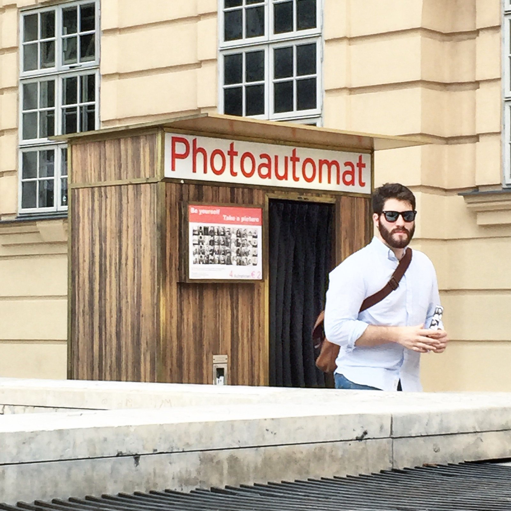

I've had a fair share of apartments.

Whether in Montréal, Philadelphia, St. Petersburg, Prague, or Vienna, I was always quite used to keeping it light knowing I'd be departing sometime soon.

That changed in 2014, when we found a great apartment in Vienna's Neubau district. Known as the "7th" – denoting its district number and distance from the city center – the area had everything young people would want. Bars, restaurants, great cafes, museums, and plenty of pizzarias. Winning!

This is where culture thrives in Vienna, where the artists and creatives live, entrepreneurs experiment with new businesses, and every left-wing demonstration ever must at least touch the pavement in one area of the district. I'm told there are even "Instagram celebrities" who live and (don't) work here.

Every time I wanted to meet a friend, it was never a stretch to meet just across the street at the local pub or cafe, or on the corner for a great schnitzel. People always want an excuse to come here, and they were more than happy to do so. And getting to a grocery store, hardware store, florist, photo studio, cafe with WiFi, wine shop, bus stop, or tram stop was never more than a few seconds away. More than that, I could always hop on an e-scooter, my bike, or rent a car by the minute (DriveNow) to get anywhere in the city within 20 minutes or less.

I imagine it's the same as living in New York without the problematic aspect of living in New York (come on bro, this is Europe).

Now, five years later, the calculus has changed a bit. With a child, priorities become different. You think less about being close to the bar, and more about the big, green park where you can go on long walks, and the prospect of an outside space you can call your own. Not to mention good schools, and adequate space to park your larger-than-life SUV.

At last, we decided to make the switch. We're moving to Döbling, Vienna's 19th District. It's a much larger district just outside the city center that hosts many embassies, international schools, and some of the best parks in the city. Added to that, it's much greener, residential, and not far from Vienna's own woods. But oddly enough, did I mention it also hosts the Karl Marx-Hof, the largest public housing facility in Europe? One dedicated to the homeboy of socialism?

Naturally, this will take some getting used to. Because I thought I was moving away from the socialists!

Though we're further out, we can still access an U-Bahn or tram within 10 minutes. That's prime. I can still use my car sharing services, but it seems e-scooters are just outside the range here. Well damn.

But I'm happy with the change. It's an upgrade. I've got an outside space where you might see me cutting wood or practicing martial arts. Okay, maybe not, but it's theoretically possible. That's what's great about having a bigger space. You can do whatever you wish, all the while knowing there's something you're forgetting to do because you have such a big damn space to maintain.
