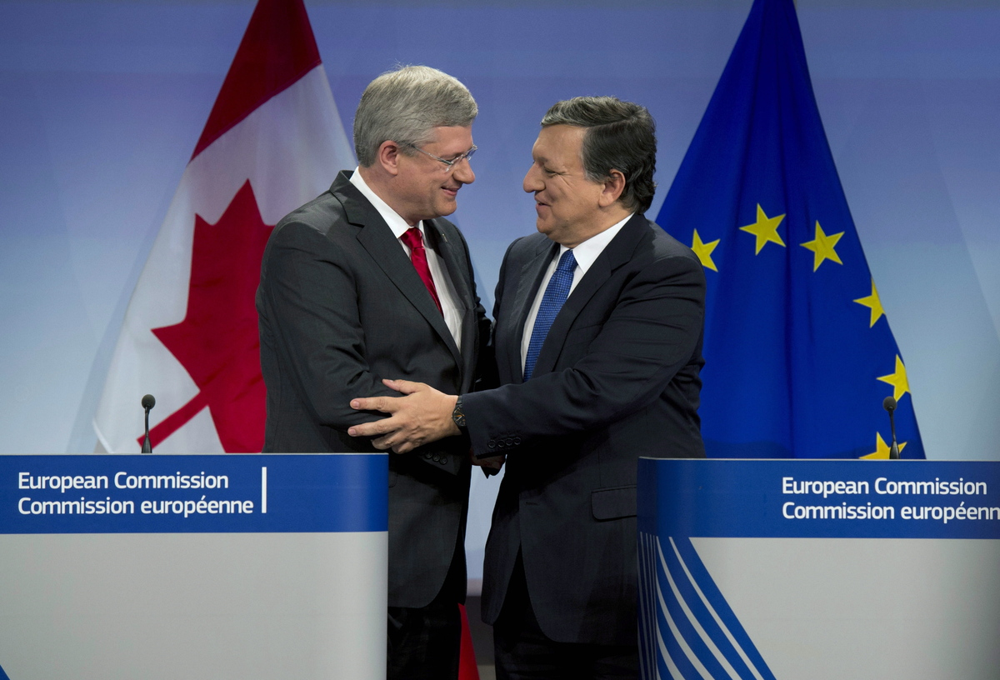

Par Yaël Ossowski et Fred Roeder | [Huffington Post Québec](http://quebec.huffingtonpost.ca/yael-ossowski/libre-echange-canada-europe_b_4244427.html)

Le 18 octobre, le gouvernement canadien a signé un accord de libre-échange avec l'Union européenne (UE). Quoiqu'il attende d'être ratifié par les États membres de l'UE et les provinces canadiennes, un coup d'œil à cet accord nous montre comment la suppression d'obstacles au commerce pourra bénéficier à la croissance économique et stimuler la prospérité des deux côtés de l'Atlantique.

Bien que cette entente soit une étape importante pour l'intégration de ces deux marchés, il faut rappeler que l'accord n'implique pas un libre-échange illimité, mais plutôt une augmentation des quotas existants.

Parmi les nombreux avantages offerts par l'accord, les pécheurs canadiens pourront notamment vendre leurs homards 20 % moins cher aux distributeurs européens de produits gourmets. Les quotas sur l'importation en Europe du bœuf canadien seront eux augmentés plus de six fois, donnant aux consommateurs européens la possibilité d'acheter de la viande moins chère dans leur épicerie ou charcuterie.

Les Canadiens pourront acheter des voitures européennes, des Volkswagen ou des Fiat, 6 % moins cher grâce à l'abolition de la taxe d'importation de l'Union européenne. Les prix élevés sur le fromage et les autres produits laitiers dans les supermarchés canadiens baisseraient de façon dramatique à la suite de l'introduction de compétiteurs européens sur le marché de l'alimentation.

Un changement dans la taxation du vin donnerait un gros coup de pouce aux vignerons européens qui veulent vendre à des prix plus compétitifs au Canada.

L'accord prévoit de créer une croissance significative pour l'économique domestique canadienne. Selon les plus récentes estimations, le marché du travail pourrait s'attendre à 80 000 nouveaux emplois dans les prochaines années.

Si ce plan réussit, les consommateurs des deux côtés de l'Atlantique pourront bénéficier du commerce entre l'Union européenne et le Canada. Ils pourront acheter plus pour moins d'argent. Les entreprises qui souhaitent se développer et élargir leurs marchés feront face à moins de réglementations et d'obstacles bureaucratiques. Cela suscitera beaucoup plus de fusions d'entreprises et des relations plus étroites dans le domaine du commerce à travers plusieurs frontières.

Un succès dans ce cycle de négociations entre l'UE et le Canada donnera beaucoup d'espoir pour l'accord de libre-échange entre les deux plus grandes économies au monde, à savoir l'Union européenne et les États-Unis, qui négocient le Partenariat transatlantique de commerce et d'investissement.

Des droits de douane réduits et des quotas d'importation élevés doivent être accueillis positivement si on vise à donner plus de choix aux consommateurs. Bien que cet accord soit un avancement pour libérer l'économie mondiale, les leaders occidentaux ont le pouvoir pour en faire plus.

Les chefs négociateurs de l'UE pourraient unilatéralement libéraliser le commerce et habiliter les producteurs de biens et services en leur offrant la possibilité d'exporter dans l'Union européenne. Cela donnerait aux 500 millions consommateurs européens une plus grande variété de biens à des prix plus bas, augmentant leur pouvoir d'achat, et cela constituerait un vrai plan de relance économique avec des effets très productifs et profitables.

Bien que l'accord de libre-échange soit négocié par des politiciens, il est hors de doute que les bénéfices pour les consommateurs mondiaux se traduiraient par des taxes plus basses, des prix moins élevés et plus de concurrence sur le marché global.

Célébrons cet accord, mais assurons-nous que davantage d'obstacles au commerce seront supprimés, puisque l'impact positif que cela engendrera enrichira non seulement le Canada et l'Union européenne, mais le monde entier.

_Cet article a été publié sur [Huffington Post Québec](http://quebec.huffingtonpost.ca/yael-ossowski/libre-echange-canada-europe_b_4244427.html)._
