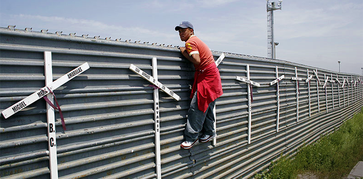

#### Federal Bureaucracy, Migration Criminalization Put Forward Nation’s Worst Face

[YAËL OSSOWSKI](http://panampost.com/author/yael-ossowski/) JULY 21, 2014 | [PanAm Post](http://panampost.com/yael-ossowski/2014/07/21/end-the-war-on-migrant-children/)

_A migrant attempts to cross the US-Mexico border fence. ([Wikimedia](http://commons.wikimedia.org/wiki/File:Migrant.jpg))_

[Español](http://es.panampost.com/yael-ossowski/2014/07/21/acabemos-con-la-guerra-contra-los-inmigrantes/)

When families with young children escape the perils of economic hardship and [gangster-dominated neighborhoods](http://panampost.com/elisa-vasquez/2014/06/27/why-a-honduran-has-no-choice-but-to-flee-to-the-united-states/) in Latin America to make their way to the American border, their chances for a better life are just within reach.

Most of them aim to connect with their family members and loved ones already living in the United States.

A costly and overly bureaucratic process awaits them if they follow all the rules and wait years. Alternatively, a short but dangerous journey across deserts and rivers, led by a high-priced_coyote_, grants them immediate access, but condemns them to illegal status in the country.

Tens of thousands of young migrant children make that journey every year, with their parents or alone, often smuggled in by notoriously dangerous gang-bangers and drug traffickers. Because crossing the border legally is next to impossible for someone without the means, these desperate migrants have to actively hide from authority figures at every turn.

It’s the equivalent of [being forced into the shadows](http://blog.panampost.com/alice-salles/2014/07/16/drug-war-migration-prohibition-force-children-into-the-shadows/?fb_action_ids=10102395205495790&fb_action_types=og.recommends). Some will make it, but others will fail to make the perilous journey.

What’s worse, migrants caught by border security agents are shuffled through the bureaucracy, so they can be deported back to their home countries. They’re rounded up, put in detainment centers, and rammed through legal proceedings and assessments. It’s the worst face of US bureaucracy.

“Our message is clear. If you come to this country illegally, we will send you back — consistent with our laws and values,” said Secretary of Homeland Security Jeh Johnson last week during a visit to an [immigrant detainment facility](http://www.dhs.gov/news/2014/07/12/readout-secretary-johnsons-visit-new-mexico-and-texas) in New Mexico. They’ve attempted to relocate some immigrant families and children in several US states, but governors have [resisted](http://online.wsj.com/articles/flood-of-child-migrants-spurs-local-backlash-1405294984). That leaves them stuck in the federal bureaucracy.

Since October 2013, over 50,000 child migrants have been filtered through the Department of Health and Human Services, a number projected to hit 90,000 by next fall. Is this really what we want our country to look like to those who want to move here?

Migrants seek a better life in the United States. So why subject them to the inefficient and ineffective federal bureaucracy so many citizens deplore?

Decades ago, immigration officials at Ellis Island took in newly arrived people and checked their health. There was no overly complicated process, and certainly not one that included armed guards and electric fences.

The United States has people begging to enter its borders, and they’re being handled more like unwanted property than human beings, a point recognized by the government bureaucracies themselves.

“Too often individuals have tragically perished attempting to cross the border illegally at the hands of criminal smugglers who have no regard for human life,” ironically states the Department of Homeland Security [on its website](http://www.dhs.gov/news/2014/06/20/fact-sheet-artesia-temporary-facility-adults-children-expedited-removal).

As an immigrant myself, hailing from Canada, I know full well the bureaucratic process involved with becoming a citizen of the United States. Though I arrived in 1994, with my parents who were economic migrants, it took until 2009 before I became a full-fledged citizen. I did my entire primary and secondary school first as a non-resident alien, then as a resident alien, and then finally as a permanent resident.

Though I had lived most of my life in the United States, I couldn’t vote when I turned 18 like all my friends, and I certainly couldn’t claim to be US American in spirit. Though I hosted the morning announcements at my high school, I was barred from reciting the Pledge of Allegiance. After only one time, a teacher complained to the administration, claiming non-citizens shouldn’t be leading the pledge. And that was before I realized the pledge was a twisted doctrinal practice to engender nationalism in the nation’s youth.

On the road to citizenship, there were thousands of dollars spent, plenty of meetings with lawyers, and mountains of paperwork. The process was exhausting and demoralizing. My uncle, a high-skilled immigrant who applied just a bit later for his family’s paperwork, still battles the immigration dragon today. Despite living in the United States most of her life, my cousin was forced to go live in Canada to avoid being deported.

_The Reason Foundation does a great job portraying what the immigration process means for average people._

Native-born US Americans can be forgiven for not knowing how burdensome and bureaucratic this system is, but those who are more privileged are similarly ignorant. This includes the likes of David Frum, himself a high-class Canadian immigrant who got a great gig as a presidential speechwriter in the Bush administration, seemingly unrelated to his [expedited application](http://www.nytimes.com/2008/01/06/magazine/06wwln-Q4-t.html?_r=0) for citizenship.

He sees migrant flows into the United States as troublesome, and demands the government do more to stop them.

“They are people coping with a very ugly set of choices, made worse by America’s past laxity on immigration. If the present surge is not stopped and reversed, those choices will get uglier still,” [argues Frum](http://www.theatlantic.com/international/archive/2014/07/an-immigration-crisis-we-brought-on-ourselves/374491/).

The criminalization of migration has come far enough. This nation cannot continue to centrally manage the entry and exit of people solely wishing to have a better future for themselves and their children.

For the sake of the migrants, let’s get the federal bureaucracy out of the business of controlling individuals’ movement. Let them in.

_This article was published on [PanAm Post](http://panampost.com/yael-ossowski/2014/07/21/end-the-war-on-migrant-children/)._
