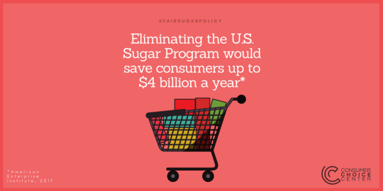

This week in the nation’s capital, the House Agriculture Committee will decide the fate of various agricultural subsidies and food benefits for millions of Americans. 

The bill, [H.R. 2](https://www.congress.gov/bill/115th-congress/house-bill/2/text) , known as the Farm Bill, includes provisions on crop insurance, dairy prices, wetland conservation, Supplemental Nutrition Assistance Program (SNAP) adjustments, and dozens of other rules and regulations on commodities. 

 Tucked within this massive bill is a continuation of the U.S. Sugar Program, a decades-old government program that effectively sets prices for sugar, guarantees cheap loans for domestic sugar producers, and keeps out foreign competitors. It’s sugar protectionism, through and through. 

As I mentioned in the [Washington Examiner](https://www.washingtonexaminer.com/sugar-subsidies-are-anything-but-sweet) some months ago, this program has the unintended consequence of raising the costs of sugar for various small businesses, and passing those costs on to consumers.

> The consequence of that multi-decade arrangement, however, has been higher costs for consumers and domestic businesses that rely on sugar as a base ingredient for their products.
> 
> According to the American Enterprise Institute, users and consumers of sugar lose out to the tune of [$2.4 billion-$4 billion](http://www.aei.org/publication/analysis-of-the-us-sugar-program/) a year. That directly hurts the thousands of small businesses that rely on sugar’s low prices.

Now that the Farm Bill is set to be voted on in the committee, legislators have a chance to alter this program that has proven to be a huge burden to small businesses and consumers. 

Key to this will be the Foxx Amendment, proposed by U.S. Rep. Virginia Foxx from North Carolina. This amendment would shrink the U.S. Sugar Program from its current size to a more moderate version. It wouldn’t go so far as scrapping the program, but it would make necessary changes that would better benefit consumers and American businesses that rely on affordable sugar. 

In an [op-ed](https://www.nationalreview.com/2018/05/sugar-subsidies-cost-taxpayers-billions-time-to-end/) with Americans For Tax Reform President Grover Norquist, Foxx makes the case for reforming the U.S. Sugar Program and slimming down sugar protectionism once and for all.

> But the sugar program costs some Americans more than higher grocery prices: it costs them their job. As the U.S. International Trade Administration [found](https://www.trade.gov/mas/ian/build/groups/public/@tg_ian/documents/webcontent/tg_ian_002705.pdf), the program kills three manufacturing jobs for every sugar-producing job that it protects.
> 
> Let’s look at a few painful examples. 

> The Spangler Candy Company [reports](https://www.candyusa.com/news/collective-wish-list-year-reforming-u-s-sugar-program/), “Today, we have about 150 people making candy for us in Mexico. In 2017, Spangler had 900 people apply for jobs at our Ohio factory. I would love to offer 250 of them a job as a candy cane maker, but our government insists that sugar processing jobs are more important than manufacturing jobs. They are picking winners and losers and our town has been the loser for many years now.” 

> The Atkinson Candy Company [moved](https://www.wsj.com/articles/cheaper-sugar-sends-candy-makers-abroad-1382320842) 80 percent of its peppermint-candy production to a factory in Guatemala that opened in 2010.
> 
> And the makers of President Reagan’s favorite candy, [Jelly Belly](https://www.wsj.com/articles/cheaper-sugar-sends-candy-makers-abroad-1382320842), had to build its new 50,000-square-foot plant in Thailand thanks to the high sugar price driven by U.S. policy. 

>  The evidence is overwhelming – this is an expensive and damaging special-interest giveaway and it must be stopped.

As Foxx and Norquist demonstrate, the current sugar program forces small, family-owned food companies to pay twice as much for sugar as the rest of the world. 

It restricts how much domestic sugar can be sold, and how much sugar can be imported from other countries.

That’s a huge blow to consumer choice, not to mention an indirect tax to small businesses that rely on sugar for their products.  

According to the U.S. Census Bureau, the sugar program killed 123,000 jobs between 1997 and 2015. The U.S. Department of Commerce reports that for every sugar-processing job subsidized through artificially high U.S. sugar prices, three American manufacturing jobs are lost. 

In response, Foxx introduced her own bill to tackle the program and modernize it. The [Sugar Policy Modernization Act of 2017](https://www.congress.gov/bill/115th-congress/house-bill/4265/text), introduced back in November, currently has 80 co-sponsors but remains stuck in the House Agriculture and Ways and Means Committees. 

The Farm Bill will take precedence, and thus focus will now be on the Foxx Amendment to make the needed changes for America’s domestic sugar policy. 

If legislators want to help prop up American consumers and small businesses rather than Big Sugar, they would vote to reign in the sugar protectionism in the Sugar Program.
