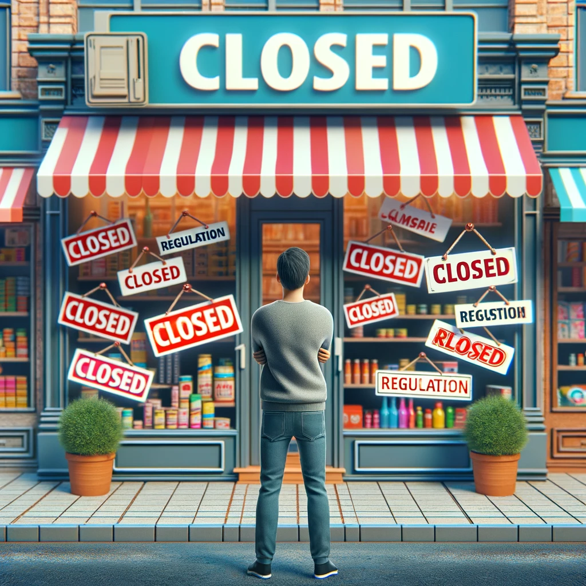

Has air pollution improved in our lifetime?

The narrative is that our atmosphere and air quality are more [polluted](https://www.nytimes.com/2023/08/24/climate/air-quality-satellite-nasa-tempo.html?searchResultPosition=4) than ever, requiring drastic economic and societal reform to clean it.

But in the United States, the opposite is true.

According to the EPA’s [data](https://www.epa.gov/air-trends/air-quality-national-summary), air pollution — measured using the six most common air pollutants — has reduced 42 percent since 2000. This measure considers the molecular makeup of particulate matter, whether that be smoke, dust or soot.

These numbers may be increasing in some developing countries where air pollution is a measurable problem, such as China or India. Still, the United States has managed to take a different path.

While some of this is because of policing and permitting programs by federal and state environmental regulators, the overwhelming amount of reduction has been generated in [cleaner and more efficient practices](https://www.iea.org/reports/co2-emissions-in-2022) from industries themselves — including manufacturing, agriculture and energy — as a means of reducing their costs.

However successful we’ve been in reducing air pollution, a proposed rule that could upset that decline and put many industries and the consumers that depend on them at risk.

In January, the Environmental Protection Agency proposed a rule limiting the amount of particulate matter from 12 micrograms per cubic meter of air to between 9 and 10, seeking to update the National Ambient Air Quality Standards.

That rule is being examined by the Office of Management and Budget, leading to concerns that the drastic regulatory change would harm more than help.

In September, 23 Republican senators [sent a letter](https://www.epw.senate.gov/public/_cache/files/1/4/14781de9-14ce-4f16-9f5d-b660a4c5f2ad/BD86744971CAF4DF5C0A0D276791152A.09.20.23-pm2.5-capito-letter.pdf) to the EPA administrator urging him to reconsider, citing the economic cost and their belief that lowering the standard would “produce little to no measurable public health or environmental benefits.”

This decision follows the EPA’s reconsideration of the Trump administration’s stance on particulate matter in June 2021, where it opted to maintain the existing National Ambient Air Quality Standards of 12 micrograms per cubic meter. The proposed rule is awaiting approval after undergoing interagency review with the OMB.

The NAAQS rule is pivotal in regulating “major sources” of pollutants or significant modifications to existing sources such as power plants and manufacturing facilities. Under the current standard, the industry has thrived thanks to innovative approaches to resource utilization. The proposed change, however, could force manufacturers and power generators to curtail their operations significantly, leading to revenue losses and job cuts. More important, this would eventually raise costs or reduce choices for consumers who depend on those industries.

If implemented, the new particulate matter standard could grind manufacturing and industrial projects to a halt, affecting new and continuing initiatives. Compliance with the stricter standard would become a significant challenge for companies, jeopardizing manufacturing, power generation and other vital industrial activities.

Ironically, this move could hinder President Biden’s goal of reshoring manufacturing jobs and establishing the nation as a leader in energy transition technologies. Rather than fostering growth, the EPA’s rule risks stifling U.S. manufacturing, driving investment and jobs overseas.

The numbers tell a grim story. According to the National Association of Manufacturers, the proposed standard could threaten economic activity from $162.4 billion to $197.4 billion, putting 852,100 to 973,900 jobs at risk. Additionally, 200 counties may be unable to support industrial activity if the rule is adopted.

In essence, the EPA’s proposed rule is a solution in search of a problem. Punishing U.S. industry, which has excelled in achieving clean air standards, this move threatens to destabilize the economy and penalize consumers. The OMB must reject this rule, recognizing the potential for severe economic repercussions and the unnecessary burden it places on businesses and consumers.

_Published in [DC Journal/ Inside Sources](https://dcjournal.com/epa-could-drown-industries-make-consumers-pay/) ([archive link](http://mazon.de/))._

_Syndicated in [Detroit News](https://www.detroitnews.com/story/opinion/2023/12/18/ossowski-epa-could-drown-industries-make-consumers-pay/71961428007/) ([archive link](https://archive.ph/7eP0M))_, [Arizona Daily Star](https://tucson.com/opinion/column/national-opinion-epa-could-drown-industries-make-consumers-pay/article_95ebaed4-9dea-11ee-bf27-5b3c584af888.html) ([archive link](https://archive.ph/Ee8R2)), and [Albuquerque Journal](https://www.abqjournal.com/opinion/opinion-epa-could-drown-industries-make-consumers-pay/article_f60ca066-9ea3-11ee-8e5b-0f7c9db65bef.html) ([archive link](https://archive.ph/oR1xW)).
