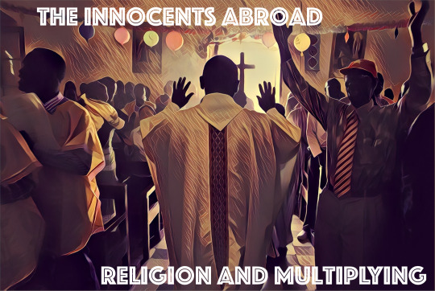

  

This episode of the podcast focuses on religion, both its impact on society, and how it can be used to shape culture. We catch up on our travels in South Korea, Greece, Georgia, Virginia, Tennessee, and try to figure out how to speak Asian languages.

**Shownotes:**

Serifos, Greece: [http://blog.yael.ca/post/161233852864/in-megalo-livadi-on-the-greek-island-of-serifos](http://blog.yael.ca/post/161233852864/in-megalo-livadi-on-the-greek-island-of-serifos)

Seoul Searching: [https://youtu.be/wbyMahgNJgY](https://youtu.be/wbyMahgNJgY)

North Korea: [https://www.wsj.com/articles/otto-warmbier-american-detainee-released-by-north-korea-has-died-1497905282](https://www.wsj.com/articles/otto-warmbier-american-detainee-released-by-north-korea-has-died-1497905282)

Reading recommendation: [https://www.amazon.com/Submission-Novel-Michel-Houellebecq/dp/0374271577](https://www.amazon.com/Submission-Novel-Michel-Houellebecq/dp/0374271577)

22\. June 2017

[http://theinnocentsabroad.com](http://theinnocentsabroad.com)
