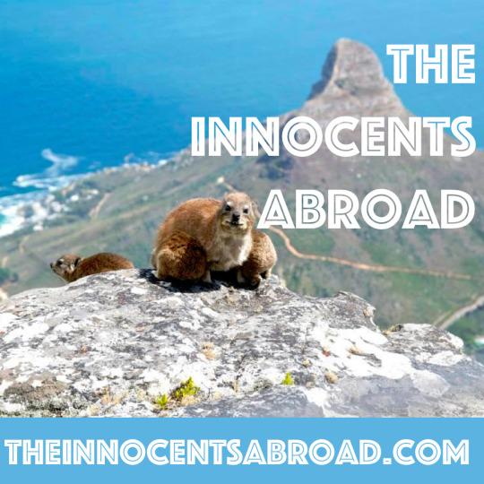

Yaël interviews Todor on his recent move to South Africa and they compare notes on the society, the history of race and current controversies, the beauty of its people and landscapes, how to have a good life, economic empowerment, living beyond the law. Also, you should totally go there. It’s awesome.

SHOWNOTES:

Wayde van Niekerk ‘coloured win’ turns racial  
[http://www.citizen.co.za/1251012/wayde-van-niekerk-coloured-win-turns-racial/](http://www.citizen.co.za/1251012/wayde-van-niekerk-coloured-win-turns-racial/)

Idiocracy Director Says It’s ‘Scary’ How Accurate His Movie Has Become  
[http://paleofuture.gizmodo.com/idiocracy-director-says-its-scary-how-accurate-his-movi-1785499058](http://paleofuture.gizmodo.com/idiocracy-director-says-its-scary-how-accurate-his-movi-1785499058)

How is Cape Town for digital nomads?  
[https://nomadforum.io/t/how-is-cape-town-for-digital-nomads/2407](https://nomadforum.io/t/how-is-cape-town-for-digital-nomads/2407)

Music: Black Coffee - Come With Me feat. Mque  
Photo: [http://TheVoyagette.com](http://TheVoyagette.com)

[http://theinnocentsabroad.com/](http://theinnocentsabroad.com/)
