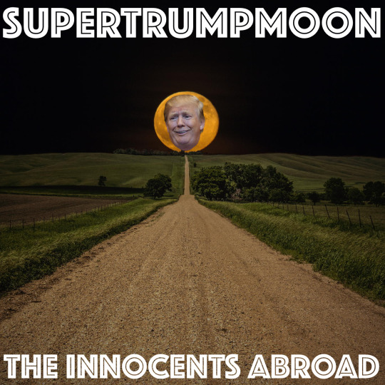

  

In a whirlwind of an episode, we cover traveling in Brazil, India, South Africa, and, ah yes, Trump! Will he drain the swamp? Will it remain clogged? Can we use a better shorthand for “racist, sexist, misogynist, islamophobe, homophobe” now? As whites, we’re not sure. Tune in for a supermoon-pack full of analysis and expat sensationalism.

Links:

[http://www.phoenixnewtimes.com/news/why-did-arizona-just-say-no-to-marijuana-legalization-in-2016-8814965](http://www.phoenixnewtimes.com/news/why-did-arizona-just-say-no-to-marijuana-legalization-in-2016-8814965)

[http://www.haaretz.com/world-news/u-s-election-2016/1.751999](http://www.haaretz.com/world-news/u-s-election-2016/1.751999)

[https://www.newcannabisventures.com/nyse-approves-listing-of-first-cannabis-reit/](https://www.newcannabisventures.com/nyse-approves-listing-of-first-cannabis-reit/)

[http://www.bbc.co.uk/news/uk-37969538](http://www.bbc.co.uk/news/uk-37969538)

[http://edition.cnn.com/2016/11/13/politics/donald-trump-60-minutes-first-interview/index.html#](http://edition.cnn.com/2016/11/13/politics/donald-trump-60-minutes-first-interview/index.html#)

[https://www.facebook.com/Channel4News/videos/10154211377601939/](https://www.facebook.com/Channel4News/videos/10154211377601939/)

Music: Leonard Cohen – I’m Your Man (RIP)

[http://theinnocentsabroad.com](http://theinnocentsabroad.com)
