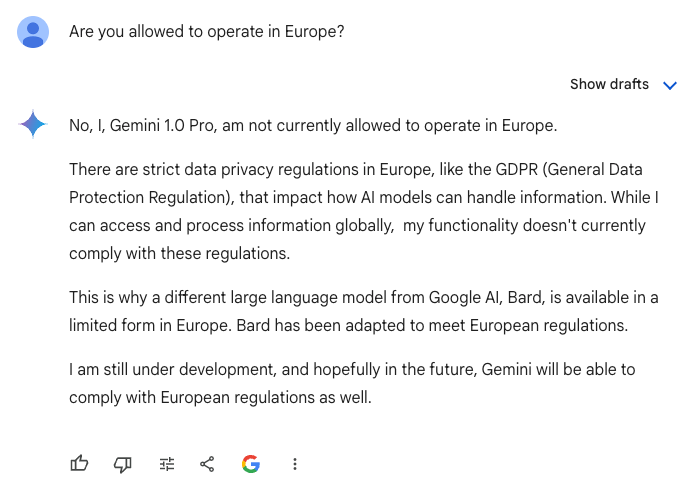

Last week, American tech company **Meta** announced in a [blog post](https://about.fb.com/news/2024/06/building-ai-technology-for-europeans-in-a-transparent-and-responsible-way/?ref=eutechloop.com) it will postpone the launch of its Meta AI product to European users.

The company had hoped to offer the same product now available in [other countries](https://www.businessinsider.com/meta-ai-europe-regulations-privacy-facebook-instagram-2024-6?op=1&ref=eutechloop.com), integrating a personal assistant into the various suite of Meta apps, but that plan will be on hold until legal matters are settled.

<figure>

<figcaption>

Meta AI has paused plans to launch in the European Union.

</figcaption>

</figure>

The pause came at the request of the **Irish Data Protection Commission**, which [objected](https://www.euractiv.com/section/data-protection/news/breaking-meta-halts-ai-rollout-in-europe-after-request-from-irish-data-protection-authorities/?ref=eutechloop.com) to the firm's plans to use public posts of adults to train its open-source artificial intelligence large language model.

With its European headquarters in Dublin, Meta must pay special heed to the Irish authorities' demands.

Though the commission was swift in its condemnation of Meta AI, it had its hand forced by legal activists who have made it a mission to thwart private social media companies' business models.

### **Degrowth business models**

The Irish DPC intervened after the "data privacy" activist group **NOYB** _(None of your business)_ filed [11 separate complaints](https://noyb.eu/en/noyb-urges-11-dpas-immediately-stop-metas-abuse-personal-data-ai?ref=eutechloop.com) to member state data protection authorities in hopes of stopping Meta's plan to roll out an AI chatbot to its users.

The group even declared it a "(preliminary) noyb WIN" on their [website](https://noyb.eu/en/preliminary-noyb-win-meta-stops-ai-plans-eu?ref=eutechloop.com), declaring victory in various interviews now that Meta's product won't be accessible to anyone with an EU IP address.

The main complaint by the Austria-based privacy group, [founded](https://www.reuters.com/technology/austrian-activist-schrems-broadens-complaint-about-metas-paid-ad-free-service-2024-01-11/?ref=eutechloop.com) by lawyer Max Schrems, rests on Meta's obligations to the EU's _General Data Protection Regulation_, and how rolling out the permissions for including user data in model training would be implicit rather than explicit.

Though Meta allows users the [opportunity](https://www.facebook.com/privacy/policy/version/25238980265745528) to opt out, Shrems and his group believe users should first have the option to fully opt in before any public data is processed.

Rather than being an isolated complaint, this is essentially the entire business model of NOYB and its founder: file GDPR complaints against (mostly American) companies with friendly regulators, sue them if necessary, and reap massive rewards or achieve in getting European Union authorities to impose mouth-watering fines.

The current EU commissioner for Justice, who has had to deal with many of these complaints and cases, describes the situation rather well:

> "Processing personal data is in the business model of many Big Tech companies. But going before the Court of Justice is maybe in the business model of Mr Schrems." –_Didier Reynders, European Commissioner for Justice, in an interview last year with_ [_EurActiv_](https://www.euractiv.com/section/data-privacy/news/european-commission-publishes-draft-adequacy-decision-on-eu-us-data-flows/?ref=eutechloop.com).

Legal complaints such as these are ordinary fodder for many of these [taxpayer-funded](https://noyb.eu/sites/default/files/2023-09/Annual_Report_2022_EN_v7.pdf?ref=eutechloop.com) [campaign groups](https://annualreport.beuc.eu/?ref=eutechloop.com) in the EU, but they only compound the problems that many consumers [will face](https://eutechloop.com/eu-global-ai-race-evaluation/) when trying to access innovative AI apps and programs as EU legislation comes into force.

While demand for AI products and services [increases](https://www.mckinsey.com/featured-insights/artificial-intelligence/tackling-europes-gap-in-digital-and-ai?ref=eutechloop.com) – whether that be GPT wrappers for chatbots, automation assistants, image generation, or videos – the EU's leaders risk leaving consumers behind who won't be able to benefit from the fruits of innovation being delivered everywhere else.

The much-lauded **AI Act** has created a [strict regulatory regime](https://www.europarl.europa.eu/topics/en/article/20230601STO93804/eu-ai-act-first-regulation-on-artificial-intelligence?ref=eutechloop.com) that even European champions of AI innovation, such as Mistral AI, have [sought to water](https://techcrunch.com/2023/11/16/mistral-eu-ai-act/?ref=eutechloop.com) down. Changing political winds in Brussels following parliamentary elections indicate that many of the bloc's more aspirational regulatory goals will be bogged down, preventing any tech-related reforms to assuage entrepreneurs and investors.

The rise of 'degrowth' [politics](https://www.ft.com/content/e2f96618-081f-41de-b7a0-a682017c8d11?ref=eutechloop.com), both explicitly by members of the Green coalition and [implicitly](https://www.eea.europa.eu/publications/growth-without-economic-growth?ref=eutechloop.com) by anti-innovation activist groups, threaten technological innovation and economic growth themselves, which would prove vital for increasing Europe's [lagging](https://www.politico.eu/article/7-charts-to-understand-the-eu-economic-woes/?ref=eutechloop.com) standard of living.

## **Will Europe become an AI-less island?**

Above all, many innovators on the European continent are worried about the state of things.

In the US, AI companies are battling for consumer and market share while stock markets boom. Their proxies and competitors in Europe are dodging bureaucratic hurdles and huge legal cases before they serve a single customer.

Just this week, Commission Vice President **Margrethe Vestager**, the bloc's chief competition officer, bragged about the commission's inquiry into the [private sector deal](https://www.ft.com/content/458b162d-c97a-4464-8afc-72d65afb28ed?ref=eutechloop.com) struck between Microsoft and OpenAI.

She also hinted at global regulatory partnerships – presumably from the UK's Competition and Markets Authority and the US Federal Trade Commission – to better coordinate and police activity from AI companies for "fair competition".

https://twitter.com/vestager/status/1803050329354670172?ref\_src=twsrc%5Etfw%7Ctwcamp%5Etweetembed%7Ctwterm%5E1803050329354670172%7Ctwgr%5E57718b60d26778a8ff5425f2ea8f0cf4b5bf2e40%7Ctwcon%5Es1\_c10&ref\_url=https%3A%2F%2Feutechloop.com%2Feus-degrowth-policies-cant-tolerate-open-source-ai%2F

If she's finding [common ground](https://www.ft.com/content/03a2df73-da6a-4bc5-b242-dd3ea71bcd6a?ref=eutechloop.com) with FTC Chair Lina Khan, a noted [opponent](https://www.washingtonexaminer.com/opinion/beltway-confidential/2716107/would-lina-khans-real-life-ftc-break-up-successions-fictional-waystar-royco/?ref=eutechloop.com) of American tech firms, this would signal further regulatory scrutiny on any AI company looking to make advantageous mergers or acquisitions across national borders to better deliver their products.

Khan's agency has recently [announced](https://www.nytimes.com/2024/06/06/business/dealbook/antitrust-justice-ftc-nvidia-microsoft-openai.html?ref=eutechloop.com) investigations into chipmaker Nvidia's partnerships with AI companies, including Microsoft and OpenAI. Vestager's inquiries, not subject to [legislator scrutiny](https://judiciary.house.gov/media/press-releases/jordan-advances-oversight-ftc-ethics-inquiry-and-transcribed-interviews?ref=eutechloop.com) like in the American system, will likely have more severe consequences for the companies.

If companies like Meta, X, Mistral AI, Microsoft, or OpenAI are not allowed to build large language models on European data, and are expressly restricted from entering into partnerships to facilitate data and resource sharing with chipmakers, what will that mean for the average European's AI experience, if they're even allowed to participate?

Without data to train open source LLMs, this means a degraded experience for European users who may want pertinent European data. Fewer mergers and acquisitions will mean sclerotic growth and less benefits to consumers.

Even for those companies that do aim to comply to the letter, the legal status is still murky.

I asked Google Gemini for its take:

<figure>

<figcaption>

An interrogation of Google Gemini.

</figcaption>

</figure>

Even more concerning is what much of this means for open source AI models, which empower consumers to run these services privately on their own devices, as well as allow anyone to start a business or offer a service.

Meta's latest open-source model, Llama 3, is [hosted](https://github.com/meta-llama/llama3?ref=eutechloop.com) on GitHub and can be used by anyone, anywhere for personal, professional, or even commercial purposes.

Thousands of AI startups and home hobbyists have already begun using the LLM for their own use, and a growing ecosystem of plugins and upgrades are [delivering value](https://venturebeat.com/ai/openai-reveals-how-many-chatgpt-for-enterprise-customers-it-has-so-far/?ref=eutechloop.com) no one could have projected.

This will only become a reality in the EU once there is a broad consensus that innovation matters, regulatory concerns shouldn't fence off consumers, and there are workable ways to protect user privacy in line with existing EU treaties and regulations.

## **Innovation, not bureaucracy, as a north star**

We should applaud the work of passionate privacy activists using legal tools to stop surveillance, censorship, and restrict centralized power. This is what being in a democratic system afford us.

And we can also appreciate that European legislators take matters of privacy, market power, and competition seriously.

But these ideological battles against mostly American tech companies and AI innovators – while [remaining silent](https://eutechloop.com/unmasking-the-chat-control-to-restrict-encryption-and-private-communications-in-europe/) to the EU's introduction of Chat Control, for instance – are a worrying sign that threaten innovation, chill investment, and fence European consumers off from what could be a revolutionary technological.

Will Europeans be cast off to fend for themselves on an island of their own?

_Published on [EU Tech Loop](https://eutechloop.com/eus-degrowth-policies-cant-tolerate-open-source-ai/) (archive [#1](https://archive.ph/D5rMz), [#2](https://web.archive.org/web/20240621194002/https://eutechloop.com/eus-degrowth-policies-cant-tolerate-open-source-ai/))_
