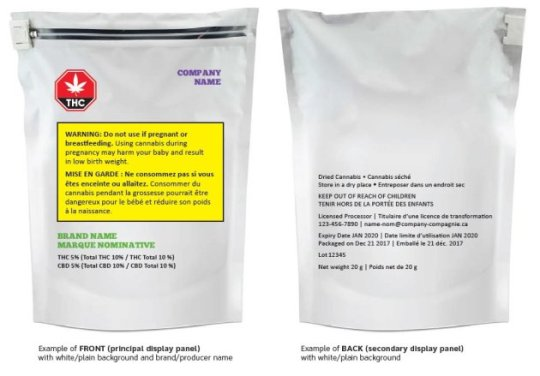

## Recently proposed restrictions on branding and logos, as well as exhaustive warning requirements, won’t benefit legal cannabis users.

- By [Yaël Ossowski](https://www.huffingtonpost.ca/author/yael-ossowski) Deputy director at [Consumer Choice Center](http://consumerchoicecenter.org/).

Last Monday, Health Canada [unveiled its proposed guidance](https://www.canada.ca/en/health-canada/services/publications/drugs-health-products/summary-comments-public-consultation-regulation-cannabis.html) on how cannabis should be regulated, marketed and sold once it is fully legalized in later this year, likely in July or August.

While the rules incorporate important and necessary standards, the restrictions on branding and logos, as well as the exhaustive warning requirements are, quite literally, an eyesore.

According to Health Canada’s guidelines, each package must contain a large red warning sign with an image of a cannabis leaf and the word THC, the main potent chemical in cannabis. Added to that, the package must come with a yellow label warning that it must not be used by children or pregnant women.

Any brand or logo must, therefore, be visibly smaller than the THC warning sign, and any use of italics or bold font to accentuate any text is prohibited. That means a brand or logo will have minimal placement on a package.

What this guideline proposes is that cannabis companies be incredibly restricted in how they’re allowed to brand and market their products. That won’t help consumers make informed choices, and may even threaten consumer safety. And it certainly won’t bring breed any creativity for entrepreneurs and marketers.

> It’s safe to say cannabis will be as heavily regulated as tobacco, but much less than alcohol. Is that fair?

For one, with such limited packaging space to market their products, how can companies differentiate themselves from competing brands? What if one company uses a completely GMO-free process, or another is from a First Nations reserve? Don’t consumers deserve to know this information, and shouldn’t companies be free to let their customers know? Without this information, the biggest and most well-known brand is best situated to gain dominant market power. Limiting branding is tantamount to limiting consumer choice.

Added to that, these restrictions will hurt consumer safety. As Health Canada recognized, the plain packaging of tobacco in countries like Australia and the United Kingdom has led to the growth of contraband tobacco products on the black market. Criminal dealers are emboldened to create fake labels on products and pass it off as another brand. In Australia, which implemented plain packaging of tobacco in 2012, [close to 15 per cent](http://www.news.com.au/finance/economy/australian-economy/illegal-tobacco-industry-flourishing-in-australia-as-government-hikes-taxes/news-story/c1d28c0a1919d0fbcc499579a2386b28) of all tobacco consumed in 2016 was purchased in the illicit market.

Illicit markets aren’t regulated and transactions take place outside our legal and financial system. That isn’t good for Canadians’ safety.

Considering these are just the federal requirements, and we have yet to see the final plans by each province, it’s safe to say cannabis will be as heavily regulated as tobacco, but much less than alcohol. Is that fair?

The question becomes, should the government treat legal cannabis users, [a drug less harmful than alcohol and many opiates](https://www.globaldrugsurvey.com/), like children who cannot make their own decisions?

Answering that will be key to determining whether this succeeds. Especially considering Canada is due to become the largest industrialized country to legalize cannabis. The world will be watching.

## Are there alternatives?

For an informed look at alternatives, we need only cite the examples of Washington State, Oregon and Colorado — U.S. states that have already legalized cannabis and proposed some common-sense rules.

In these states, the most onerous regulations are applied to [media and billboard advertising](https://www.leafly.com/news/industry/state-by-state-guide-to-cannabis-advertising-regulations), rather than the packages themselves.

And this approach works.

I ventured into various Washington State dispensaries last year and was taken aback by the number of competing brands present inside. There is a plethora of magazines and websites dedicated to comparing each strain and product, discussing the various tastes and promised effects for responsible users. Entire companies have sprung up to promote safe and enjoyable experiences for consumers. [That’s what its laws allow for](http://apps.leg.wa.gov/rcw/default.aspx?cite=69.50&full=true).

As successful cannabis companies such as Weedmaps, Leafly and Ganjapreneur prove, entrepreneurs can actually fill the space left by government when it comes to safety and information. They can provide better guidance on how much to take, where to buy it and which companies have the most ethical practices. We don’t need government branding restrictions to do that for us.

By restricting brands, we as Canadians are completely outsourcing the imagination of cannabis to an overzealous crowd of public health regulators.

Rather than our current path, we should follow the Washington-Oregon-Colorado (WOC) model. One that embraces brands and logos, information and entrepreneurship.

The fact remains: brands matter. Much like Prime Minister Justin Trudeau during the 2015 election, or the Canadian flag abroad, a strong brand tied to good information will ultimately make for better and happier consumers.

British design critic Stephen Bayley [said it best](https://www.dezeen.com/2017/10/16/stephen-bayley-opinion-war-against-branding-signs-life-why-brands-matter/):

“A war against branding is a war against people. Brands are, quite literally, signs of life, or, at least, popular expressions of it. They are culture, art, design, value, belief.”

If Canada wants to be an example to the world when it comes to the legalization of cannabis, we’d be wise to follow his words.

_Yaël Ossowski, a Montreal-area native, is deputy director of Consumer Choice Center._

_Published on [Huffington Post](https://www.huffingtonpost.ca/yael-ossowski/marijuana-branding-consumer-choice_a_23397449/)._
