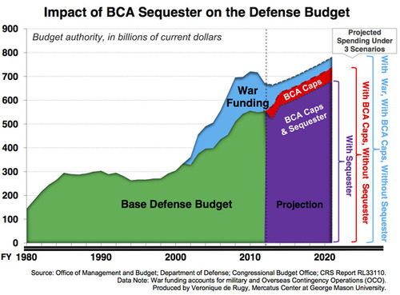

By Yaël Ossowski | Florida Watchdog

> ST. PETERSBURG — Even in the heat of the campaign season, Florida’s top candidates for U.S. Senate find themselves in agreement about not cutting federal spending — for the military, at least.
> 
> 
> 
> In the latest bout between Republican U.S. Rep. **Connie Mack**, of District 14, and Democratic U.S. Sen. **Bill Nelson**, the men are clamoring to protest $500 billion in triggered military sequestration cuts, which go into effect Jan. 1. The cuts are the result of last year’s failed **Super Committee**, which was tasked with finding ways to trim federal spending.
> 
> The latest attack line on the campaign trail comes from Mack, charging that Nelson is responsible for the “reckless cuts” because he voted for the original deal to raise the debt ceiling in August 2011. It’s the same bill that laid out the mechanism of automatic cuts to military spending if the **Super Committee** failed.
> 
> Flash forward one year later, and now both men are seeking to stop those cuts, representing $50 billion a year for the **Defense Department**, which spends nearly $1 trillion a year on contingency operations, health care and pensions for its employees. That would represent a 5 percent cut each year.
> 
> “Instead of fighting to stop these reckless cuts to our military, Bill Nelson was complicit in making it happen in the first place, even though he has tried to convince the people of Florida that he opposed it,” Mack [said in a statement](http://www.conniemack.com/senator-bill-nelson-says-one-thing-to-the-people-of-florida-but-does-another-when-he-votes-like-a-lockstep-liberal-with-barack-obama-in-washington-2/)released Sept. 17.
> 
> “Thank you for your efforts to warn residents in some of the states with high military employment about how automatic spending cuts at the Pentagon could harm their communities,” Nelson [wrote in a July letter](http://thehill.com/blogs/defcon-hill/budget-appropriations/240785-nelson-wants-to-work-with-gop-on-sequester-) to Republican U.S. Sens.**[John McCain](http://ballotpedia.org/wiki/index.php/John_McCainhttp:/ballotpedia.org/wiki/index.php/John_McCain)** of Arizona, **[Lindsey Graham](http://ballotpedia.org/wiki/index.php/Lindsey_Graham)** of South Carolina and **[Kelly Ayotte](http://ballotpedia.org/wiki/index.php/Kelly_Ayotte)** of New Hampshire.
> 
> 
> 
> The three senators made a sweep through Tampa on July 30 to [cast the sequestration cuts](http://watchdog.org/45731/mccain-military-contractors-sequestration-cuts/) as harmful, impacting the jobs of military contractors, as well as national security.
> 
> “We invited Senator Nelson to join us, but he had a scheduling conflict and unfortunately couldn’t make it,” McCain told the crowd.
> 
> Nelson has since campaigned heavily on the promise of stopping the automatic sequestration cuts.
> 
> **Cutting ‘corporate welfare’ in the military**
> 
> Mack and Nelson, therefore, do not actually have a point of contention with this issue. Neither wants to be portrayed as having reduced federal spending if the price is layoffs for the nearly 70,000 military contractors stationed throughout the state.
> 
> “Such reductions represent only a small proportion of all defense and security spending, and they could be made without jeopardizing anyone’s safety,” said **Fergus Hodgson**, fiscal policy director at the **John Locke Foundation,** a nonprofit free-market think-tank based in **Raleigh**, N.C.
> 
> North Carolina is another state with large installments of military bases and has hosted similar debates on military sequestration cuts.
> 
> “Considering that credible estimates place the federal debts, including unfunded liabilities, at over $200 trillion, a mere $500 billion dollars over 10 years is a drop in the ocean,” said Hodgson. “Federal officials could make much larger, targeted reductions and still not jeopardize safety.
> 
> He believes the debate on sequestration cuts has so far obfuscated the most rational approach to reducing spending and supporting defense.
> 
> “Responsible elected officials would support this reduction and seek many others,” Hodgson told Florida Watchdog.
> 
> Other critics of the candidates say they have yet to be specific about the sequestration or other cuts to more profligate areas of government.
> 
> “They’re spending $2 billion a week in Afghanistan. Why don’t they talk about bringing the troops home to save money?” asked **Gene Jones**, founder and president of **[Florida Veterans for Common Sense](http://floridaveteransforcommonsense.org/)**, an anti-war group of veterans based in **Sarasota**.
> 
> 
> 
> “If they’re really serious about saving the country money, they’d call for the Pentagon to audit their books,” Jones added. “Once we find out what the Pentagon is spending, then we can determine what we need in order to be a strong military.”
> 
> As for the cuts’ effects on military contractors and employment in the state, Jones says these groups have gotten enough of the public’s money.
> 
> “The term I use is corporate welfare,” he reminded **Florida Watchdog**. “A lot of these military contractors, there is no question about it, they live on the government teat. And the rest of us taxpayers support them.”

Read more: [Florida Watchdog](http://watchdog.org/56688/fl-bill-nelson-connie-mack-join-forces-to-halt-military-sequestration-and-put-off-cuts-to-federal-budget/)
