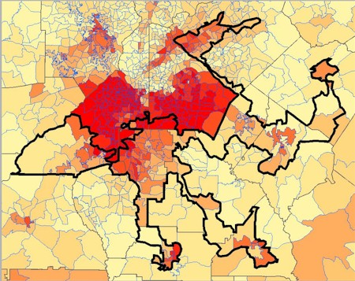

By Yaël Ossowski | Florida Watchdog

TAMPA — After striking down a previous plan drawn up by state Senate lawmakers in February, the **Florida Supreme Court** unanimously approved a new map Friday morning, defining the political districts for legislators ahead of state elections this fall.

The issue stems from the first lawsuit filed by groups such as the **League of Women Voters of Florida**, the **National Council of La Raza**, and **Common Cause Florida**, the **National Association for the Advancement of Colored People** and the **Florida Democratic Party**, which objected to the manner in which the first Republican plan divided districts previously populated with minority communities.

Read more: [StatehouseNewsOnline](http://statehousenewsonline.com/2012/04/27/fl-supreme-court-grants-new-district-boundaries/)
