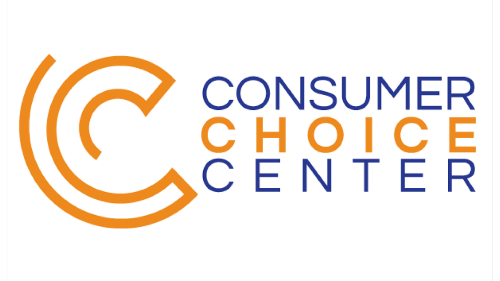
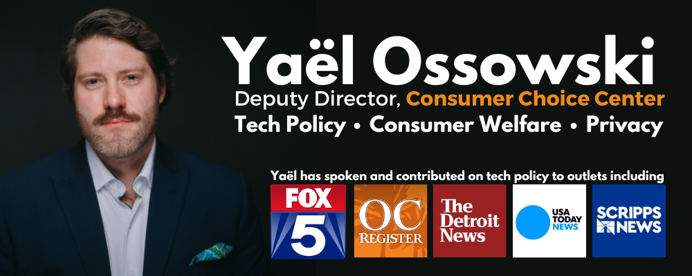

**Washington, D.C.** – Yesterday, a bipartisan group of US House legislators introduced [a bill](https://www.congress.gov/bill/118th-congress/house-bill/7521/cosponsors?s=1&r=1) that would force ByteDance Ltd. to sell its US version of TikTok or face massive fines and federal investigations. This would have big ramifications for the video-sharing app, which is estimated to have over 150 million users in the US.

In practice, **HR7521** designates the popular social media application TikTok as a “foreign adversary controlled application,” invoking the government’s ability to force the firm into new ownership by any private, legal entity in the United States —  a full forced divestiture.

**Yaël Ossowski**, deputy director of the consumer advocacy group, Consumer Choice Center, responded:

**“In recent years, the default mode for the federal government has been to wage a regulatory war against American tech companies, all the while leaving the Chinese Communist Party-linked app TikTok to grow uninhibited,”** said Ossowski. **“While consumers generally do not want wholesale bans on popular tech, considering the unique privacy and security concerns implicit in TikTok’s ownership structure as well as its accountability and relationship to the CCP, [the solution of a forced divestiture](https://consumerchoicecenter.org/the-best-answer-to-tiktok-is-a-forced-divestiture/) is both appropriate and necessary.”**

Reports have already [revealed](https://www.cnn.com/2022/11/03/tech/tiktok-european-data-china-staff/index.html) that European TikTok users can, and have, had their data accessed by company officials in Beijing. The [same](https://www.buzzfeednews.com/article/emilybakerwhite/tiktok-tapes-us-user-data-china-bytedance-access) goes for US users. Given the ownership structure of TikTok, there isn’t anything that can be done about this to shield American consumers from privacy violations. A forced divestiture would bring TikTok under the legal authority of the US and thus alleviate many of the concerns that consumers have about their security on the app. 

“**We praise Reps. Gallagher and Krishnamoorthi for spearheading this effort in a constitutionally nuanced and legal way that does not risk furthering the anti-tech attitudes of so many in Washington**,” concluded Ossowski. “**Upholding consumer choice is among our core principles, as is ensuring that the ethos of liberal democracies continues to guide the arc of technological progress.**“

## **_[READ: The best answer to TikTok is a forced divestiture](https://consumerchoicecenter.org/the-best-answer-to-tiktok-is-a-forced-divestiture/)_** 

_The CCC represents consumers in over 100 countries across the globe. We closely monitor regulatory trends in Washington, D.C., Ottawa, Brussels, Geneva, and other hotspots of regulation and inform and activate consumers to fight for  Consumer Choice. Learn more at [consumerchoicecenter.org](http://consumerchoicecenter.org/)_

_Originally published on [consumerchoicecenter.org](https://consumerchoicecenter.org/forcing-tiktoks-divestiture-from-the-ccp-is-both-reasonable-and-necessary/)._
