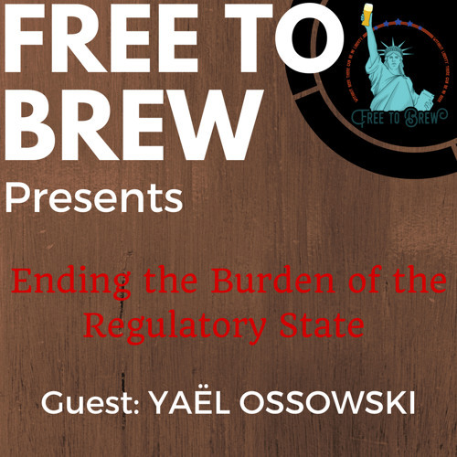

I joined the Free to Brew podcast this week.

We discuss a wide array of topics and the effects many regulations from UBER to Sunday alcohol sale laws not only have on the companies they are directly imposed on, but also on the choices the consumer is then faced with. Surprise surprise, quite often the consumer is left behind, then adding insult to injury is told its for their own good.

[http://www.pulseofliberty.com/](http://www.pulseofliberty.com/)
