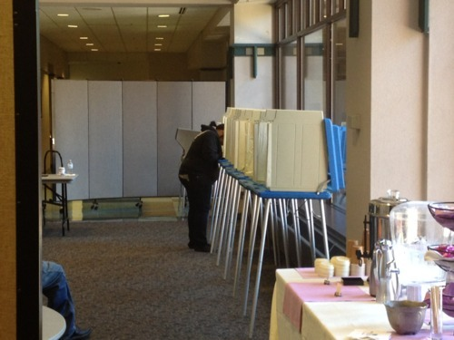

By Yaël Ossowski | Wisconsin Reporter

> MILWAUKEE — At Marquette University in downtown, the line to vote extended past the entrance of the door and turned left down a hallway of offices.
> 
> Students with backpacks stood alongside dozens of parents towing child behind them, giving them a glimpse of the tranquil process that has been preceded by so much discord, disunion and disagreement among friends and families in the state of Wisconsin.
> 
> More than 19 months after voters last where given the option of Republican **Scott Walker** and Democrat **Tom Barrett** for governor, they were being asked to make the same choice — and [early exit polls](http://apnews.myway.com/article/20120605/D9V778VG0.html) confirm that the results won’t be too different from the previous go around.
> 
> In the very front of the line at Marquette, three poll workers flipped through 2-inch notebooks filled with paperwork procedures to help previously unregistered voters make their vote count on election day.

Read more: [Wisconsin Reporter](http://www.wisconsinreporter.com/frustrations-excitement-grip-voters-on-election-day-in-wisconsin)
